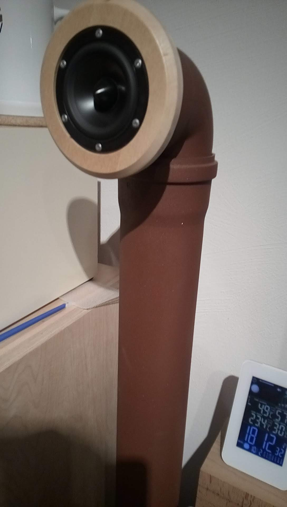
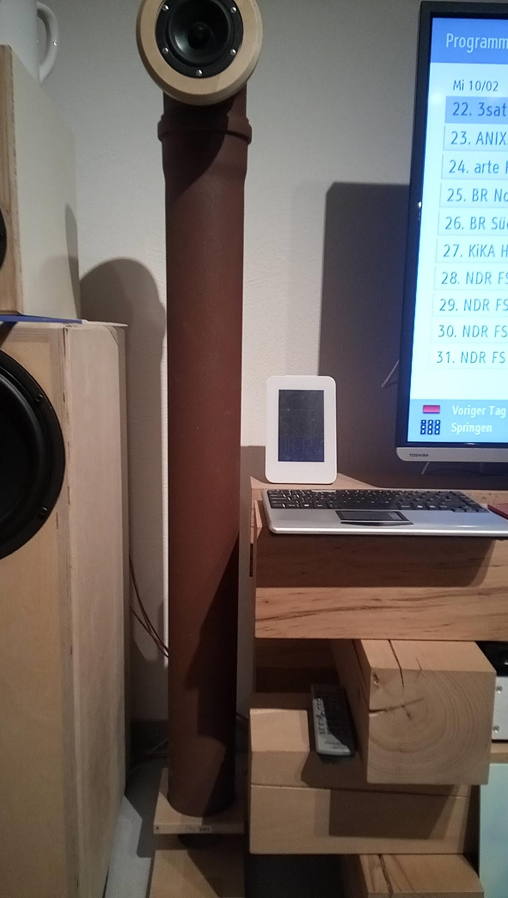
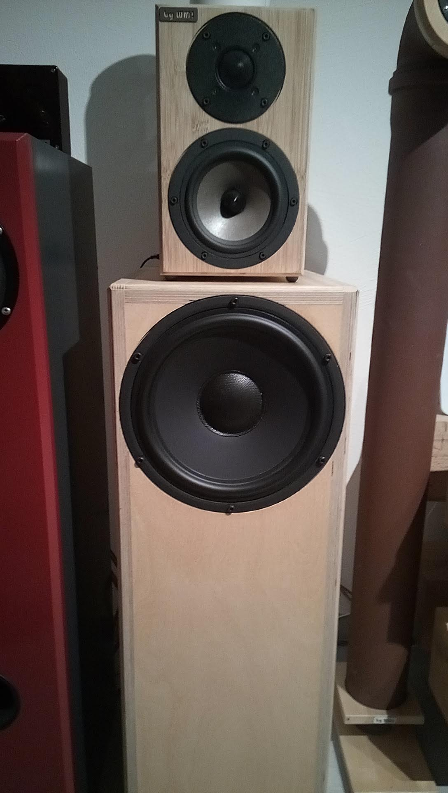
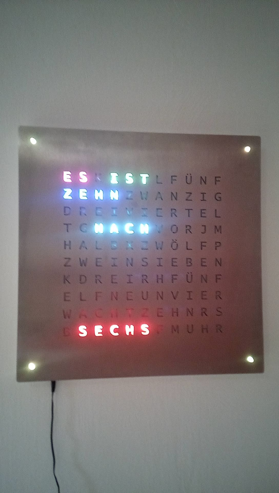
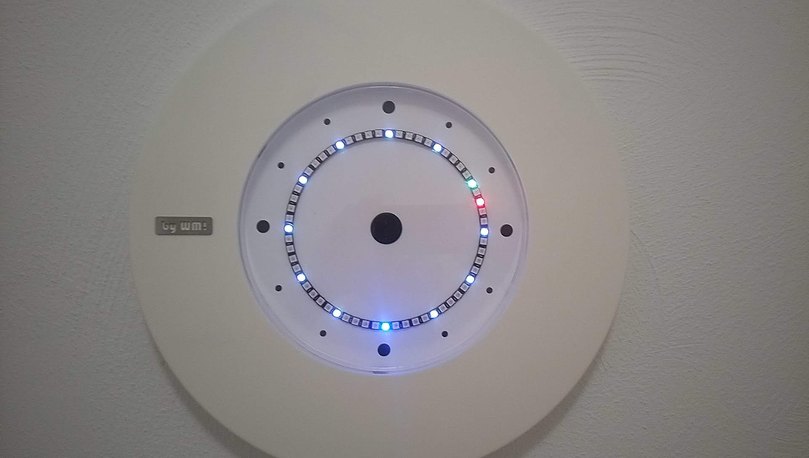

= RC Elektronik
Wilhelm Meier <wilhelm.wm.meier@googlemail.com>
:toc:
:toc-title: Inhalt
:toclevels: 4
:numbered:
:toc-placement!:

:tip-caption: :bulb:
:note-caption: :information_source:
:important-caption: :heavy_exclamation_mark:
:caution-caption: :fire:
:warning-caption: :warning:

:ddir: https://wimalopaan.github.io/Electronics
:rcb: {ddir}/rc/boards

[NOTE]
--
Hier finden Sie Informationen zu den von mir entworfenen RC-Elektronik-Modulen, OpenTx-Addons, LUA-Scripting, und vieles mehr.
--

.Aktualisierung
[TIP]
--
Wer auf dem Laufenden bleiben möchte, kann _rechts oben_ auf den `watch` Button drücken. 
--

toc::[]

[TIP]
--
Die leeren Kapitel sind für mich Gedankenstützen, dass hier noch etwas zu tun ist ;-) Es liegt einfach nur an der mangelnden Zeit, alles zu 
dokumentieren. Wer Fragen zu einer Überschrift ohne Inhalt halt, möge einfach fragen.
--

image::images/zfcf.jpg[width=50%]

== Allgemein

=== News

* <<etx, EdgeTx>>-Versionen werden hier zur Verfügung gestellt.

* Ab Version `1.15` können die EdgeTx/OpenTx-Skripte für die Steuerung der `RC-MultiSwitch-D, ...` auch _virtuelle_ Schalter

* Ab Version `1.13` sind die EdgeTx/OpenTx-Skripte für die Steuerung der `RC-MultiSwitch-D, ...` für eine Bedienung per Touch-Screen ausgelegt.

* Ab Version `1.09` sind die EdgeTx/OpenTx-Skripte für die Steuerung der `RC-MultiSwitch-D, ...` für den `FullScreen`-Modus geeignet.

* Schrittweise Einführung der _automatischen Erkennung_ der Bus-Systeme: `IBus`, `SBus`, `SBus` (inv.), `Hott`. Die Verwendung eines
_Inverters_ bei `SBus` entfällt.
Darüber hinaus auch Detektion eines `PWM`-Signals (falls sinnvoll). 

[options="header"]
|====
| Version  | Modul mit _Bus_-Erkennung
| >= V46   | `RC-720-D`, `RC-Haptic-D`
| >= V21   | `RC-MultiAdapter-DA`, `RC-Quad-D`, `RC-ThreeSixty-D`, `RC-Bmc-D`, `RC-MultiSwitch`
|====

=== Parallelschalten von Akkus (im Modellbau)

Die Anleitung der <<poweror, Akkuweiche>> enthält viel nützliche Information über das Thema *Parallelschalten* von Akkus.
Hier geht es direkt zur {rcb}/power_or.html[Info über das Parallelschalten von Akkus] und der Zweck einer <<poweror,Akkuweiche>>.

=== Bus-Systeme im RC-Modellbau

(_work-in-progress_)

Übersicht: {ddir}/rc/rcBusSysteme.html[RC Bus Systeme] {ddir}/rc/rcBusSysteme_r.pdf[pdf]

== RC-Elektronik-Module

Es folgt eine Übersicht über die von mir entwickelten Elektronik-Module für den RC-Modellbau.

=== Module zum Einbau in ein Modell (empfängerseitig)

==== RC-MicroStep / RC-MiniStep

Zwei kleine Module zum Betrieb von Micro- und Mini-Schrittmotoren an Stellen, wo oft Gleichstromgetriebemotoren eingesetzt werden.
Dies vermeidet Geräusche und ermöglichst eine sehr starke Miniaturisierung.

Anleitung: {rcb}/mmstep.html[RC Mico/MiniStep] {rcb}/mmstep_r.pdf[pdf]

[[msd]]
==== RC-Multiswitch-D

Der `RC-Multiswitch-D` ist ein _digitales_ Schaltmodul mit 8-Kanälen. 

Die Ansteuerung erfolgt rein digital über

* `OpenTx` und einen `Sbus`-Empfänger
* `OpenTx` und einen `Ibus`-Empfänger
* `Hott` und einen `Hott`-Empfänger

Anleitung: {rcb}/rcmultiswitch.html[RC MultiSwitch] {rcb}/rcmultiswitch_r.pdf[pdf]

Anleitung (Hott): {rcb}/rcmultiswitch_h.html[RC MultiSwitch] {rcb}/rcmultiswitch_h_r.pdf[pdf]

* Firmware:

* OpenTx:
** Fixed page switch if not 6pos

==== RC-MultiAdapter-DA

Der `Rc_MultiAdapter-DA` dient dazu, _alte_, _analoge_ Schaltmodule wie etwa das _Graupner_ 16-Kanal (4159) an
einer `OpenTx`-Anlage zu betreiben. Dies ist für Anwender interessant, die ein bestehendes Modell mit derartigen 
alten analogen Schaltmodulen auf neue Technik umrüsten möchten, _ohne_ die _gesamte_ Elektronik im Model zu erneuern.

s.a. <<msd,RC-MultiSwitch-D>>

* Firmware:
** neue Firmware (V21) erkennt automatisch IBus/SBus/SBus(Inv), SBus-Inverter nicht mehr notwendig

==== RC-ServoSwitch-D

Mit dem `RC-ServoSwitch-D` kann man Bewegungsabläufe als _Schaltfunktion_ realisieren. Je _Funktion_ können _vier_ 
unterschiedliche Positionen für eines der 5 Servos angefahren werden. Servos können auch _gekoppelt_ werden.

s.a. <<msd,RC-MultiSwitch-D>>

==== RC-Quad-D

Ein Sonderfunktionssteuerung mit vier Funktionen. Eigent sich gut, um bis zu 4-Achsen-Kräne anzusteuern (inkl. Endabschaltung und Telemetrie).

Anleitung: {rcb}/rcquad.html[RC Quad] {rcb}/rcquad_r.pdf[pdf]

* Hardware-Revision: 04
** BEC-Spannung (vom dem Empfänger) bis 16V möglich. Damit aus HV-Servos einsetzbar im Model ;-) 
** Weitere LED zur Indikation des Empfängerprotokolls (Sbus, Sbus-Inv, IBus, SumD)

* Firmware: V22
** Master-Reset über Jumper

* Firmware: V21
** _Automatische_ Erkennung des Bus-Systems

* Firmware: V20
** FrSky: Sensor-ID für die Zustandsanzeige (Aus, Vor, Rück, Anlauf, Stromabschaltung, Endlagenabschaltung, ...) einstellbar

* OpenTx: V1.06
** XJT: Bug-Fix für Adressen oberhalb von 5 (5, 6, 7, 8) 

[[rc360]]
==== RC-ThreeSixty-D (ausgelaufen)

Dies ist eine Schottelsteuerung für einen Schottelantrieb.

Anleitung: {rcb}/rc360.html[RC-ThreeSixty-D] {rcb}/rc360_r.pdf[pdf]

Video: https://www.youtube.com/watch?v=n65u5VO-_PI[Video]

* Firmware: V21
** _Automatische_ Erkennung des Bus-Systems

[[rc720]]
==== RC-720-D

* ab Firmware `V48`: Einstellung der mechnischen Null-Position (Geradeaus-Position) am Sender.

Wie <<rc360>> jedoch als Doppel-Steuerung (wie 2x <<rc360>>).

Weitere zusätzliche Merkmale:

* Telemetrie: Positionssensor für die tatsächliche Lage des Antriebs
* BEC-Weiche: Weil ja zwei Motorsteller mit BEC benötigt werden, sorgt eine Weiche dafür, dass beide BECs verwendet werden können.

Anleitung: {rcb}/rc720.html[RC-720-D] {rcb}/rc720_r.pdf[pdf]

===== Mixer-Skript 

Das ursprüngliche Mischer-Skript für den RC-ThreeSixty-D ist erweitert für zwei Schottel.

https://github.com/wimalopaan/OpenTxLua/blob/main/SCRIPTS/MIXES/schotl.lua[Mischer-Skript]

===== Widget

Zur Anzeige der aktuellen und gewünschten Lage des Antriebes bzw. auch des Schubs dient je Schottel das folgende Widget:

https://github.com/wimalopaan/OpenTxLua/tree/main/WIDGETS/Schottel[Widget]

==== RC-Led-D

Eine 16-Kanal LED-Ansteuerung mit einer Konstantstromquelle je Kanal, je Kanal einstellbarem Strom und unterschiedlichen Schaltmustern.
Mit automatischer Erkennung des Bus-Systems.

==== RC-BMC-D

BMC: _Brushed-Motor-Control_, also ein Steller für Bürstenmotoren

https://www.youtube.com/watch?v=YcGqh6H6jHw[Video-1]

https://www.youtube.com/watch?v=bvdUeQNDzLk[Video-2]

https://www.youtube.com/watch?v=zHA3FsItgLM[Video 3]

https://www.youtube.com/watch?v=5HorOrrKEpc[Video-4]

* Features:
** max. 36V, max 30A
** parallelschaltbares BEC (5V/1A)
** SBus / IBus / SumD / Servo-PWM (Auto-Erkennung)
** S.Port / IBus / Hott - Telemetrie
*** Versorgungsspannung
*** Motorstrom
*** Temperatur des Stellers
*** Temperatur des Motors
*** Drehzahl des Motors
** Adaptive PWM-Frequenz (Kennlinie)
** Aktive Drehzahlrückführung
** _Kickstart_
** bequeme _Konfiguration_ über _zweiten_ Kanal (auch bei Servo-PWM)

==== RC-Cellwatch

Ein Akkuzellenmonitor für bis zu 4-Zellen für `IBus`, `Hott` und `SPort` (und sehr geringem Leckstrom = geringe Entladung des Akkus).
Kaskadierbar für 7-Zellen (10, 13, ...)

Anleitung: {rcb}/cellwatch.html[RC Cellwatch] {rcb}/cellwatch_r.pdf[pdf]

==== RC-SensorModul

Vielfältiges Sensor-Modul (`IBus`) für

* Drehzahlen
* Temperaturen
* GPS-Geschwindigkeit
* Wassereinbruch
* Ströme

==== RC-Hauptschalter

Zentraler elektronischer Schalter zur Bedienung per Taster oder Magnet, Telemetrie für Strom und Spannung, für `IBus`, `SPort` und `Hott`.
Akustische Rückmeldung.

Anleitung: {rcb}/onoff_telemetrie.html[RC Hauptschalter] {rcb}/onoff_telemetrie_r.pdf[pdf]

==== DIY RC-Hauptschalter

Zentraler elektronischer Schalter zur Bedienung per Taster oder Magnet, _ohne_ Telemtrie

Anleitung: {rcb}/onoff_simple.html[DIY RC Hauptschalter] {rcb}/onoff_simple_r.pdf[pdf]

[[poweror]]
==== RC-Akkuweiche

Die Anleitung enthält auch eine ausführliche Betrachtung über das Thema *Parallelschalten* von Akkus.

Anleitung: {rcb}/power_or.html[Akkuweiche] {rcb}/power_or_r.pdf[pdf]

==== RC-BEC-Weiche

Hat man mehrere BEC-Quellen (etwa mehrere _Steller_ mit je einem `BEC`) entsteht immer die Frage nache dem _Parallelbetrieb_ der 
`BEC` der Steller. Normalerweise verkraften die Steller-BEC das Parallelschalten _nicht_, mit diesem Modul ist das jedoch effektiv möglich. 
Damit verteilt sich die Last auf _beide_ `BEC` der Steller, das _Deaktivieren_ der anderen `BEC` durch Unterbrechen des _Plus_-Zuleitung ist _nicht_ 
mehr notwendig.

==== RC-`Bus`-Verteiler

`RC-Distri` 

=== Wassermelder

Kleines Modul zum Detektieren eines Wassereinbruchs. Mit LED, kann / sollte an Telemetrie angeschlossen werden.

=== Elektronischer Schalter

Einfach High-Side-Switch, etwa zum Anschluss an den Wassermelder , um eine Pumpe einzuschalten.

=== Module zum Einbau in den Sender

==== Digitales Sendemodul für den JR-Modulschacht von OpenTx / EdgeTx-Sendern

https://www.youtube.com/watch?v=NoHuX-6Vqxw[Video]

==== RC-Haptic-Control

RC-Haptic-Control ist eine neuartige Möglichkeit

* Geber mit beliebigen Eigenschaften zu simulieren, und / oder
* Modelle mit "Motion-Feedback" zu steuern

https://www.youtube.com/watch?v=i7hTHSYI2aA[Video 5]

https://www.youtube.com/watch?v=G81UkoHOj9A[Video 4]

https://www.youtube.com/watch?v=1llRP9EBrLc[Video 3]

https://www.youtube.com/watch?v=Rj6FijD5dco[Video 2]

https://www.youtube.com/watch?v=KmKqtQulzzM[Video 1]

==== RC-Inkrementalgeber

Anleitung: {rcb}/rcincr.html[RC Inkrementalgeber] {rcb}/rcincr_r.pdf[pdf]

https://www.youtube.com/watch?v=jsHxym2csJ4&t=2s[Video]

* Firmware V20
** Gr/SJ-Cppm-mode

===== Diskretisierung

Emulation eines Mehrstufenschalters etwa für die Ansteuerung eines _Sound-Moduls_ wie _Benedini_ oder clones.

==== RC-Desk

`Rc-Desk` ist ein _Senderpult_ mit Erweiterungsmöglichkeiten für `OpenTx`-Sender wie für Sender mit einem _üblichen_ Lehrer/Schüler-Eingang (etwas Graupner/SJ).

https://www.youtube.com/watch?v=UBqiqOP0Xog[Video]

Das _Senderpult_ ermögicht

* bis zu 16 zusätzliche proportionale Geber für den Sender
* Ankoppelung eines _SmartPhones_ oder _NotePad_ per _Bluetooth_ zur Realisierung _virtueller_ Bedienelemente (Potis, Schieber, Taster, Schalter)
* 4 Inkrementalgeber
* 8 Poti-Geber
* 16 Schalter / Taster

Geeignet für alle Sender (`OpenTx`) mit

* einer freien _seriellen_ Schnittstelle 
** Radiomaster TX16s
** FrSky X9e
** FrSky X10s
** FrSky X12s
** ...
* Leher-Schüler Eingang (und sinnvollerweise Kanal-_Mapping_)
** Graupner/SJ

[[oix6]]
== Openix6

=== Firmware

Das Openix6-Projekt stellt eine von OpenTx ge-fork-te Version 
für kleine Sender des Typs _FlySky_ *FS-i6x* zur Verfügung. 

https://github.com/wimalopaan/Electronics/blob/main/openi6x[Hier] findet man die von mir angepasste, deutsche Version.

=== Compiling

Es gelten die gleichen Einschränkungen wie für OpenTx:

GNU-ARM 4.7.4 

=== Flashing

Anleitung als https://www.youtube.com/watch?v=tvDtpW6TglE&t[Video]

Liste der _device_:

----
$ dfu-util  -l 
dfu-util 0.11

Copyright 2005-2009 Weston Schmidt, Harald Welte and OpenMoko Inc.
Copyright 2010-2021 Tormod Volden and Stefan Schmidt
This program is Free Software and has ABSOLUTELY NO WARRANTY
Please report bugs to http://sourceforge.net/p/dfu-util/tickets/

Found DFU: [0483:df11] ver=2200, devnum=10, cfg=1, intf=0, path="1-2", alt=1, name="@Option Bytes  /0x1FFFF800/01*016 e", serial="FFFFFFFEFFFF"
Found DFU: [0483:df11] ver=2200, devnum=10, cfg=1, intf=0, path="1-2", alt=0, name="@Internal Flash  /0x08000000/064*0002Kg", serial="FFFFFFFEFFFF"
----

Flashing:
----
dfu-util -s 0x08000000 -a 0 -D firmware.bin
----

[[etx]]
== EdgeTx

=== `X12` und Touch-Display

=== Firmware 

https://github.com/EdgeTX/edgetx[EdgeTx] ist ein 
https://de.wikipedia.org/wiki/Open_Source[Open-Source]-Betriebssystem für eine Reihe von populären Fernsteuerungen (Sender). Es ist aus <<otx, OpenTX>> 
hervorgegangen und durchlebt einen wesentlich schnelleren Entwicklungszyklus als _OpenTx_.

Weil derzeit noch keine anpaßbaren Versionen in deutscher Sprache zum Download zur Verfügung stehen, stelle ich hier 
in regelmäßigen Abständen sie neuesten Varianten (_work-in-progress_) zur Verfügung.

*Wer kein Backup seiner SD-Karte macht ist selbst schuld!*

In meinem Video-Kanal <<otxw, OpenTx-Weekly>> sind auch zum Update Anleitungen vorhanden.

Die https://github.com/wimalopaan/Electronics/tree/main/edgetx[Firmware] gibt es https://github.com/wimalopaan/Electronics/tree/main/edgetx[hier.]

Gegenüber der _vanilla_ Version ist folgendes zu beachten:

* Sprache (Text): deutsch-rc-neutral
* _kein_ Heli
* _kein_ Ghost
* _kein_ AFHDS3
* _kein_ Crossfire
* _ohne_ `override channel`

=== Themes

Hier sind alle Dateien: https://github.com/wimalopaan/Electronics/tree/main/edgetx/sd/THEMES[Dateien]

Die bitte die Dateien `<themename>.yml` und `<themename>.png` in das Verzeichnis `/THEMES` der SD-Karte kopieren. 

==== Theme für Tageslicht

https://github.com/wimalopaan/Electronics/tree/main/edgetx/sd/THEMES/wmd.yml[Daylight]

image::https://github.com/wimalopaan/Electronics/blob/main/edgetx/sd/THEMES/wmd.png[Daylight]

==== Themes für nachts

===== Maritim-Nacht

https://github.com/wimalopaan/Electronics/tree/main/edgetx/sd/THEMES/wmn.yml[Night]

image::https://github.com/wimalopaan/Electronics/blob/main/edgetx/sd/THEMES/wmn.png[Night]

===== Darkroom

Dieses _Dunkelkammer_-Theme ist vielleicht noch besser für nachts geeignet (vielen Dank an @viperjoe):

https://github.com/wimalopaan/Electronics/tree/main/edgetx/sd/THEMES/wmn2.yml[Darkroom]

image::https://github.com/wimalopaan/Electronics/blob/main/edgetx/sd/THEMES/wmn2.png[Darkroom]

[[otx]]
== OpenTx

https://www.open-tx.org[OpenTx]

=== Mehrstufenschalter-Emulation

Emulation eine Mehrstufenschalter ähnlich wie der `6pos` in _OpenTx_.

==== Mischer-Skript

Umwandlung der Geberwerte in Stufenwerte

==== Widget

Anzeige als Text

=== Integral-Mischer

==== Mischer-Skript

==== Rückgekopplerter Mischer (t_n -> t_(n+1) )

=== Schottelsteuerung

==== Mischerskript

Zur Steuerung eine Schottelantriebes (Polarkoordinaten) durch einen normale Kreuzknüppel (kartesische Koordinaten):

https://github.com/wimalopaan/OpenTxLua/blob/main/SCRIPTS/MIXES/schotl.lua[Skript]

==== Widget

Anzeige der Soll- und Ist-Position des Schottelantriebes so des aktuellen Schubs.

In Zusammenarbeit mit <<rc720>>:

https://github.com/wimalopaan/OpenTxLua/tree/main/WIDGETS/Schottel[Widget]

=== Voith-Schneider-Steuerung

==== Mischerskript

Dynamische Begrenzung der Servo-Auslenkung auf den Einheitskreis für die mechanisch korrekte Ansteuerung eines VSP:

https://github.com/wimalopaan/OpenTxLua/blob/main/SCRIPTS/MIXES/vsp.lua[VSP-Skript]

=== Spiele für OpenTx / EdgeTx

==== Pong

Die Datei `pong.lua` in den `TOOLS` Ordner kopieren und von dort dann starten:

https://github.com/wimalopaan/OpenTxLua/tree/main/SCRIPTS/TOOLS[TOOLS]

[[otxw]]
=== OpenTx Weekly

_OpenTx weekly_ ist eine Video-Reihe auf meinem
https://www.youtube.com/channel/UCedl1hS-dfWh-V4WBz_jGog[YouTube]-Kanal.

Dort gibt es viele Videos in loser Folge mit Tips zu speziellen Themen rund um OpenTx.

==== Inhaltsverzeichnis mit Themen

Auf der Seite https://schiffsmodell.blogspot.com/p/grundlagen-zu-opentx.html[Holger Meyer] findet man auch immer das aktuelle Verzeichnis
aller Folgen (meistens aktueller als hier bei mir ;-) )

[%header, cols="1, 1, 1"]
|===
| Reihe  | Folge | Titel 
| OpenTx | 001   | Open TX Was ist das
| OpenTx | 002	| Die Unterschiede zu einer traditionellen Fernsteuerung
| OpenTx | 003	| Flashen eines Senders mit OpenTx
| OpenTx | 004	| Binden und erste Einstellungen
| OpenTx | 005	| Einrichten eines neuen Modells mit den Companion
| OpenTx | 006	| Fortsetzung Einrichtung eines einfachen Modells  Gasweg
| OpenTx | 007	| Schalter und ihre Verwendung
| OpenTx | 008	| Fortsetzung des einfachen Modells  rückwärts per Schalter
| OpenTx | 009	| Intermezzo  ein paar Begriffe
| OpenTx | 010	| Fortsetzung des einfachen Schiffsmodells  logische Schalter
| OpenTx | 011	| Fortsetzung des einfachen Schiffsmodells  sicheres V R per Schalter
| OpenTX | 012	| Wozu sind Geberverarbeitung (Inputs), Ausgaben(Servos) und Mischer eigentlich da
| OpenTx | 013	| Auf dem Weg zu Fahrzuständen  Dual-Rate
| OpenTx | 014	| Fahrzustände (Flugphasen)
| OpenTx | 015	| Spezial Funktionen  die kleinen Helferlein
| OpenTx | 016	| Einführung in Telemetrie
| OpenTx | 017	| Weiter mit der Telemetrie
| OpenTx | 018	| Telemetrie  mehr Details
| OpenTX | 019	| Telemetrie mit FlySky   IBus
| OpenTX | 020	| Schaltmodule revisited
| OpenTx | 021	| Update
| OpenTx | 022	| BUS-Systeme
| OpenTX | 023	| Bus-System (followup)
| OpenTx | 024	| Bootloader
| OpenTx | 025	| Kurven
| OpenTx | 026a	| Graupner SJ Hott
| OpenTx | 027	| Widgets
| OpenTx | 028	| Grundeinstellungen revisited
| OpenTx | 029	| ( spezial)  Ebenenumschaltung
| OpenTx | 030	| ( spezial)  3-motoriges Modell (Kettenmischer)
| OpenTx | 031	| Zellensensoren (FrSky, Hott)
| OpenTx | 032	| Erweiterte Telemetrie
| OpenTX | 033	| Spaß mit OpenTx
| OpenTx | 034	| Spaß mit OpenTx (Fortsetzung), mit Ziel einer Ebenenumschaltung
| OpenTx | 035	| Spaß mit OpenTx
| OpenTx | 036	| Geber, Inputs, Mixer und Outputs nochmal am Beispiel Ebenenumschaltung
| OpenTx | 037	| Ebenenumschaltung und Inkrementalgeber
| OpenTx | 038	| Das Ende der Ebenenumschaltung inkl. Inkrementalgeberersatz
| OpenTx | 039	| Beginn einer Mini-Serie für OpenTx-Neulinge
| OpenTx | 040	| Mini-Serie  Logischer Aufbau von OpenTx
| OpenTx | 041	| Fortsetzung der Mini-Serie. Was ist AETR  Was bedeutet Mode 1-4
| OpenTx | 042 	| Mehrere Empfänger für ein HF-Modul
| OpenTx | 043	| Unsymmetrische Mischer.
| OpenTx | 044	| Unsymmetrische Mischer Die Auflösung
| OpenTx | 045	| Schaltfunktion von Gr SJ-Empfängern und OpenTx (Hardware included)
| OpenTx | 046	| Lehrer-Schüler-Betrieb auf besondere Weise
| OpenTx | 047 	| Lehrer Schüler nächste Stufe ;-)
| OpenTx | 048	| Für Vergessliche!
| OpenTx | 049	| Krach machen
| OpenTx | 050	| Musik mit 6p
| OpenTx | 051	| Musik mit 6p
| OpenTx | 052 	| Von 0 auf 100
| OpenTx | 053	| Wo sind alle meine Schalter hin 
| OpenTx | 054	| Trimm Dich!
| OpenTx | 055	| The bleeding edge
| OpenTx | 056	| Neues von EdgeTx
| OpenTx | 057 	| Das Totmann-Problem ;-)
| OpenTx | 058 	| Sneak-Preview EdgeTx 2.5.0
| OpenTx | 059 	| Preview EdgeTx 2.5.0
| OpenTx | 060 	| QuickTip ScreenShots
| OpenTx | 061 	| Preview EdgeTx 2.6.0
| OpenTx | 062 	| Für Nachteulen
| OpenTx | 063 	| Spieltrieb
| OpenTx | 064 	| Mischer, das unbekannte Wesen
| OpenTx | 065 	| Inputs sind keine Mischer
| OpenTx | 066 	| News
| OpenTx | 067 	| Mini-Series "Alte Funktechnik im neuen Sender" 40MHz Teil 1
| OpenTx | 068 	| Mini-Series "Alte Funktechnik im neuen Sender" 40MHz Teil 2
| OpenTx | 069 	| Wer sich ewig bindet ... Teil 1 
| OpenTx | 070 	| Quicktipp: Hydrauliksimulation
| OpenTx | 071 	| Mini-Series "Alte Funktechnik im neuen Sender" 40MHz Teil 3
| OpenTx | 072 	| Wer sich ewig bindet ... Teil 2
| OpenTx | 073 	| Mini-Series "Alte Funktechnik im neuen Sender" 40MHz Teil 4
| OpenTx | 074 	| Wer sich ewig bindet ... Teil 3
| OpenTx | 075 	| Trimm Dich!
| OpenTx | 076 	| Spezial: OpenTx auf der FlySky FS-i6X
| OpenTx | 077 	| Wer sich ewig bindet ... Teil 4
| OpenTx | 078 	| Wer sich ewig bindet ... Teil 5
| OpenTx | 079 	| Logische Schalter via Touch-Buttons
| OpenTx | 080 	| Was ist _FullScreen_ bei EdgeTx?
| OpenTx | 081 	| Wer sich ewig bindet ... Teil 6 (Ende)
| OpenTx | 082 	| Virtuelle Schieberegler
| OpenTx | 083 	| Endlich mal was für Funktionsmodellbauer: Gas-Alarm und Checklisten
| OpenTx | 084 	| Fremde Module (Schaltmodule)
| OpenTx | 085 	| Schieberegler, die Zweite (ausführlicher und mit Ton)
| OpenTx | 086 	| Quicktip: Schaltmodule autoreset
|===

== Anleitungen

=== Umbau 40MHz-JR-Sendermodul

Die Anleitung zum Umbau: {ddir}/rc/jr40mhz.html[Umbau] {ddir}/rc/jr40mhz_r.pdf[pdf]

== Audio

=== Werner-GWS-Box

=== Daytonetta

== Uhren

=== WordClock 1

=== WordClock 2

=== Binär-Uhr

=== Nixie-Uhr

=== Servo-Uhr

=== Fahradketten-Uhr

=== Ikea-Uhr

== License

Siehe auch link:LICENSE[Lizenz], sofern in der Anleitung, dem Code oder sonstigem Artefakt nicht anders angegeben.

== Kontakt

mailto:wilhelm.wm.meier@googlemail.com[email]
