= RC Electronics
Wilhelm Meier <wilhelm.wm.meier@googlemail.com>
:toc:
:toclevels: 5
:numbered:
:sectnums:
:sectnumlevels: 5
:toc-placement!:
:tip-caption: :bulb:
:note-caption: :information_source:
:important-caption: :heavy_exclamation_mark:
:caution-caption: :fire:
:warning-caption: :warning:
  
:ddir: https://wimalopaan.github.io/Electronics
:rcb: {ddir}/rc/boards

[NOTE]
--
This page and the accompanying repositories are mostly for my rc (radio controlled models) electronics including EdgeTx/OpenTx and ExpressLRS addons, LUA-scripting, videos, and more.
--

toc::[]

image::images/zfcf.jpg[width=50%]

== Foreword

[NOTE]
.To the german readers
--
Die alte Seite ist noch (und bleibt auch) als <<Old.adoc#, Old.adoc>> verfügbar.
--

[[edgetx]]
== EdgeTx

https://github.com/EdgeTX/edgetx[EdgeTx] is my favorite radio firmware - together with <<elrs>> as the RC-link. Both are open-source software and therefore 
offers full freedom realizing my (your) ideas and preventing a vendor-lock-in.

[[vcontrols]]
=== Virtual Controls for EdgeTx

In the good old days there were radios like the FrSky X9E that provide a large amount of potentiometers and switches. 
This type of radio was/is very popular for controlling crawler/ships- or other functional-models. 
The number of these physical items is still limited and due to their physical nature, the labels for all these elements are also handwritten on paper.
With the advent of the `lvgl` LUA support it is possible to create virtual controls that perfectly fit into the UI look-and-feel of EdgeTx 
and also are not very compute-intensive. This opens the way to use widgets to provide arbitrary virtual controls and switches with customisable labes 
and colors. It also opens the way to use widgets to read from serials like AUX1/AUX2 and get controls data from some external devices 
(e.g. a µC with some physical potiometers, switches, incrementals, ... connected) (s.a. <<hwext>>)

I wrote a https://github.com/EdgeTX/edgetx/pull/5885[PR5885] for EdgetX that adds _virtual inputs_ (Vin1 ... Vin16) 
and _virtual switches_ (VS1 ... VS64) and neccessary LUA support functions 

*  `setVirtualInput()`
*  `getVirtualInput()`
*  `activateVirtualInput()`
*  `setVirtualSwitch()`
*  `getVirtualSwitch()`
*  `activateVirtualSwitch()`

A LUA widget `lvglControls` (see: https://github.com/wimalopaan/LUA/tree/main/WIDGETS/lvglControls ) is provided 
for demonstration a simple use case: extending the number of physical inputs and physical switches of the radio via a widget 
that provides some _virtual_ touch controls for these virtual inputs and virtual switches.

For compiling this PR you may also be interested in <<edgetx_custom>>.

Another purpose is to extend the amount of physical knobs, etc. of the radio by connecting some external device via serial (AUX1, AUX2) 
to the radio, and installing a custom widget, that reads from the serial and uses the above functions to set the virtual inputs and virtual switches.
A <<hwext,proposal>> for such a serial protocol can be found later on this page.

Alternative:
There is a cumbersome alternative way to achieve a similar but very limited result: 
a widget could use the function `shmSet()` to transport up to 16 values, to a _mixer_ script which could pick them up via `shmGet()` 
and simple return them (only up to 6). These output values of the mixer script could then be used as mixer-inputs. There is no such a way for switches. 

[[edgetx_shm_bw]]
=== SHM-Variables for B&W radios

Due to the limited amount of RAM of black-and-white radios (128kB to 192kB) some features are only compiled-in for color-lcd radios.
One of these features is the support of SHM variables (useful to transport of data from one LUA context (e.g. telemety scripts) to another (e.g. mixer scripts)).

This feature is rarely used, and even more rarely requested on b&w radios. 

But the multiswitch telemetry script (<<msw_bw>>) needs this feature if used together with `SBus`. Despite the fact that this scenario is kind of weird (you can't
transport true bit-information via `SBus` channels because they undergo various strange scalings) some users still request this.

Therefore the https://github.com/wimalopaan/edgetx/tree/wmshmbw[] branch adds excactly this feature (one has to use the `-DSHMBW=YES` command line switch 
to enable this also for b&w radios, for color-lcd radios this feature is always on). Please refer to <<edgetx_custom>> on how to compile this non-standard extension.

[[edgetx_custom]]
=== Custom EdgeTx builds

Being familiar with a _Linux_ system is very handy when dealing with custom builds of _EdgeTx_. Occaisionally I develop some extensions to the main-line _EdgeTx_ 
code. These extension are published as so called _pull-requests_ (PR) to the _EdgeTx_ github repository. Interested users can pull these PR and compile the 
code themselves and then flash them onto the radio. The flashing procedure is the same as it is for the official firmware releases (or RC versions or nightlies). 
But compiling the firmware from the source code may place some burden for the unexperienced users: preparing a developement system with all the neccessary tools 
and using the right versions of them may be not the easiest task, especially working on a non-Linux system.

[WARNING]
--
The information to `gitpod` is somewhat outdated: `gitpod` is now hidden behind a paywall. 

But there is help: `github` supports _CodeSpaces_. Please refer to <<cs_wm>>. Then continue with <<compiling_edgetx>>.
--

==== Setting up `gitpod` (not recommended)

But there is a _very_ convenient way to do: using https://gitpod.io[GitPod].
(There is also a howto in the EdgeTx wiki: https://github.com/EdgeTX/edgetx/wiki/Building-radio-firmware-in-a-webbrowser-with-Gitpod[] ).

Maybe you want to use my `virtual controls` extension for _EdgeTx_. This extension is published as https://github.com/EdgeTX/edgetx/pull/5885[pull request 5885].

You can concatenate the URI `https://gitpod.io` with a `#` character and then the URI of the PR itself, e.g. `https://github.com/EdgeTX/edgetx/pull/5885`. 

Type or paste the combined URI into your browsers address field: https://gitpod.io/#https://github.com/EdgeTX/edgetx/pull/5885[]. 

Opening this URI gets you to the gitpod workspace. There you simply click on `Continue` (leaving all settings to their defaults) and 
after some minutes initializing this workspace you'll see a `vscode`-like user interface. In the lower third you'll a command-prompt. 

[[compiling_edgetx]]
==== Compiling EdgeTx

[source,console]
----
gitpod /workspace/edgetx/build (wmvcontrols) $ 
----

In this prompt you simply the the following command line (you may want to change the translation to another language)

----
cmake -DVCONTROLS=YES -DTRANSLATIONS=DE -DPCB=X10 -DPCBREV=TX16S -DLUA=YES -DLUA_MIXER=YES -DGVARS=YES ..
----

For a more vanilla configuration use the following `cmake` line:

----
cmake -DTRANSLATIONS=DE -DPCB=X10 -DPCBREV=TX16S -DLUA=YES -DLUA_MIXER=YES -DGVARS=YES ..
----

[source,console]
----
gitpod /workspace/edgetx/build (wmvcontrols) $ cmake -DVCONTROLS=YES -DTRANSLATIONS=DE -DPCB=X10 -DPCBREV=TX16S -DLUA=YES -DLUA_MIXER=YES -DGVARS=YES ..
----

This line highly depends on how you would like to compile the firmware and it should be described in the text of the PR. 

*If not, please ask* ;-)  

Running this command should be reasonable fast and now you are ready to start the real compilation process. 

Just type `make firmware` :

[source,console]
----
gitpod /workspace/edgetx/build (wmvcontrols) $ make firmware
----

After some minutes you'll find the file `firmware.bin` in the folder `build/arm_none_eabi` on the left side of the workspace. Now right click onto this file and download the firmware. Save it 
on your local machine, connect the radio and flash / copy it.

Ready ;-)

[[elrs]]
== ExpressLRS

=== ExpressLRS for short range radio control

https://www.expresslrs.org[ExpressLRS] (ELRS) is a long range link for radio controlled models / machinery of all kind.
Obviously it has some advantages over some other commercial rc-links like AFHDS2A, Hott or ACCST, ...

ExpressLRS is:

[[elrs_feat]]
.Main features of ExpressLRS
* open-source (software and hardware)
* low-latency / high packet-rate
* using open (well-documented) CRSF protocol (https://github.com/crsf-wg/crsf[working group])
* extremely long range

Together with https://edgetx.org[EdgeTx] (Open-Source radio transmitter operating system) one has a extremely powerful system 
at hand to control and monitor all kind of models or machinery from remote. And the whole system (but the handset) now is open-source: 
there are no limits in extending the system.

But ELRS is not limited to its long-range capability, that makes it useful for all kind of flying machinery (planes, helicopters, drones, ...).
ELRS is as well suited for short-range radio control of boats, cars, crawlers, stationary-models (e.g. cranes, ...).

The most appealing features of ELRS with respect to short-range radio-control of models are:

[[elrs_func]]
.Features for functional models
* extensibility due the flexibility of the CRSF protocol, mainly on the model side (after the receiver)
* low-latency / high packet-rate for new kinds of features (e.g. haptic-control)

In the following sections are proposals for some s to the CRSF protocol. These s are already in use with my <<CC>> and some 
multi-switch-modules or lighting-modules

[[crsf_sw]]
=== Proposal for the CRSF protocol

Following is a proposal for an extension to the the `CRSF` protocol. This can be used with every handset, transmitter-module and receiver 
due to the extensability of the protocol. 

Refer to https://github.com/crsf-wg/crsf/wiki[crsf].

This is used by a <<elrs-widget, EdgetTx-Widget>> (encoder) alongside with the <<CC>> (decoder).

.CRSF-protocol 
[TIP]
--
For all commands new _realms_  are defined:

* `0xa0`: `CruiseController`
* `0xa1`: `MultiSwitch`
* `0xa2`: `Schottel-Controller`
--

[[crsf-sw]]
==== Commands for MultiSwitch (realm `0xa1`)

* Paket type: `CRSF_FRAMETYPE_COMMAND`, `0x32`
* Command realm: `MultiSwitch`, `0xa1`, (user defined realm)

Overall packet: `[0xc8]` `[len]` `[0x32]` `[` `[dst]` `[src]` `[0xa1]` `<command>` `<payload>` `]` `[crc8]`

Defined commands in this realm are:

* `0x01`: set 8 binary-switches
* `0x02`: set a proportional value (8-bit resolution)
* `0x03`: RequestTelemetry (deprecated)
* `0x04`: RequestTelemetryItem (deprecated)
* `0x05`: RequestConfigItem (deprecated)
* `0x06`: RequestDeviceInfo (deprecated)
* `0x07`: set 8 4-state switches (2-bits for each switch -> 2 bytes payload)
* `0x08`: tbd
* `0x09`: set multiple 4-state switches with different switch addresses
* `0x0a`: set color of RGB leds of the switch
* `0x10`: intermodule comunication (deprecated)

===== Command `0x01` (Set)

Payload: `<address>` `<state>` 

* `<address>`: 1 byte : switch-address (0 ... 255)
* `<state>`: 1 byte : state of 8 binary switches

===== Command `0x07` (Set4)

Payload: `<address>` `<stateH>` `<stateL>` 

* `<address>`: 1 byte : switch-address (0 ... 255)
* `<stateH>`: 1 byte : state of 4 2-ary switches
* `<stateL>`: 1 byte : state of 4 2-ary switches

===== Command `0x09` (Set4M)

Payload: `<count>` [ `<address>` `<stateH>` `<stateL>` ](repeated `count` times) 

* `<count>`: 1 byte: number of following 3-byte sequences
* `<address>`: 1 byte : switch-address (0 ... 255)
* `<stateH>`: 1 byte : state of 4 2-ary switches
* `<stateL>`: 1 byte : state of 4 2-ary switches

===== Command `0x02` (Prop)

Payload: `<address>` `<channel>` `<duyt>` 

* `<address>`: 1 byte : switch-address (0 ... 255)
* `<channel>`: 1 byte : number of the output channel
* `<duty>`: 1 byte : duty for the output channel

===== Command `0x0a` (setRGB)

Payload: `<address>` `<count<` [ `<adr_color_r>` `<color_gb>` ](repeated `count` times) 

* `<address>`: 1 byte : switch-address (0 ... 255)
* `<count>`  : 1 byte: number of following 2-byte sequences (1...8)
* `<adr_color_r>` : 1 byte : upper nibble: number of output (0...7) ; lower nibble: red value (0...f)
* `<color_gb>` : 1 byte : upper nibble: green value (0...f) ;  lower nibble: blue value (0...f)

[[prop32]]
==== Proportional data (e.g. additional channels: >=8bit)

The following is realized as https://github.com/wimalopaan/LUA/blob/main/SCRIPTS/MIXES/crsfch.lua[].

.Variant `0x03`

Total of 16 channels switches.

The total number of bytes is transferred in chunks:

* Paket type: `CRSF_FRAMETYPE_COMMAND`, `0x32`
* Command realm: `CruiseController`, `0xa0`, (user defined realm)
* Command: `0x3` (8 bit per channel) 
* Data: 64 bits as 16 x 8 bytes (16 8-bit-channels)

Overall packet: `[0xc8]` `[len]` `[0x32]` `[` `[dst]` `[src]` `[0xa0]` `[0x03]` `<byte0>` ... `[byte15]` `]` `[crc8]`

.Variant `0x04`

The total number of bytes is transferred in chunks:

* Paket type: `CRSF_FRAMETYPE_COMMAND`, `0x32`
* Command realm: `CruiseController`, `0xa0`, (user defined realm)
* Command: `0x4` (8 bit per channel)
* Additional flags byte: 
** bit0: flip ch1-16 and ch17-32 on SBUs capable receivers / controllers
** bit1: filp ch1-16 and ch17-32 on SumDV3 capable receivers / controllers
* Data: 64 bits as 16 x 8 bytes (16 8-bit-channels)

Overall packet: `[0xc8]` `[len]` `[0x32]` `[` `[dst]` `[src]` `[0xa0]` `[0x04]` `<flags>` `<byte0>` ... `[byte15]` `]` `[crc8]`

=== ExpressLRS: modules and receivers

With ELRS modules like <<hm_es24tx>> (approx. 100mW RF power)  and ultra-small receivers like <<hm_ep1ep2>> or <<rm_er6>>
you get an enormous range of n-times 10km. This is good for drone-pilots but is of no use for crawler or model-boat / ship control.

[[hm_es24tx]]
.Happymodel ES24TX transmitter module
image::elrs/es24tx.jpg[width=240]

[[hm_ep1ep2]]
.Happymodel EP1 and EP2 receiver with CRSF/SBUS output
image::elrs/ep1ep2.jpg[width=240]

[[rm_er6]]
.RadioMaster ER6 receiver with dedicated PWM outputs
image::elrs/rmer6.jpg[width=240]

The <<elrs_func>> can also be achieved using an ELRS-receiver as a transmitter-module. This is a big advantage because it make it possible 
to equip many handsets with an internal elrs-capability, e.g. the _FrSky X12S_, _X9E_ or _Jumper T12_ or the _FlySky FS-I6X_. 
See <<elrs_jr>> and <<elrs_x12s>> and <<elrs_i6x>> for details.

=== Multiple ELRS-receivers bound to one ELRS-module

Using the same pass-phrase it is possible to bin more than one receiver to a tx-module. If all receivers were sending telemetry data to the tx-module, 
there will be interference in the rf domain, and, if by pure accident the rf data comes through undistorted, the tx module would receive ambigous data. 
ELRS is not capable of handling multiple telemetry streams in one passphrase realm.

Therefore, one has to disable sending telemetry on all but one receiver. This can be done via the web interface of the receiver(s). In this scenario, one 
may have multiple receivers - maybe in different models -, but only one is allowed to send telemetry, while all others must not send telemetry data. 
Sometimes this may be acceptable, but more often this is not acceptable: if the recivers belong to different models, not all batteries, etc. can be 
monitored. This may lead to severe damage to the batteries.

Since version `3.4` of ELRS it incorporates a feature called _TeamRace_ (see the receivers menu in the `elrsV3.lua` menu).
In _TeamRace_ each receiver has a unique ID-number called `position`. One can select an _active_ receiver via a designated rc channel 
(one of the 16 rc channels). The active receiver outputs servo data and sends back telemetry, an inactive receiver does not send telemetry and goes 
into failsafe for the channel data. For more info see: https://github.com/ExpressLRS/ExpressLRS/pull/2176[TeamRace].

_TeamRace_ allows to switch the receiver / model very quick by e.g. the six-position-switch on a TX16S or X12S.

Going into failsafe for the inactive receivers will not be desired in most above mentioned use cases: it would be way better, if the inactive receiver
simply stops sending telemetry but still outputs the channel data.

This was implemented in this pull-request: https://github.com/ExpressLRS/ExpressLRS/pull/2685[Multi model telemetry].
Unfortunately this pull-request waas not accepted by the ELRS team. Therefore you have to select this pull-request manually in the 
`expresslrs-configurator`.

=== 32-channels for ELRS

ELRS transfers 16 RC-channels from the handset to the receiver. In EdgeTx one can select the first of the 16 consecutive channels 
to be transferred.

EdgeTx manages 32 RC-channels, so it would be of interest to tranfer the remaining 16 channels also.

On the handset a LUA-script (mixer script) collects the channels 17-32 and encodes them as a custom CRSF package (<<prop32>>).
The ELRS-receiver outputs this custom packages on his serial interface (select: CRSF-protokoll). 
Clearly, a special CRSF-decoder is needed: it has to decode the normal RC channel packages and the custom-packages. 

The <<CC>> uses two `SBus`-interface, one for channel 1-16, and one for the channels 17-32.

[[elrs-mods]]
=== ELRS modifications and pull-requests

[TIP]
--
The following modifications are unneccessary / useless for V4 of ExpressLRS

* <<elrs-route>>
* <<elts_arm4>>
* <<elrs_perm_arm>>
--

[[elrs-route]]
==== Allow other than `0xc8` as extended addresses (Version 3.x.x only)

The stock ELRS only routes `0xc8` (Flight-Controller) as extended address from and to the handset. This is kind of wrong based on the 
protocol definition of CRSF. 
https://github.com/wimalopaan/ExpressLRS/tree/3.x.x-wmaddress[This] or 
https://github.com/ExpressLRS/ExpressLRS/pull/2975[this]
allows to use the complete range of `0xc0` to `0xcf` to be routed.

===== Use `github` codespaces to compile ExpressLRS

Before you can compile the source code to get the `firmware.bin` file, that you flash onto the receiver, you 
have to create a `codespace`.

Use this https://github.com/wimalopaan/ExpressLRS/tree/3.x.x-wmaddress[] URL to navigate to the right `github` repository. Then follow <<cs_wm>> 
to setup a _Codespace_.

.Codespace for ExpressLRS: newly created codespace
image::images/gc/wm_gc10.png[width=240, link="images/gc/wm_gc10.png"]

Now continue with <<elrs_compile>> and also refer to the following image after compilation:

.Codespace for ExpressLRS: result of compilation `firmware.bin`
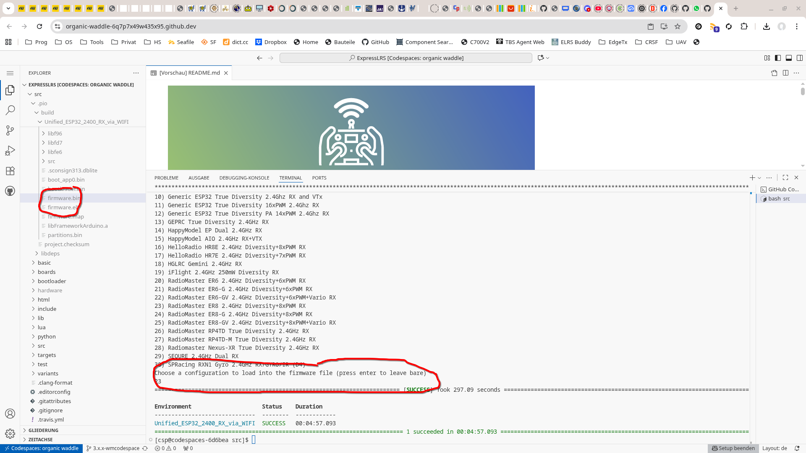

===== Use `gitpod` to compile ExpressLRS (not recommended)

[WARNING]
--
The following information about using `gitpod` is kind of outdated, because `gitpod` changed its name to `ONA` and
now is hidden behind a paywal.
--

To compile this on your own just use `gitpod` and prepend the above `URL` with `https://gitpod.io/#`. 

For the above simply use: https://gitpod.io/#https://github.com/wimalopaan/ExpressLRS/tree/3.x.x-wmaddress[].

[[elrs_compile]]
===== Compilation 

In the terminal area simply type:

[source,console]
----
$ cd src
----

Make sure that the file `user_defines.txt` has the right contents, especially look 
for `\#-DMY_BINDING_PHRASE="default ExpressLRS binding phrase"` and `\#-DRegulatory_Domain_EU_CE_2400`.
Here, remove the first `#` char of these lines and replace the _binding phrase_.

Now, you can start the compilation:

[source,console]
----
$ platformio -c qtcreator run --environment Unified_ESP32_2400_RX_via_WIFI
----

After some minutes you'll be prompted with a menu to choose the desired device configuration:

[source,console]
----
18) RadioMaster ER6 2.4GHz Diversity+6xPWM RX
19) RadioMaster ER6-G 2.4GHz Diversity+6xPWM RX
20) RadioMaster ER6-GV 2.4GHz Diversity+6xPWM+Vario RX
21) RadioMaster ER8 2.4GHz Diversity+8xPWM RX
22) RadioMaster ER8-G 2.4GHz Diversity+8xPWM RX
23) RadioMaster ER8-GV 2.4GHz Diversity+8xPWM+Vario RX
24) RadioMaster RP4-TD True Diversity 2.4GHz RX
Choose a configuration to load into the firmware file (press enter to leave bare)
----

Type in the number, e.g. `18` for a RadioMaster ER6.

After some seconds you can download the file `firmware.bin` out of the correcponding directory, e.g. `src/.pio/build/Unified_ESP32_2400_RX_via_WIFI/` .

[[elrs_arm4]]
==== ELRS4 new arming method for version 3  (Version 3.x.x only)

ELRS version 4 introduces a new arming method: now you can use a switch-based arming instead of a channel-based arming. 

Before the release of ELRS V4 and with ELRS V3 you can use this new arming method with https://github.com/wimalopaan/ExpressLRS/tree/3.x.x-arm4[this] 
based on the version 3 maintenance branch.

To build this version use this URL: https://gitpod.io/#https://github.com/wimalopaan/ExpressLRS/tree/3.x.x-arm4[]

Then follow the steps as decribed under <<elrs-route>>.

[[elrs_perm_arm]]
==== ELRS4 permanent arming (Version 3.x.x only)

[CAUTION]
--
This may only be useful if you have a _PPM_ input to your tx-module.
--

ELRS version 4 introduces a new arming method: now you can use a switch-based arming instead of a channel-based arming. 
This maodification makes the arming permanent. This is useful if you use the _switch mode_ CH16/2 of ELRS. Then you have the
full range of _dynamic power_ (race telemetry isn't of concern here: you can turn telemetry off, since with _PPM_ input
telemetry is useless.

To build this version use this URL: https://gitpod.io/#https://github.com/wimalopaan/ExpressLRS/tree/3.x.x-perm-arm[]

Then follow the steps as decribed under <<elrs-route>>.

[[elrs_sbus_flip]]
==== ELRS, 32-channels and SBus-Output (with channel flipping)

ELRS can use a serial interface (Serial or Serial2) to output SBus data. SBus can (only) transport 16 channels. ELRS therefore outputs
channels 1-16 on this SBus data stream. As this is fully usefull on receiver _without_ PWM outputs, this has the drawback of kind-of doubling
the output of some of the channels 1-16 on the PWM outputs as well.

Additionally, with the <<prop32>> mixer script on the _EdgeTx_ handset, it would be good, if the PWM receiver (maybe with 8, 10,  or 14 pwm ouputs) 
could make use of the additional channels 17-32 instead of doubling all these channels in the SBus output. Therefore this modification enables to select
the upper set of channels (17-32) to be outputted on the SBus.

To enable the flipping and sending the channels 17-32 one must install the mixer-script `crsfch.lua` (see https://github.com/wimalopaan/LUA/tree/main/SCRIPTS/MIXES[]) 
and then set the value of the `Flags` input of the mixer-script to `1` (say, set the `bit0` of the value).

See also: <<elrs_sumdv3>>.

To build this version use this URL: https://gitpod.io/#https://github.com/wimalopaan/ExpressLRS/tree/3.x.x-wmchanext[]

Then follow the steps as decribed under <<elrs-route>>.

[[elrs_sumdv3]]
==== ELRS, SumDV3 and MultiSwitch 

The stock ELRS can output 16 channels via `SumD`, but not via `SumDV3`. `SumDV3` has several advantages over `SumDV1`: it can transport 32 proportional channels 
and 64 binary switches. 

This modification implements `SumDV3` _and_ implements the MutliSwitch-Protocol as described in <<crsf-sw>> and used in <<elrs_msw>> and  <<msw_widget>>.

It works as follows:

* the ELRS receiver running this modification maintains the state of 64 _binary_ switches,
* as usual, it maintains the state of 16 RC-channels,
* setting one of the serial interfaces (_serial_ or _serial2_) to `SumDV3`, it outputs the 16 RC-channles _and_ the state of the 64 binary switches,
* to set/reset a switch the EdgeTx radio has to run the <<msw_widget>>,
* this widget must be configured to use the addresses `240`, ..., `247` (attention: these are the logical _switch_ addresses, _not_ the device `CRSF`-address, so that the first 8 switches are reachable on the address `240`, the next octett of switches on the address `241` ... until the last octett on the address `247`)

Additionally in combination with <<prop32>> the `SumDV3` can use _all_ of the 32 rc channels. For this to happen one has to use the `crshch.lua` mixer script (see above). This mixer script has 
also the option to flip the channel groups 1-16 and 17-32 in the `SumDV3` output (use case: see below).

This modification is ideal to use in combination with e.g. the USM-RC-3 (Fa. Beier: https://www.beier-electronic.de/modellbau/produkte/usm-rc-3/usm-rc-3.php[]). 
The minimal setup is to use a tiny receiver like a Radiomaster RP1/RP2 or RP3, and connect this (only the TX-line of the serial-interface of the receiver is needed) to the USM-RC3 (Port X2/8). 
The USM-RC3 can output 4 (of the 32) RC-channels and use all of the 64 switches. 

Sadly, the USM-RC-3 can only make use of 16 channels (1-16) of the `SumDV3` input. This limitation can be circumvented if you flip the channel groups 1-16 and 17-32 using the above mentioned
mixer-script `crsfch.lua` and setting `bit1` of the flags (use value `2` in the mixr-script options).

To build this version use this URL: https://gitpod.io/#https://github.com/wimalopaan/ExpressLRS/tree/3.x.x-wmsumdv3[]

Then follow the steps as decribed under <<elrs-route>>.

[[elrs_pwm_msw]]
==== Use an ELRS PWM-receiver as MultiSwitch

Every stock `pwm` receiver can output binary on/off signals or [0%;100%] duty-cycle pwm signals. The former is useful to switch light loads (up to 10mA) on and off, where the latter is useful to pwm modulate the output
according to the correcpondig channel input. Both outputs can be used to control a logic-level MosFET to switch higher loads.

It is a bit unsatisfactory to use a normal rc channel (one of the 16 channels ELRS transports) to control the binary on/off output of a pwm-receiver. 
This modification implements the MutliSwitch-Protocol as described in <<crsf-sw>> and used in <<elrs_msw>> and  <<msw_widget>>, so that it can be used for the switching of the outputs.

It works as follows:

* the ELRS receiver running this modification maintains the state of as many binary switches the receiver outputs has.
* to set/reset a switch the EdgeTx radio has to run the <<msw_widget>>,
* this widget must be configured to use the address `240` (and `241` if it has more than 8 outputs) (attention: these are the logical _switch_ addresses, so that the first 8 switches are reachable on the address `240`, the next octett of switches on the address `241`) 
* on the receiver the outputs must be set to `on/off` mode
* as soon as the receiver gets data from the widget, the `on/off` mode outputs are controlled via the widget and not by the rc channel values anymore.

Additional for receivers with WS2812B external socket:

On switch address(es) `248` (up to `255`) one can set WS2812 RGB leds. For this to happen one has to increase the number of configured rgb leds in the `hardware.html` configuration. 
This normally duplicated the internal led color to the externally connected leds.

If you use the _MultiSwitch-Widget_ <<msw_widget>> you can reach these leds using address `248` and following. You can also set the color of these leds via the multiswitch widget.

To build this version use this URL: https://gitpod.io/#https://github.com/wimalopaan/ExpressLRS/tree/3.x.x-wmswitch[]

Then follow the steps as decribed under <<elrs-route>>.

[[elrs_combined]]
==== Combined ELRS modifications

If you want to use an ELRS firmware with all the following modifications

* <<elrs-route>>, 
* <<elrs_arm4>>, 
* <<elrs_sumdv3>>
* <<elrs_sbus_flip>>
* <<elrs_pwm_msw>>

you can use this branch: https://github.com/wimalopaan/ExpressLRS/tree/3.x.x-wmaddress-arm4-sumdv3-chanext-switch[].

To build this version use this URL: https://gitpod.io/#https://github.com/wimalopaan/ExpressLRS/tree/3.x.x-wmaddress-arm4-sumdv3-chanext-switch[]

Then follow the steps as decribed under <<elrs-route>>.

[[elrs_v4]]
==== ExpressLRS V4

===== Multiple CRSF devices connected to a receiver

ExpressLRS V4 contains a _full_ implementation of the CRSF protocol. This means, that it can handle all valid CRSF (extended) addresses and route them accordingly. I recognises which devices are connected 
to which CRSF endpoints. The serial interfaces of a receiver act as an endpoint as well as the RF-transmitter (over-the-air endpoint) inside the receiver. it is crucial that all connected devices 
have _different_ CRSF addresses.

Please note, that the standard physical layer of CRSF is _not_ a bus! The standard CRSF is a _point-to-point_ protocol. Therefore, you can connect at most _one_ external device to a serial interface of the receiver.

If you want to connect more than on CRSF device, you have to use different serial interfaces of the receiver. Usually, all PWM-receiver can define an additional serial interface using two (CRSF is bidirectional and use rx and tx lines) 
of the pwm-outputs. There exist also non-pwm receiver like the _Radiomaster XR2_ that comprise two serial interfaces.  

To use more than _one_ external CRSF devices on the _same_ serial interface of a receive, you have to use a CRSF switch/router (see <<crsf-switch>>).  

== Projects

The following chapters describe some of my active projects. The majority of my former projects (see <<Old.adoc#, Old>> (in german)) are
in a frozen state now. This is due to the fact that I completely shifted the µCs from the AVR-family (DA, DB, tiny1/2) to the more powerful 
STM32-family, mainly the STM32G4xx and STM32G0xx. These have enough computing resources for the <<sdr>> project, which would have been impossible sticking to 
the AVRs. And the G0xx also have enough internal peripheral to comfy realize all that crazy rc stuff.

Well, there is one exception: the <<corona>>.

[[trademark]]
=== Logo

Despite the fact that I publish all my projects as open-hardware (mostly CC licensed) and open-source (most GPLV3 licensed)
I use the floowing _logo_ on the physical projects.

.Logo (License of the logo: https://creativecommons.org/licenses/by-nc-nd/4.0[CC BY-NC-ND 4.0]) (click to enlarge)
image::images/logo/Logo.png[width=240, link="images/logo/Logo.png"]

[[gitpod_wm]]
=== Compiling the source code for the following projects

The source code for all projects described in the following sections (if any) is located in this github repositoty: https://github.com/wimalopaan/wmucpp[]. 
I you want to self-compile the source into a piece of firmware that you can flash onto the µC, you have to clone the repository. 
To be able to compile the source code you have to have a developement environment with all the compilers and libraries as well as all 
other needed tools. As I usually only use _Linux_ systems to do my day to day work, the developemnt also takes place on _Linux_ systems. 
To be clear: I don't care of other plattforms like Windows or MacOs. And therefore the build process is tested only on _Linux_ systems that are 
setup like my personal developement systems. This would require that interested users should use an https://archlinux.org[Arch Linux] system
with all the 3rd-party stuff in the right place. Clearly, this is a real burden for the average user und will limit the amount of
people being able to use all the stuff.

[[cs_wm]]
==== Using `github` CodeSpaces 

To use the `github` _codespaces_ service first of all you need a valid `github` account. So, go ahead and create one ;-) 

The next step is that you create and open a new _codespace_. This is fairly simple: got to the code repository https://github.com/wimalopaan/wmucpp[] 
and then click on `Code (green button) --> Tab: Codespaces -->  Button: Create (green)`.

.Steps to create a `github` codespace: step 1
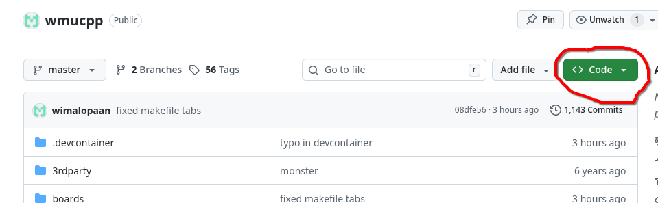

.Steps to create a `github` codespace: step 2
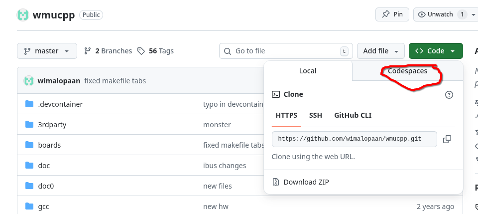

.Steps to create a `github` codespace: step 3
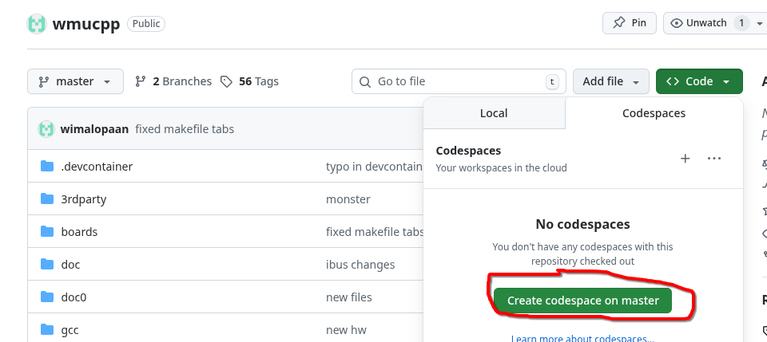

After waiting some time (up to some minutes) you'll see the following interface:

.`github` codespace: main view (vscode)
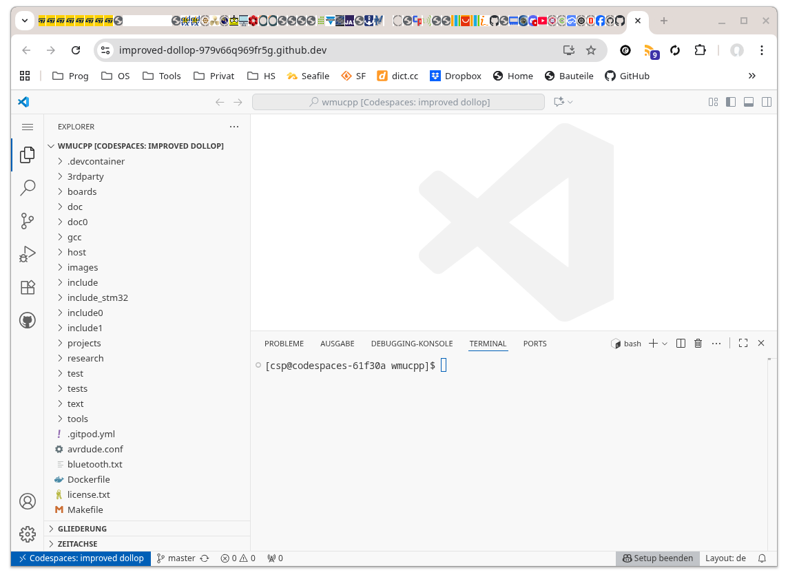

Now you want to change the directory of the `terminal` (shell)  to the directory of the project you want to compile the code for. The following
example shows the steps for compiling the _RC-MultiSwitch-E-32_, which is located in the directory `/workspaces/wmucpp/boards/rcmultiswitchG030`.
So you have to type in the command `cd boards/rcmultiswitchG030` (because the shell already starts in the directory `/workspaces/wmucpp`.

.Navigating to the right place in the terminal
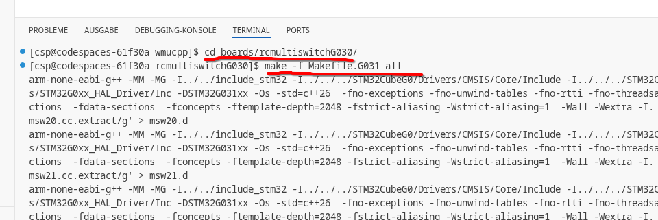

In most cases you need to change some settings in some of the code files (see description of the projects below). So, open the appropriate file 
in the editor by navigating to the same directory in the left side-bar and then clicking on the file to modify: here `msw30.cc`.

.Open a project file in the editor
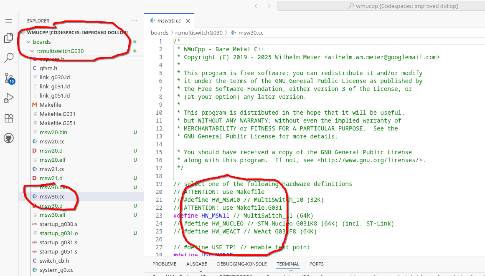

After _saving_  the changes to one or more files you can start the compiling: in most cases this is the command `make all`, but in some rare cases
you have to specify the right _makefile_ for the `make` tool. So, in this case, because we want to generate code for the STM32G031 we have to 
use the makefile `Makefile.G031` (see also project description for details).

.Starting the compilation
[source, console]
----
[cs@codespaces-qwazx8g1drv rcmultiswitchG030]$ make -f Makefile.G031 all
----

After a few seconds you (hopefully) get a fresh generated binary file containing the desired firmware. In this case we get the files `msw30.bin`  and `msw30.elf`.
You can use the command `ls` to list the contents of the whole directory where find the new files:

.Result of the compilation
image::images/gc/wm_gc6.png[width=240, link="images/gc/wm_gc6.png"]

You also find the firmware binary file in the left side bar of the UI.

.Result of the compilation in the left side bar

The last step now is to download the files: please right-click onto the file and select download.

Afterwards you you favorite STM32 programmer to flash the firmware to you µC.

==== Using `gitpod` (not recommended)

[WARNING]
--
The following information about using `gitpod` is kind of outdated, because `gitpod` changed its name to `ONA` and
now is hidden behind a paywal.
--

The much more convinet solution to all this is https://gitpod.io[] (see also <<edgetx_custom>>).

So, just use the following URI to get a fully setup developement environment: https://gitpod.io/#https://github.com/wimalopaan/wmucpp[].

After some (ten) minutes of initializing you'll get a `vscode` like workspace. In the lower thrid of this workspace you'll see 
a command line interface.

.Example terminal and changing directory to the RC-Multiswitch-E
[source, console]
----
[gitpod@wimalopaan-wmucpp-qwazx8g1drv wmucpp]$ 
[gitpod@wimalopaan-wmucpp-qwazx8g1drv wmucpp]$ cd boards/
[gitpod@wimalopaan-wmucpp-qwazx8g1drv boards]$ cd rcmultiswitchG030/
[gitpod@wimalopaan-wmucpp-qwazx8g1drv rcmultiswitchG030]$ ls
Makefile   devices.h    link_g030.ld  msw02.cc  msw04.cc  msw06.cc  msw08.cc  msw10.cc  msw12.cc  msw99.cc        system_g0.cc
adapter.h  devices_2.h  msw01.cc      msw03.cc  msw05.cc  msw07.cc  msw09.cc  msw11.cc  msw20.cc  startup_g030.s  todo.txt
[gitpod@wimalopaan-wmucpp-qwazx8g1drv rcmultiswitchG030]$ 
----

The source code for a specific project is located in `boards/<name>`, where `<name>` is the appropriate _name_ for that project. You find
this info / name in the follwing chapters for each project.

After navigating to the specific directory you just need to type: `make all`

.Compiling the source code for the RC-Multiswitch-E
[source, console]
----
[gitpod@wimalopaan-wmucpp-qwazx8g1drv rcmultiswitchG030]$ make all
----

After a couple of seconds the _prompt_ returns and you can list the newly created contents via the command: `ls` or `ls -l`.

.Listing the contents of the directory for the RC-Multiswitch-E
[source, console]
----
[gitpod@wimalopaan-wmucpp-qwazx8g1drv rcmultiswitchG030]$ ls
Makefile   devices_2.h   msw01.d   msw03.cc  msw04.d   msw06.cc  msw07.d   msw09.cc  msw10.d   msw12.cc   msw20.cc   msw99.cc        startup_g030.s  system_g0.o
adapter.h  link_g030.ld  msw02.cc  msw03.d   msw05.cc  msw06.d   msw08.cc  msw09.d   msw11.cc  msw12.d    msw20.d    msw99.d         system_g0.cc    todo.txt
devices.h  msw01.cc      msw02.d   msw04.cc  msw05.d   msw07.cc  msw08.d   msw10.cc  msw11.d   msw20.bin  msw20.elf  startup_g030.o  system_g0.d
[gitpod@wimalopaan-wmucpp-qwazx8g1drv rcmultiswitchG030]$ 
----

In this specific case you find the new created file `msw20.bin` which is exactly the firmware file you want to flash onto the µC. 
You can download the file using the menu-bar on the left: navigating to the very same directory and right-clicking on this file gives you 
the chance to download that file.

Enjoy ;-) 

[[corona]]
=== Corona RP8D1 replacement firmware

The `Corona RP8D1` receiver come into several flavors, for the 35MHz band, the 40MHz and the 72MHz band (afaik). 
The reason for giving a substantial amount of time to develop a new firmware for this receiver is the fact that I am
_hoarding_ vintage electronic RC stuff. Unfortunately some of this gear wasn't working anymore. In the process of 
reworking these things I needed a good receiver and I decided to get a scan-receiver without external crystals. But it turns out
that the mostly helpful signal filtering of the `Corona` receiver makes the situation worse if one tries to use these multi-channels
s in the transmitters. These encoders produce a time-multiplex over one RC channel, and the correspondant decoder
isn't capable decoding the time multiplex if the receiver modifies / filters the impulse durations. So, the project started ;-) 

There is an extra repositoty https://github.com/wimalopaan/CoronaRP8D1[] for this project.

For ease of compilation I've added a gitpod: https://gitpod.io/#https://github.com/wimalopaan/CoronaRP8D1[]

[[varioprop]]
=== Renewed mainboard for some (old) 27/35/40MHz RC transmitters

As you can see in <<gr_txs>> or <<rb_txs>> I own some old, vintage RC transmitters. As of this writing some of them are more than 40 years old.
The majority of them does kind of work, but due to aging of the components the do not meet the RC criteria of the RF regulations in the EU.

But there are also some other shortcomings with these old transmitters:

* to change the rf channel one has to change the quarz in the transmitter.
** quarzes are very expensive nowadays
** if not using receivers with quarzes, scan-receivers are ubiquous (see also <<corona>>) and they don't need a quarz
* With the exception of the Robbe/Futaba F-14 most of them are not capable of having switches together with a switching encoder
* They don't have features like mixers, trainer ...

All this lead to the idea to design a new mainboard not only for the Robbe/Futaba F14, but also for the yellow, red and black Graupner/Grundig
Varioprop series of transmitters. 

The first attempt was to make a new mainboard for the yellow Varioprop S8. This mainboard uses a small µC `atmega324pb` to sample the potentiometers 
of the handset and produce a `ppm`-signal, which was fed into a FrSky DHT 2.4GHz module. This worked quite well but felt a bit like abusing the
old yellow Varioprop, which is very cool stuff nowadays (in germany). Actually the attempt is undocumented.

The next attempt was to design a kind of relais-station to transform the 2.4-GHz FrSky ACCST into FM-FSK-40MHz. I thought this to be a cool idea
because this relais-station could (in theory) used by more than one pilot / captain. The main reason was to re-use a modern 
transmitter with all its features like mixers and other cool stuff for the 40MHz band. But then came Corona (the disease, not <<corona>>) ... 

I learned a lot about rf electronics in the sub-GHZ range and this was great fun, so I decided to design something that would combine 
all the features I played with in the previous versions.

This lead to the actual design ...

==== The new mainboard

The mainboard comes as pcb that coul be easily adapted to the three form factors for the

* Robbe/Futaba F-14 (see <<robbe_f14>>)
* yellow Graupner/Grundig Varioprop 8S (see <<varioprop_yellow>>)
* red/black Graupner/Grundig Varioprop (see <<varioprop_red>> and <<varioprop_black>>)

The mainboard 

* handles up to 8 analog inputs (usually the potentiometers of the handset)
* has a 100mW rf module (27/35/40 MHz)
* uses the analog gauge as an accu monitor
* has a beeper
* has a I2C-connector to use with up to two switches-boads with 8 3pos-switches each
* has a bluetooth (BLE) module
* has an ELRS module (to be used as receiver or transmitter)
* can switch channels via BLE or ELRS
* has a free uart for further s

===== Previous versions of the new mainboard

There have been some iterations for the design of the new mainboard though. In the following you see
the last iteration: this one really works, but has some design flaws that I'm actually in process of fixing ;-) 

.The new mainboard populated, but with many design problems (click to enlarge)
image::variopropng/board3.jpg[width=240, link="variopropng/board3.jpg"]

.The new mainboard inside an old VarioProp case (click to enlarge)
image::variopropng/incase1.jpg[width=240, link="variopropng/incase1.jpg"]

In <<VarNG02>> you see the schematic. Aside from some minor flaws there is one major issue with this board: the generation 
of the frequency-shift-signal! As you see in the schematic the `Si5361` genarates two rectangular signals, one with the `space`
frequency _f0_ on `CLK0` and one with the `mark` frequency _f1_ on `CLK1`. Thereafter a `74LVC1G157` is used to switch between
these two frequencies with the `cppm` signal. 

Although this appears to work there are very serious problems! (Do not use this part of the schematic in your projects.)

A little bit of theory: the switching between these two signals can be seen as a convolution of each signal 
(each itself a _si()_ signal in the frequency domain) with another according _si()_ signal (the cppm rectagular signal in the time domain) 
and then added together. This produces two main problems:

* The switching in the time-domain witch a rectangular signal or convolution in the frequency domain of two _si()_ function results in a very broad spectrum (see <<hardsw>>).

* Additionally the switching is not synchronized with the base signal, so there are additional short-term pulses and therefore broad fequency components.

It turns out that this renders the rf part unusable, because several conventional receivers were not able to decode the signal if the signal strength goes down. 
And clearly this was not acceptable.

[[VarNG02]]
.Schematic of Version 2 (click to enlarge)  
image::variopropng/VariopropLargeNG02_SCH.PNG[width=240, link="variopropng/VariopropLargeNG02_SCH.PNG"]

Well, although I was aware of this problem from the beginning I didn't think that the negative impact was as this huge!

I looked around and I found some `27MHz` VCXO (voltage controlled crystal oszillator) with an appropriate pulling range up to 100ppm. This looks quite reasonable: the µC could generate the cppm signal 
with some exponential (gaussian) roll-on / roll-off via its DAC. The VCXO clock signal is the used as the input for the SI5351. And the SI5351 simply generates the desired output
frequency from the modulated clock signal. I made several test with different roll-on / roll-off curves and found that an exponential gives the best results with respect 
to the smallest frequency sprectrum of the resulting rf signal. Very good (see <<gausssw>>).

The roll-on / roll-off via DAC of the µC (STM32G431) is easily realized via timer-triggered DMA to the DAC for each pulse-edge of the cppm signal.

All modifications are now in <<VarNG03>>.

[[VarNG03]]
.Schematic of Version 3 (click to enlarge)  
image::variopropng/VariopropLargeNG03_SCH.PNG[width=240, link="variopropng/VariopropLargeNG03_SCH.PNG"]

[[VarNG03pcbtop]]
.PCB top (click to enlarge)  
image::variopropng/VariopropLargeNG03_PCB_top.PNG[width=240, link="variopropng/VariopropLargeNG03_PCB_top.PNG"]

[[VarNG03pcbbot]]
.PCB bottom (click to enlarge)  
image::variopropng/VariopropLargeNG03_PCB_bot.PNG[width=240, link="variopropng/VariopropLargeNG03_PCB_bot.PNG"]

As said above the main reason for this version was the problematic rf signal generation part, but there are other modifications:

* new rf signal generation part to produce way better spectral results
* additional I2C interface (in total now two interfaces)
* on/off switching of the ELRS
* circuit to reduce rf power
* simplified power switching for submodules

This version is actually under test.

[[hardsw]]
.Spectrum when hard-switching the frequencies (click to enlarge)  
image::variopropng/hard_switch.png[width=240, link="variopropng/hard_switch.png"]

[[gausssw]]
.Spectrum when using gaussian roll-on  / roll-off (click to enlarge)  
image::variopropng/gauss.png[width=240, link="variopropng/gauss.png"]

[[f14spec]]
.Spectrum Futaba F14 (click to enlarge)  
image::variopropng/F14spec.png[width=240, link="variopropng/F14spec.png"]

[[grspec]]
.Spectrum Graupner 40MHz JR module (click to enlarge)  
image::variopropng/GrModulSpec.png[width=240, link="variopropng/GrModulSpec.png"]

==== The new switches-board

The switches board is very simple: it is connected via `I2C` to the main board. And it can be cascaded.

.Schematic (click to enlarge)
image::variopropng/F14Switches01_SCH.PNG[width=240, link="variopropng/F14Switches01_SCH.PNG"]

.PCB (click to enlarge)
image::variopropng/F14Switches01_PCB.PNG[width=240, link="variopropng/F14Switches01_PCB.PNG"]

.Two switches boards connected to the new mainboard (click to enlarge)
image::variopropng/switches.jpg[width=240, link="variopropng/switches.jpg"]

==== Remote control the remote control via BlueTooth

.RoboRemo App Interface (click to enlarge)
image::variopropng/robo1.png[width=240, link="variopropng/robo1.png"]

.RoboRemo App Interface conncting to the new mainboard via BLE (click to enlarge)
image::variopropng/robo2.png[width=240, link="variopropng/robo2.png"]

==== Inside the housing

tbd

[[sdr]]
=== SDR RC receiver for 27/35/40MHz

My most ambitious project. The origin is also in <<corona>>. The goal is to design a SDR as a I/Q-mixer (tayloe-mixer) with zero-IF and a STM32G431 doing all
the DSP stuff.

Actually, this works for ppm/pcm-modulation in the near field of the transmitter. 

Remaining problems are sensitivity and AGC.

There is no documentation yet.

[[x12s_touch]]
=== Touch-Screen for the FrSky X12S

In my opinion the `FrSky X12S` is a very well designed and high-quality RC transmitter. Together with https://edgetx.org[EdgeTx] this is unbeatable.
The only drawback is, that it has no touch-screen. I managed to modify https://edgetx.org[EdgeTx] and the hardware to get the same touch-LCD as with the 
RadioMaster TX16S working inside the X12s.

The software modifications are in mainline https://edgetx.org[EdgeTx] (no need to patch or modify) and the hardware modification is described in an extra 
document: {ddir}/rc/touch.html[X12S touch]

For better mounting the FPC/FFC-cable adapter, there is a printable adapter: https://www.printables.com/model/1342784-frsky-horus-x12s-touch-screen-mod-fpc-6p-05mm-adap[]

Video: https://www.youtube.com/watch?v=BhzwIHQNJnw[Demo]

=== Modification of an old Graupner / JR 40MHz transmitter RF modul for use in e.g. a Radiomaster TX16s / FrSky X12S/X9e or similar

Modern handsets with a JR-like module bay provide a `cppm`-signal and battery-voltage on the pins of the connector. 
Therefore it must be possible to use an old vintage _Graupner JR 40MHz_ quarz transmitter module together with an old 40MHz quarz receiver.

The good news are: yes, it is possible. *But* ...

[CAUTION]
--
It is tempting to place an old 40MHz JR module into the module bay of a modern handset. 

Please: *don't do this!!!*

You can damage your handset!
--

.Some old vintage 40MHz transmitter modules
image::rc/jr_old/mods.jpg[width=240, link="rc/jr_old/mods.jpg"]

.After the modification
image::rc/jr_old/jpt12_3.jpg[width=240, link="rc/jr_old/jpt12_3.jpg"]

For the full story, please follow this link:rc/jr40mhz.html[Howto (german)]

=== Brushed DC-motor controller with sensorless measurement of rotational speed

Features:

* SBus(2)/IBus/SumDV3 serial input
* SBus2/S.Port/IBus/Hott telemetry
* PPM-Input
* serial terminal configuration interface
* telemetry
** supply voltage
** motor current
** motor temperature (sensor needed)
** motor rotational speed (*no* sensor)

==== Rotational speed measurement

A bit of theory ...

tbd

==== Version 1: max. 8A / 36V

The smaller one of the two versions comes as one _pcb_.

[[bdc_S_sch]]
===== Schematic and PCB

.Schematic (Version 1) (click to enlarge)
image::bdc/BDC_ESC_G431_02_SCH.PNG[width=240, link="bdc/BDC_ESC_G431_02_SCH.PNG"]

.PCB (Version 1) (click to enlarge)
image::bdc/BDC_ESC_G431_02_PCB.PNG[width=240, link="bdc/BDC_ESC_G431_02_PCB.PNG"]

If you use _Target 3001_ as your EDA: link:bdc/BDC_ESC_G431_02.T3001[Target 3001 design file].

===== Images

.BDC (Version 1) (click to enlarge)
image::bdc/bdc_S_1.jpg[width=240, link="bdc/bdc_S_1.jpg"]

.BDC (Version 1) (click to enlarge)
image::bdc/bdc_S_2.jpg[width=240, link="bdc/bdc_S_2.jpg"]

.BDC (Version 1) (click to enlarge)
image::bdc/bdc_S_3.jpg[width=240, link="bdc/bdc_S_3.jpg"]

.BDC (Version 1) (click to enlarge)
image::bdc/bdc_S_4.jpg[width=240, link="bdc/bdc_S_4.jpg"]

==== Version 2: max. 50A / 36V

The bigger one of the two versions consists of two pcbs, one pcb for the µC module and one pcb for the power module.
Both are connected via two pin-header or the can be soldered directly back-to-back with one layer of capton-tape in between.

===== µC module

.Schematic µC module (Version 1) (click to enlarge)
image::bdc/BDC_ESC_mC_Module_01_SCH.PNG[width=240, link="bdc/BDC_ESC_mC_Module_01_SCH.PNG"]

.PCB µC module (Version 1) (click to enlarge)
image::bdc/BDC_ESC_mC_Module_01_PCB.PNG[width=240, link="bdc/BDC_ESC_mC_Module_01_PCB.PNG"]

If you use _Target 3001_ as your EDA: link:bdc/BDC_ESC_mC_Module_01_PCB.T3001[Target 3001 design file].

===== Power module

.Schematic power module (Version 1) (click to enlarge)
image::bdc/BDC_ESC_PWR_Module_01_SCH.PNG[width=240, link="bdc/BDC_ESC_PWR_Module_01_SCH.PNG"]

.PCB power module (Version 1) (click to enlarge)
image::bdc/BDC_ESC_PWR_Module_01_PCB.PNG[width=240, link="bdc/BDC_ESC_PWR_Module_01_PCB.PNG"]

If you use _Target 3001_ as your EDA: link:bdc/BDC_ESC_PWR_Module_01_PCB.T3001[Target 3001 design file].

===== Images

.BDC (Version 2) (click to enlarge)
image::bdc/bdc_L_1.jpg[width=240, link="bdc/bdc_L_1.jpg"]

.BDC (Version 2) (click to enlarge)
image::bdc/bdc_L_2.jpg[width=240, link="bdc/bdc_L_2.jpg"]

.BDC (Version 2) (click to enlarge)
image::bdc/bdc_L_3.jpg[width=240, link="bdc/bdc_L_3.jpg"]

.BDC (Version 2) (click to enlarge)
image::bdc/bdc_L_4.jpg[width=240, link="bdc/bdc_L_4.jpg"]

[[escape32]]
=== ESCape32: firmware for a familiy of small/medium BLDC motor controller (brushless ESC)

`ESCape32` is a firmware for a family of brushless motor controller sharing a common design (originated in the _BLHeli_-project). 
One of the most outstanding feature of `ESCape32` is the possibility to use serial input (SBus(2), CRSF, ...) and telemetry. A markable 
feature ist the `Sbus2` protocoll, than combines control and telemetry data via one half-duplex line.

https://github.com/wimalopaan/ESCape32[ESCape32]

.ESCape32
image::bldc/escape32/escape32_1.jpg[width=240, link="bldc/escape32/escape32_1.jpg"]

[[vesc]]
=== V/ESC: the ultimate firmware for medium/big BLDC motor controller (brushless ESC) 

Clearly, _V/ESC_ is the king. The firmware provides sensorless FOC, that gives us full torque from *zero* RPM and silent motor 
operation. This comes together with an incredible configuration software.

Unfortunately the `V/ESC` project has only an analog PPM input, but no SBUS/IBUS/SumDv3 serial input. 

This modification introduces a serial, half-duplex connection using the V/ESC serial commands for the FlipSky hardware:

Half-Duplex Modification https://github.com/wimalopaan/bldc/tree/master[VESC]

[[elrs_jr]]
=== JR-module-bay adapter for ELRS receiver as transmitter

==== Using ELRS receivers as transmitter-modules

Since the differences between ELRS receivers and transmitters (well: both are transceivers and the differences are mostly in transmit-power) are
marginal, one can use every ELRS receiver as a transmitter. Of course, you have to flash a different firmware to it.
See <<elrs_esp8285>> and <<elrs_esp32>> for the correct setting in `expresslrs-configurator`.

[CAUTION]
--
Don't expect the range to be more than 1km. Please test before going to the field (or lake or sea)!
--

==== ESP8285-based receivers

The small receivers based upon the `ESP8285` are very well suited to either placed inside the handset or to the used 
mounted inside a typical _JR-bay module_.

But they have two (not so major) drawbacks: 

* they allow only _univerted_, _full-duplex_ serial communication
* they need regulated 5V as power source

If you want to use this kind of receiver as an _external module_ it is neccessary to

* uninvert and split the _inverted_, _half-duplex_ serial signal out of the _S.Port_ connector in the module bay
* produce a regulated 5V out of the unregulated battery voltage out ouf the module bay connector.

A special case is the _FlySky-I6X_ handset: here you get an uninverted, half-duplex serial, that can simply be converted 
to the full-duplex of the ESP8285-based rx-as-tx.

* on OpenI6X uninverted mode ist compile-time option

[[elrs_esp8285]]
.ELRS firmware selection for ESP8285 based receivers
image::elrs/rx_as_tx.png[width=480]

==== ESP32 and ESP32C3-based receivers

Instead of the small / simple ESP8285-based receivers you can also use the ESP32 or ESP32C3-based (since ELRS 3.6) receiver (e.g. TuneRC Nano RX/PA). 
Fortunately the are capable of inverting the serial polarity ond also to use half-suplex on one (tx) pin. Therefore, they can directly 
connected to the _S.Port_ connector-pin.

[CAUTION]
--
Please check that to supply voltage you use from the JR-bay of your handset is no more than 5V.

Please check that the max. voltage of the serial signal on the _S.Port_ connector is no more than 3.3V (or that it uses an open-drain circuit, since the receiver uses a pull-up resistor on that line).
--

===== Using `expresslrs-configurator` to flash an ESP32/C3 receiver as a transmitter

As of version `v1.7.7` of the `exprexxlrs-configurator` it is fairly easy to flash an Rx as Tx. 

Please select the correct categorie and type of actual device (e.g. TuneRC 2.4GHz and TuneRC 2.4G nano PA RX, please refer to <<elrs_esp32>>) and select 
under compatibility options to use the receiver as transmitter (TX). Normally you would use the receiver in the external module bay of the handset, so select
`external`, but if you want to use to receiver as internal module select `internal` (this comes into place e.g. if you change the internal module of a e.g. 
FrSky X12S, see <<elrs_x12s>>).

Please be sure to check the `force` option. This is because when in comes to the flashing procedure the receiver itself identifies as _receiver_ and normally refuses to accept
the tx firmware.

Please be sure to select an ELRS version above or equal 3.4 for ESP32-based receivers and an ELRS version above or equal 3.6 for ESP32C3-based receivers. 

[[elrs_esp32]]
.ELRS firmware selection for ESP32 / ESP32C3 based receivers
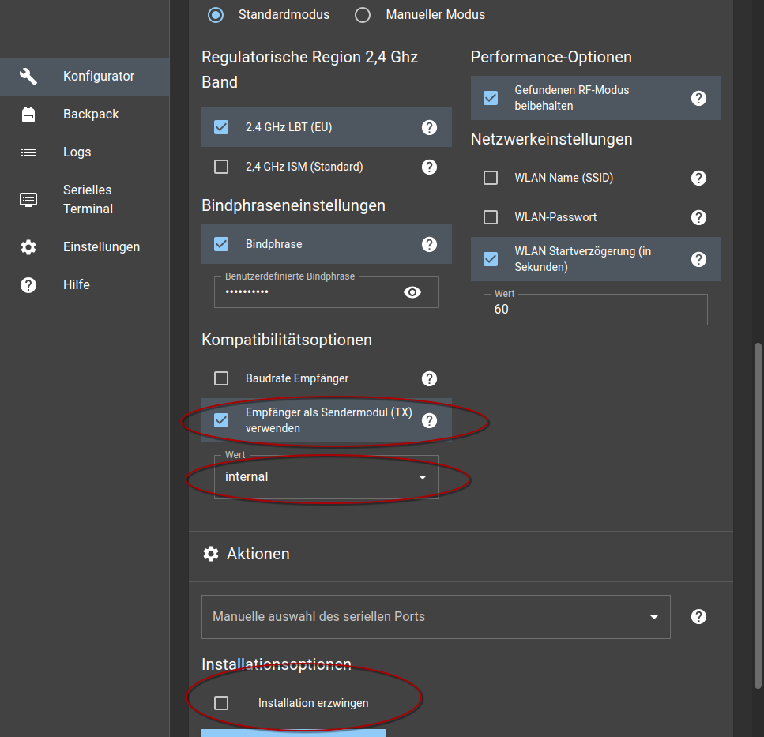

After flashing the receiver starts blinking _yellow_ if it does not receive a CRSF signal. If it gets a signal, it changes to _blue heartbeat_, and when it connects, it changes 
to _steady blue_.

[TIP]
--
As a side benefit, the ESP32 / ESP32C3 based receivers are also capable of _PPM_ input. They _autodetect_ if they get a serial or ppm signal.
So, this is super handy to renew an old handset.
--

===== Using `platformio` `cli` to flash an ESP32/C3 receiver as a transmitter

If you want to do the same without the `expresslrs-configurator` and use raw `paltformio` for the same purpose (maybe because you want to use the <<elrs-mods>> 
or other foreign github-repo or special PRs) then you have to do the follwoing steps:

* power-up the receiver into wifi-mode and connect
* save the hardware-definition: browse to http::/10.0.0.1/hardware.json and save it to a local file
* compile and flash the firmware (see also <<elrs-mods>>): `platformio run --environment Unified_ESP32C32_2400_TX_via_WIFI --target=uploadforce`. 
* restore the hardware-definition: browse to http::/10.0.0.1/hardware.html and upload the previously saved hardware-definition
* change the hardware-definition: the `serial-rx` and `serial-tx` pin numbers must be the same (half-duplex), use the appropriate connection that you want to use in your adapter
* save the changed hardware-definition and reboot the rx

You are done!

===== Outdated information

Instead of the small / simple ESP8285-based receivers you can also use the (slightly larger) ESP32-based receiver (e.g. BetaFPV SuperD). 
Fortunately the are capable of inverting the serial polarity ond also to use half-suplex on one (tx) pin. Therefore, they can directly 
connected to the _S.Port_ connector-pin.

Pleas be aware, that you now have to use a special firmware (`gemini`), see <<elrs_esp32>>.

In the hardware-config (wifi) you can now:

* disable gemini mode
* use inverted serial on one (tx) pin 

For more detals see this https://github.com/ExpressLRS/ExpressLRS/pull/1914[PR].

// [[elrs_esp32]]
.ELRS firmware selection for ESP32 based receivers
image::elrs/rx_as_tx2.png[width=480]

==== JR-Module-bay adapter

The communication between the handset and the tranceiver-module inside the JR-module bay takes place over 
`CRSF` / half-duplex serial protocol. The main difficulty here is that for historic reasons the polarity of the 
physical layer is inverted, so the idle level is low (0V) instead of high (3.3V) as normal. The `ESP8285` based boards
aren't capable of processing inverted serial signals. 

The next culprit is that there is no 5V regulated voltage on the pins of the module bay, but the ELRS receiver boad needs
5V regulated voltage.

Due to this fact it would be most convenient to have a adapter, that

* produces the regulated 5V out of the main battery voltage of the handset,
* uninvertes the inverted serial data, and
* splits the half-duplex connection into a seperated full-duplex one.

If you are interested in the pinout of the module bay, see: https://www.expresslrs.org/quick-start/transmitters/tx-prep[pinout]

[[jr_elrs_sch]]
.The schematic (click to view in full-scale)
image::elrs/jr/JR-ELRS_SCH.PNG[width=240, link="elrs/jr/JR-ELRS_SCH.PDF"]

[[jr_elrs_pcb]]
.The PCB (click to view in full-scale)
image::elrs/jr/JR-ELRS_PCB.PNG[width=240, link="elrs/jr/JR-ELRS_PCB.PDF"]

[[jr_elrs_target]]
If you use _Target 3001_ as your EDA: link:elrs/jr/JR-ELRS.T3001[Target 3001 design file].

In <<jr_elrs_la>> you see a logic-analyser trace of the `rx` and `tx` serial signal as they appear
at the ELRS-receiver. So, they are in normal polarity. 
Please not, the the sent bytes at the `tx` do not appear at the `rx`-pin: no local echo. This is 
suppressed by the circuit.

[[jr_elrs_la]]
.Signals from the ELRS receiver (click to view in full-scale)
image::elrs/jr/LA1.png[width=240, link="elrs/jr/LA1.png"]

==== Assembling

The assembling is straight forward, all components are placed on one side. Please refer to the <<jr_elrs_target>>.

.The unpopulated pcb and the empty box (click to enlarge)
image::elrs/jr/a.jpg[width=240, link="elrs/jr/a.jpg"]

.The unpopulated pcb, the empty box, the 5-pin connector and a Happymodel EP2 receiver (click to enlarge)
image::elrs/jr/b.jpg[width=240, link="elrs/jr/b.jpg"]

.All parts assembled (click to enlarge)
image::elrs/jr/c.jpg[width=240, link="elrs/jr/c.jpg"]

.Assembled pcb inside the JR box (click to enlarge)
image::elrs/jr/d.jpg[width=240, link="elrs/jr/d.jpg"]

==== Usages

===== Jumper T12

.JR box snapped into the module bay of a Jumper T12 (click to enlarge)
image::elrs/jr/e.jpg[width=240, link="elrs/jr/e.jpg"]

===== FrSky X9e

Unfortunately, one cannot easily replace the internal XJT-module of a _FrSky X9E_. 

.JR box inside a FrSky X9e (click to enlarge)
image::elrs/jr/f1.jpg[width=240, link="elrs/jr/f1.jpg"]

It would be possible to use the antenne of the internal XJT oder the Bluetooth module as well as an antenna for the ELRS.

.JR box inside a FrSky X9e (click to enlarge)
image::elrs/jr/f2.jpg[width=240, link="elrs/jr/f2.jpg"]

.ELRSV3.lua on FrSky X9E(click to enlarge)
image::elrs/jr/f3.jpg[width=240, link="elrs/jr/f3.jpg"]

[[elrs_x12s]]
=== Adapter for ELRS receiver as internal XJT/ISRM module for FrSky X12S

If you don't want to use an external ELRS transceiver module e.g. for the JR-bay of your handset, then you may choose to replace the 
internal XJT / ISRM module of the X12S with an ELRS module. 

As mentioned in <<elrs_jr>> it is possible to use (most) ELRS receivers as trasmitters (well: transceiver). The advantage of this approach
is that the ELRS is so tiny, that you can mount it onto the X12S internal daughter boad. Maybe you can also use the antennas of the X12S if
the ELRS is also working at 2.4 GHz. The disadvantage is clearly, that the range is somewhat limited: don't expect it to be more than 1km and 
please make range tests before going to the field or lake.

You can hand-wire all the stuff but much more convenient is a small adapter board as is <<x12s_elrs_sch>> and <<x12s_elrs_pcb>>.

[[x12s_elrs_target]]
If you use _Target 3001_ as your EDA: link:elrs/x12s/X12S_ELRS_Adapter.T3001[Target 3001 design file].

.The Adapter mounted onto the X12S daughter board (click to view in full-scale)
image::elrs/x12s/a.jpg[width=240, link="elrs/x12s/a.jpg"]

.Soldering the ELRS RX-as-TX to the adapter (click to view in full-scale)
image::elrs/x12s/b.jpg[width=240, link="elrs/x12s/b.jpg"]

.Using the antennas (click to view in full-scale)
image::elrs/x12s/c.jpg[width=240, link="elrs/x12s/c.jpg"]

[[x12s_elrs_sch]]
.The schematic (click to view in full-scale)
image:elrs/x12s/X12S_ELRS_Adapter_SCH.PNG[width=240, link="elrs/x12s/X12S_ELRS_Adapter_SCH.PNG"]

[[x12s_elrs_pcb]]
.The PCB (click to view in full-scale)
image:elrs/x12s/X12S_ELRS_Adapter_PCB.PNG[width=240, link="elrs/x12s/X12S_ELRS_Adapter_PCB.PNG"]

[[elrx_i6x]]
=== ELRS for the FlySky-I6X

==== Since Version `1.13`

Because of problems with the half-duplex solution and `CRSF_UNINVERTED`, this option was removed and the option `CRSF_FULLDUPLEX`
was introduced. As the name states, with this option it is possible to use a full-duplex, uninverted (normal) serial connection to the RX-as-TX.

All you have to do is to locate the `TX2` and the `PA15` pad on the mainboard of the `I6X`, refer to https://github.com/OpenI6X/opentx/wiki/Modifications#all-optional-hardware-connections[I6X elrs]
Connect the `rx`-pin of the RX-as-TX with the `TX2` pad on the board and the `tx`-pin of the RX-as-TX with the `PA15` pad on the board.
Then compile the firmware with the following options:

.cmake for uninverted full-duplex `crsf` on the `TX2` and `PA15` pad of the I6X mainbard.
[source]
--
$ cmake -DCRSF_FULLDUPLEX=YES -DEXTPWR_INVERT=YES -DUSB_SERIAL=OFF -DCMAKE_BUILD_TYPE=Release -DSPLASH=OFF  -DTIMERS=1 -DHELI=OFF -DTRANSLATIONS=DE -DPCB=I6X 
-DLUA_COMPILER=NO -DLUA=NO -DGVARS=YES  -DMULTIMODULE=OFF -DOVERRIDE_CHANNEL_FUNCTION=OFF -DPCBI6X_ELRS=YES -DPCBI6X_HELLO=YES ..
--

The option `EXTPWR_INVERT` inverts the logic on the `PC13` pad, that is used as a power-on signal to an external module. Normally the is _logic-high_ 
to signal power-on. If you want to used a simple P-channel MosFet at power-switch for the RX-as-TX, this mus be logic-low as power-on 
to the gate of the P-Channel MosFet. Be sure to use a MosFet with a low (<=2V) `Ugs` gate-source-threshold voltage 
(I use the https://www.digikey.de/de/products/detail/microchip-technology/LP0701N3-G/4902364?s=N4IgjCBcpgTAnBaIDGUBmBDANgZwKYA0IA9lANogAsYAzAOwAMVIAusQA4AuUIAylwBOASwB2AcxABfKcVgUQ2DoyYRWUoA[LP0701N3] in
a TO-92 package)

==== Before Version `1.13`

(be aware, that for some reason with this modification one get 5-8% packet loss on the connection handset <-> rx-as-tx)

All you need is to identify the `TX2` pad on the mainboard of the `I6X`, 
refer to https://github.com/OpenI6X/opentx/wiki/Modifications#all-optional-hardware-connections[I6X elrs]. This is used as the `S.Port` 
signal, which would be inverted. But fortunately there is a compile-time option to the firmare (`CRSF_UNINVERTED`) that can be set.
So the `cmake` line should be read as follows:

.cmake for uninverted `crsf` on the `tx2` pin of the I6X mainbard.
[source]
--
$ cmake -DCRSF_UNINVERTED=YES -DUSB_SERIAL=OFF -DCMAKE_BUILD_TYPE=Release -DSPLASH=OFF  -DTIMERS=1 -DHELI=OFF -DTRANSLATIONS=DE -DPCB=I6X 
-DLUA_COMPILER=NO -DLUA=NO -DGVARS=YES  -DMULTIMODULE=OFF -DOVERRIDE_CHANNEL_FUNCTION=OFF -DPCBI6X_ELRS=YES -DPCBI6X_HELLO=YES ..
--

The next dificulty is to get the regulated `5V` for the rx-as-tx. You can install a _LDO_ but it turns out to be sufficient to power the 
rx-as-tx with the internal `3.3V` of the https://github.com/OpenI6X/opentx/wiki/Modifications#all-optional-hardware-connections[mainboard].

If you want to power-off the external module, you can use `PC13` of the µC to control a power-switch for the module. If you are stouthearted desolder the
volatge-regulator from the ELRS-receiver (tx-module) and try to solder a p-Channel mosfet with _source_ and _drain_ on the same foorprint. Then use _PC13_ 
to drive the gate (by an additional n-Channel (to invert the polarity)) or use the `-DEXTPWR_INVERT=YES` compile-time switch.

==== Images, wiring and schematic

tbd

[[elrs_msw]]
=== ELRS-MultiSwitch

==== In the old days

I have been working for a long time on generalized _MultiSwitch_-Modules (s.a. https://github.com/wimalopaan/Electronics/blob/main/Old.adoc#msd[MultiSwitch-D] ).
For those not knowing what a _MultiSwitch_ is lets first explain some things (for the german reader, 
the follwing maybe sufficient: https://www.beier-electronic.de/modellbau/produkte/nms-16/nms-16.php[Beier])

In ancient times handset / transmitters were only capable of transmitting proportional _channel values_ like rudder or speed. These value got encoded as `PPM`-signals. There was no possibility to 
transport _binary_ information, e.g. like the state of a 2-position switch on the handset. Some clever people therefore invented the so called multi-switch-encoder / decoder. The encoder was placed 
inside the handset and encoded the state of a set of switches (typically 8) as distinct pulse-length on one of the _proportional_-channels of the transmitter. Since only _one_ channel should be use for 
this purpose, the switch-states have to be encoded as a time-multiplex, making it neccessary to introduce a 9th (and maybe 10th) impulse as synchronizing event.

This situation has not really changed with the advent of modern, digital 2,4GHz rc-links: these are typically designed to transport 16 (or 24 or 32) 10/11/12-bit integers as _proportional_ values. 
There is not *direct* way to transport arbitrary binary (state of switches) information (exception: Hott/SJ together with SUMDV3 can transport 64 binary state values). 

My above mentioned old MultiSwitch modules somewhat got around this limitation with the obvious technique: use the 10/11/12-bit integers to transport the binary data. But if you want to do this 
you have recognize that there is some _scaling_ on the way from the handset to the transmitter-module and inside the receiver. This renders this approach ... well ... say uncomfortable (but working). 
Other limitations are e.g. that the communacation uni-directional (exception as said above: Hott).

But the really serious limitation was, that all these rc-links (Hott, ACCST, AFHDS2A, ...) where _closed-source_ stuff!

But eventually then I dicovered `ExpressLRS`. And this was a game changer.

==== New ELRS version

With ELRS and clearly EdgeTx we have two open-source projects, that work perfectly together and give us a _complete_ rc solution. No need for closed-source components anymore. 
And as an additional important fact, the communication protocoll between the handset and the ELRS transmitter-module and betwenn the ELRS-receiver and some other device (e.g. flight-controller) 
is `CRSF`, which is well documented and nowadays the evolution is kind-of governed: https://github.com/crsf-wg/crsf[CRSF-WG].

===== Overview

The first MutliSwitch-ELRS module is the MultiSwitch-E8: this module is capable of switching 8 loads (dc-motors, LEDs, sound, ...) steady on/off, intervall on/off (blinking) 
or pwm on/off (the on-state is pwm-modulated). It is possible to have up to 256 such MultiSwitch-E8 connected to _one_ ELRS-receiver. 

To make use of the functions of the MultiSwitch-E8, a special `MultiSwitch`-Widget is needed on the radio. This widget has the _module address_ (0 ... 255) as an option. Each widget instance
can control one of the 256 MultiSwitch-E8 modules in the model. All functions can be reached via the touch-screen. If appropriate some of the functions can also be controlled via the 
physical switches on the radio.

The configuration of each of all the MultiSwitch-E8 modules is done via the standard `elrsv3.lua` script. The modules are listed under `Other devices` in the menu of that `elrsv3.lua` script.

Different to the old versions using other rc-links (AFHDS2A, ACCST, ...) this new concept does not need one the the 16 proportional channels: it is completely 
independent!

.The `MultiSwitch` widget
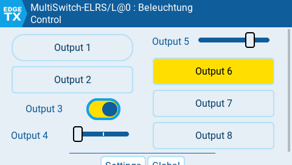

.The `MultiSwitch` telemetry script
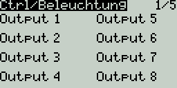

===== Puzzeling parts

The hardware components:

* Radio running `EdgeTx`
* ELRS-Transmitter module
* ELRS-Receiver (PWM or serial-only)
* up to 256 MultiSwitch-ELRS modules (see below)
* CRSF-half-duplex bus (not strictly needed) (see below)

The software components:

* `elrsv3.lua` script on the radio (if you are already using ELRS, you know it for sure)
* `MultiSwitch` widget script (see below

Additional:

If you want to use multiple `MultiSwitch-E` with the _telemetry-menu_ permanently on (without pressing the button), there are some prerequisites:

* use the <<elrs-route>> version for ELRS
* make sure, each `MultiSwitch-E` uses a different CRSF-Bus address (from `0xc0` up to `0xcf`)
* make sure, each `MultiSwitch-E` uses a different _ping-answer-slot_ (which is ensured, if you use the defaults in the config menu)

Auto-Configuration:

If you want to use the _Auto-Configuration_ of the `MultiSwitch-E` be sure to use https://github.com/EdgeTX/edgetx/pull/5773[this] PR for EgdeTx.
This is optional if you only use _one_ MultiSwitch-Widget at a time. But if you plan to use more thant one MultiSwitch-Widget in one model configuration
then you'll need this. Otherwise the _auto-configuration_ may not work.

===== Design

Although it would be possible to control the MultiSwitch-E8 via the standard `elrsv3.lua` script, this approch would be very inconvenient. So, I wrote a special 
widget to control the MultiSwitch modules. Each MultiSwitch module has its own _address_ (0 ... 255), so the widget must _know_ the appropriate address. There is a widget 
option where you can set the address of the correponding module.

For each address you can also set a descriptive _name_ of the module unique for each model on the radio, as well as the names of the _function_ to switch on or off and 
which physical switches should be used (if any). This is done via a model-specific configuration file on the sd-card of the radio.

The CRSF protocol is extensible, and this fact is used to propose an to control such modules: <<crsf-sw>>.

[[mswe8]]
===== MultiSwitch-E8

You find the actual version on https://oshwlab.com/wilhelm.wm.meier/works[].

[CAUTION]
--
The following design is outdated. Please use the new design.
--

.The schematic (click to enlarge)
image::images/elrs_msw/RCMultiSwitchSmall10_SCH.PNG[width=240, link="images/elrs_msw/RCMultiSwitchSmall10_SCH.PNG"]

.The PCB  (click to enlarge)
image::images/elrs_msw/RCMultiSwitchSmall10_PCB.PNG[width=240, link="images/elrs_msw/RCMultiSwitchSmall10_PCB.PNG"]

Link to the PCB order (Aisler): https://aisler.net/p/GCSJNSFV[PCB order]

Link to link:images/elrs_msw/RCMultiSwitchSmall10.T3001[Target 3001 design file].

Link to link:images/elrs_msw/RCMultiSwitchSmall10.zip[Gerber].

Link to https://github.com/wimalopaan/wmucpp/tree/master/boards/rcmultiswitchG030[source code] (unfortunately you have to clone to whole repository)

Instructions to compile to firmware:

[source,console]
----
$ cd <repo-root>/boards/rcmultiswitchG030
$ make all
----

===== Housing

here you can find the files to print a nice housing for the PCS: https://github.com/firlefantz/Elrs-Multiswitch-guide[Housing and additional information].

===== Super simple MultiSwitch (ELRS/CRSF, FlySky/SBus, FlySky/IBus, FrSky/SBus, FrSky/S.Port)

There was demand for a much simpler hardware compared to the <<mswe8>>: it should comprise only THT parts, so one could solder it onto a simple
stripe THT-PCB. And it should use simpler µC, since the STM32/ARM looks too complicated to some hobbyists.

So I decided to strip done the code and to port it to the AVR-DA/DB and the AVRtiny1 series. The only µC available as DIP package is the 
AVR32DA28 (or other AVRxxDA28). Out of the AVRtiny1 series the ATtiny1614 looks promising, albeit it is available only in SOIC-14. But for this 
package there exist ready to use adapter boards with THT pin header.

Clearly there are some limitations:

* simple turn on/off of the outputs
* no ELRS telemetry, no menu via the `ELRSv3.lua` or TBS Agent
* no PWM output
* no blinking patterns
* all other stuff via the `ELRSv3.lua` is not possible

The code can be found here: https://github.com/wimalopaan/wmucpp/boards/rcmultiswitch[]. There you should find `mswitch01.cc`.

You find an actual hardware-design here: <<ssmsw>>.

[NOTE]
--
Please not that the file `mswitch01.cc` is a generic source-code. So, please obey the pin assignment in the source-code.

The users of my _old_ multiswitch hardware (PCB): please use the file `sbus01.cc` instead of `mswitchß1.cc` for all following steps.
But also be sure to edit the _address_ and the _encoding_ in the first few lines of the file `sbus01.cc` according to your needs!
--

You can compile the firmware using this _gitpod_: https://gitpod.io/#https://github.com/wimalopaan/wmucpp[]. 

Please do the following:

* Navigate to the directory: `boards/rcmultiswitch`
* Edit the top lines in the file `mswitch01.cc`
** select input (CRSF or SBUS or IBUS or S.Port)
** select the multiswitch address 0...7
** select if SBus is _normal_ or _inverted_
** select the rc-link (ELRS/AFHDS2A/ACCST for SBUS)
* Edit the `Makefile.da`: just de/comment the lines to choose the right µC
* use the command: `make -f Makefile.da all`
* download `mswitch01.hex`
* connect the µC to the UPDI programmer (USBserial with a diode)
* flash, e.g.: `pymcuprog write --erase -d avr128da32 -t uart -u /dev/ttyUSB0 -f mswitch01.hex`

.Two multiswitches on the breadboad and the widget 
image::images/elrs_msw/ss01.png[width=240, link="images/elrs_msw/ss01.png"]

.Two multiswitches on the breadboad
image::images/elrs_msw/ss02.png[width=240, link="images/elrs_msw/ss02.png"]

Something to say about the configuration of the <<msw_widget>>: the widget was designed to work 
with `CRSF` (and ELRS). If you use ELRS gear and connect this super simple multiswitch to the
receiver via `CRSF` you are fine.

But you can connect the super simple multiswitch also via `SBUS`, which makes sense, because the 
super simple multiswitch does not have telemetry, e.g. no menu via `elrsv3.lua` or TBS Agent. So, the 
communication is simpy uni-directional.

You can connect the super simple multiswitch via `SBUS` (see source code:  `mswitch01.cc`) and you can use
different RC-links aside from ELRS like AFHDS2A/FlySky or ACCST/FrSky. But you have to be aware that the `SBUS` channel 
values undergo some really obscure scaling. So, the bits in a `SBUS` channel aren't exactly received by a device connected 
to the receivers `SBUS`.

Additionally `SBUS` does not allow to transport _out-of-band_ data. As a consequence the data has to encoded and send out 
via one of the `SBUS` 16 channels (in the case of `mswitch01.cc` this has to be channel 16). Therefore you must encode the
data in channel 16 one the radio. This is done via a _mixer_ script in EdgeTx: `mswsb.lua`, 
see https://github.com/wimalopaan/LUA/tree/main/SCRIPTS/MIXES[].

For the _widget_ and the _mixer_ script to communicate, setup the `ShmEncoding` in the widgets settings. And use the same
SHM variable in the mixer script.

If yout `SBUS` setup does not work, amybe because of the above mentioned obscure scalings, your next try may be S.Port. In the
widget you can select the S.Port transport and the appropriate physical ID and application ID.

If you are a FlySky user, a better approach is to use `ibus`.  FlySky does not support S.Port but the channel values do not undergo
such strange scalings as with ACCST/SBus. Beaware that the mixer script is `mswib.lua`, obviously.

[[ssmsw]]
===== 16-Outputs PCB

I designed a _SuperSimpleMultiSwitch_-Hardware using the AVR128DA28 in DIP-packes. This is a very easy reproducible hardware design that 
you can find on https://oshwlab.com/wilhelm.wm.meier/supersimplemultiswitch[]. 
If the PCB doen't attract you, you can use the schematics to design your own. 

.The SuperSimpleMultiSwitch with 16 outputs
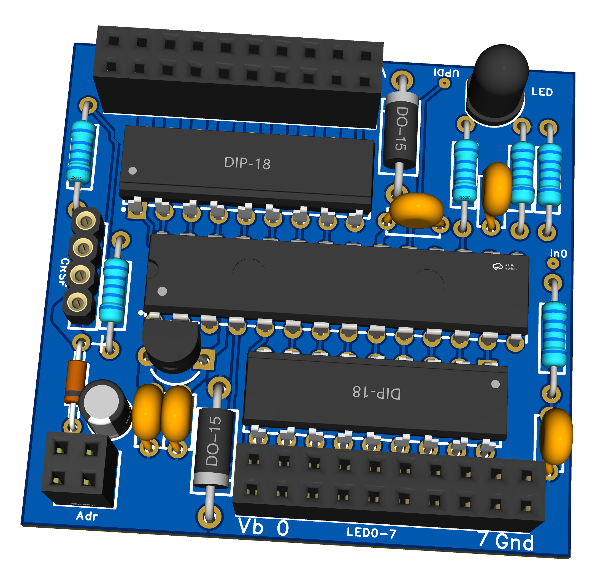

.The SuperSimpleMultiSwitch with 16 outputs PCB
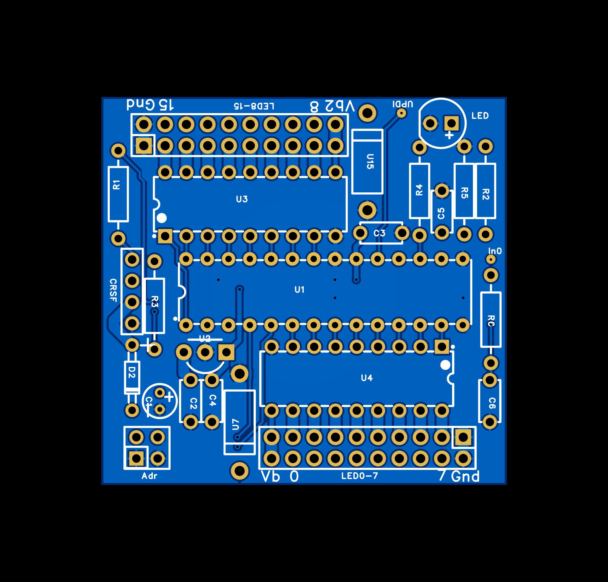

It has 16 output channels, so it inherently ues _two_ multiswitch address. The base address of the module can be selected via two jumpers on the board.

The firmware con be found here: https://github.com/wimalopaan/wmucpp/boards/rcsupersimplemultiswitch[]. If you don't want to compile the firmware locally 
on your notebook or PC, you can use `github` _CodeSpaces_ to do so. Please refer to  <<cs_wm>>.

[[msw_nucleo]]
===== STM32G031F8 Nucleo-Board as a MultiSwitch

Despite the fact that there are man people assembling there one <<mswe8>>, there are also people who do not want to order these boards and assemble all
parts by themselves, nor do they want to use the assembly-service of some of the main pcb manufactorers. Therefore, there was some demand for more DIY friendly
version of this MultiSwitch.

The solution is to use bre-built µC boards, that contain all that smd stuff and on the other hand have some 2.54mm pin-header, where all the connections
to the receiver, power-supply, outputs and programming connections go. In the case of the used STM Nucleo boards, these boards also come with a simple to use 
on-board programmer: programming is as simple as to copy the firmware file to the emulated USB drive of the on-board programmer (but you can use the st-link programming 
software as well).

The STM nucleo-board: https://www.st.com/en/evaluation-tools/nucleo-g031k8.html[]. In this documentation you can find all the details of the board.

The pinout used for the MultiSwitch for the nucleo-board can be found here: https://github.com/wimalopaan/wmucpp/blob/a9a4ad7189aacfe1117c3167641f161669980336/boards/rcmultiswitchG030/devices_2.h#L310-L319[]

So, all you have to do is to build the firmware via gitpod (see: <<gitpod_wm>>).

Please be sure to enable the correct version of the firmware: https://github.com/wimalopaan/wmucpp/blob/69835d2d781f9924fd9ded9a67e0e75d033ec7dc/boards/rcmultiswitchG030/msw20.cc#L19-L24[here]

Here you enable `HW_NUCLEO` (comment all the others).

.Pins of the Nucleo STM32G031 Board
|===
| Description | Pin | Pin-Header-Name

| Output 0 | PA7 | A7
| Output 1 | PA6 | A6
| Output 2 | PA11 | A5
| Output 3 | PA8 | D9
| Output 4 | PA5 | A3
| Output 5 | PA4 | A2
| Output 6 | PA1 | A1
| Output 7 | PB3 | D13
| to receiver crsf tx | PA9 | D5 
| to receiver crsf rx | PA10 | D4 
| button | PB6 | D1
| serial debug output | PA2 | (via USB) 
| LED (onboard) | PC6 | 
| Testpoint (if enabled) | PB4 | D12
|===

At last you use `make` to compile the `G031` version of the source:

[source]
--
make clean g031
--

[TIP]
--
If you want to use more than one Nucleo-MultiSwitch in parallel, be sure to set `CRSF_TX_OPENDRAIN` in the source code. Then you can connect the `tx` and `rx` line of all 
modules in parallel.
--

[[msw_weact]]
===== WeAct STM32G031F8 as a MultiSwitch

The https://de.aliexpress.com/item/1005005748198584.html[] is even smaller than the <<msw_nucleo, nucleo>> version. So, this board is a really good choice in terms of price and size.

The differences to the <<msw_nucleo, nucleo>> are, that there is no programmer included (you have to use a seperate `st-link` programmer, and that the pin assignments are different

So, all you have to do is to build the firmware via gitpod (see: <<gitpod_wm>>).

Please be sure to enable the correct version of the firmware: https://github.com/wimalopaan/wmucpp/blob/a9a4ad7189aacfe1117c3167641f161669980336/boards/rcmultiswitchG030/msw20.cc#L19-L22[]
Here you enable `HW_WEACT` (comment all the others).

.Pins of the WeAct STM32G031 Board
|===
| Description | Pin | Pin-Header-Name | Name on the board

| Output 0 | PA0 | P2-7 | A0
| Output 1 | PA1 | P2-8 | A1
| Output 2 | PA2 | P2-9 | A2
| Output 3 | PA3 | P2-10 | A3
| Output 4 | PB6 | P3-1 | B6
| Output 5 | PA6 | P3-6 | A6
| Output 6 | PA7 | P3-5 | A7
| Output 7 | PA8 | P3-4 | A8
| to receiver crsf tx | PA9 | P3-3  | A9 
| to receiver crsf rx | PA10 | P3-2  | A10
| button on-board | PA14 | 
| serial debug output | PA14 | (collision with button) 
| LED (onboard) | PA4 | 
| Testpoint (if enabled) | PB7 | P2-1
|===

At last you use `make` to compile the `G031` version of the source:

[source]
--
make clean g031
--

[TIP]
--
If you want to use more than one Nucleo-MultiSwitch in parallel, be sure to set `CRSF_TX_OPENDRAIN` in the source code. Then you can connect the `tx` and `rx` line of all 
modules in parallel.
--

[[msw_tht]]
===== WeAct STM32G031F8 as a MultiSwitch with PCB as THT

The following PCB design is by courtesy of Florian (`seaspotter`).

.The `MultiSwitch` PCB with THT components
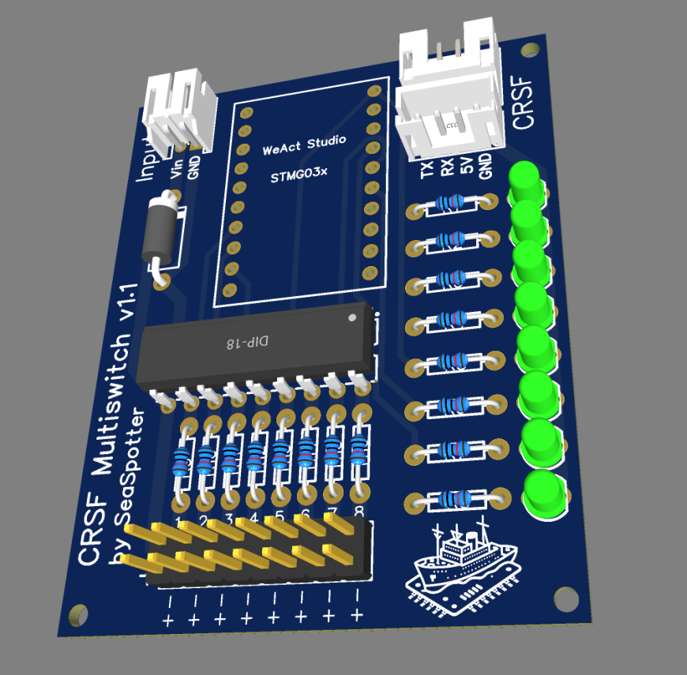

.The `MultiSwitch` PCB with THT components schematics
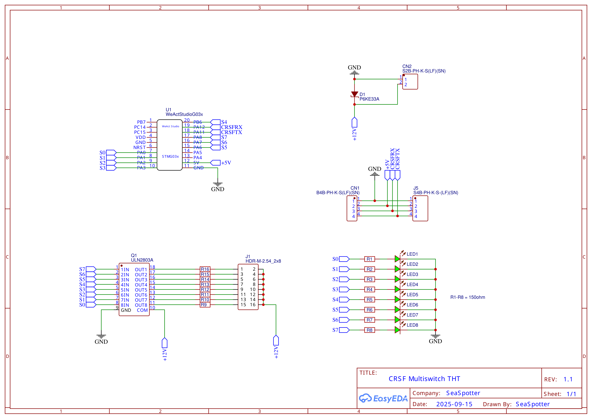

If you want to produce this PCB, you can use the following link to the gerber files.

Link to link:images/elrs_msw/seaspotter/Gerber_CRSF-Multiswitch-THT-v1.1.zip[Gerber].

[[msw_widget]]
===== MultiSwitch Widget

The new widget can be found here: https://github.com/wimalopaan/LUA?tab=readme-ov-file#lvglmsw[]

[TIP]
--
Be sure to copy all files _into_ a directory name `lvglMultiSw` (obey small and capital letters). 
--

[WARNING]
--
Before installing a new version of the widget, _allways_ make a copy _all_ config files for the widget. The config file
are named `<modelname>_<startaddress>.lua` 
--

.The `MultiSwitch` widget main screen

.The `MultiSwitch` widget settings 1 screen
image::images/elrs_msw/widget/settings10.png[width=240, link="images/elrs_msw/widget/settings10.png"]

.The `MultiSwitch` widget global settings screen
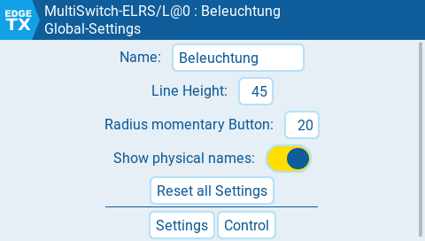

.The `MultiSwitch` widget telemetry screen
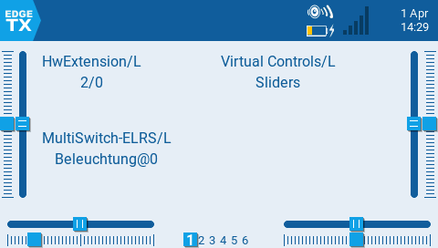

////
(the following is *outdated information*) 

The code of the widget can be found here: https://github.com/wimalopaan/LUA[]

.The `MultiSwitch` widget
image::images/elrs_msw/elrs_msw01.png[]

.The `MultiSwitch` widget (fullscreen)
image::images/elrs_msw/elrs_msw02.png[]

Normally the widget uses a _config-file_ (name of the file: `<name_of_model>.lua`) to determine the type of buttons, the text of the buttons, which logical switch to use, ...
This work well, but if you switch the handet, the new handset must ahve the same model name set up and also you must copy (and keep equal) the config file. This might be tedious.
This overcomde this limitation, the `MultiSwitch-E` module itself can contain the configuration and the widget can request that configuration.

To use this, enable the `AutoConf` option of the widget.
////

[[msw_bw]]
===== MultiSwitch Telemetry Script

To use the `MultiSwitch` with black&white LCD radios you have to install a _telemetry_ script. 
This _script_ can be found here: https://github.com/wimalopaan/LUA?tab=readme-ov-file#multiswitch-bw-telemetry-script[]

This script runs fine alongside with `elrcV3.lua` on radios with 192kB of RAM. But don't expect it to run on radios with only 128kB or less of RAM. 

.The `MultiSwitch` telemetry script control screen

.The `MultiSwitch` telemetry script settings 1 screen
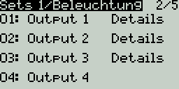

.The `MultiSwitch` telemetry script settings details screen
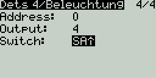

.The `MultiSwitch` telemetry script settings 2 screen
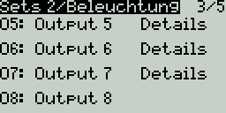

.The `MultiSwitch` telemetry script global screen
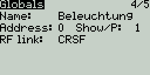

.The `MultiSwitch` telemetry script info screen
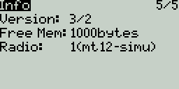

[[crsf_enc]]
===== CRSF encoding

The encoding of the switch states is done via the CRSF protocol (see <<crsf_sw>>).

[[sport_enc]]
===== S.Port encoding

The encoding of the switch states is done via S.Port commands. For the multiswitch part a _write-command_ (`0x31`) is used:

* S.Port command: `0x31`
* physical ID: configurable
* applicationID: `0x5100` (DIY1) (switch address `0`) to `0x51ff` (switch address `255`)
* value: 16bit (out of 32bit): each switch as 2-bit (binary, ternary, quaternary switches are possible)

These S.Port commands are send to the multiswitch module, which has to decode this command.

[[sbus_enc]]
===== SBus simple (unreliable) encoding

The encoding of the switch states is done via channel values.

A word of caution: the transport of the channel values undergoes several scaling steps including `EdgeTx`, RF-module and receiver. Different vendors use different
scaling techniques. As a consequence, out of the 11 bits of the SBus channel vakues only 6 bits are usable. On the transmitter state the state of an output (1Bit), the
number of the output (3bit) and the address of the multiswitch module (2bit) is encoded into one 6bit code and upshifted to reach the full SBus scale. On the receiver side 
in the multiswitch module the channel value is richt-shifted by 4 and the 6bit are decoded. 

[[led4x4]]
=== LED 4x4 Module

This module can control up to 16 leds. All these leds can be individually controlled, but also can be grouped into up to 4 groups. 
It is especially well suited for _RC crawlers_. 

Features:

* 16 LED outputs with
** individual controllable constant current source
** individual controllable pwm generator
** optionally group membership
* 4 groups with 
** individual ramp-up time
** individual ramp-down time
** individual hold-on time
** individual hold-off time
** continous and single patterns
* 8 virtual switches
** each virtual switch comprises up to 4 outputs

The module is controlled via the _MultiSwitch Widget_ (like the <<mswe8>>), all settings are controllable via the `elrsV3.lua` or the _TBS Agent Lite_.

==== Schematic

You find the actual version on https://oshwlab.com/wilhelm.wm.meier/works[].

[CAUTION]
--
Please note that the following hardware-design is outdated. Use the above mentioned version.
--

.Schematic (click to enlarge)
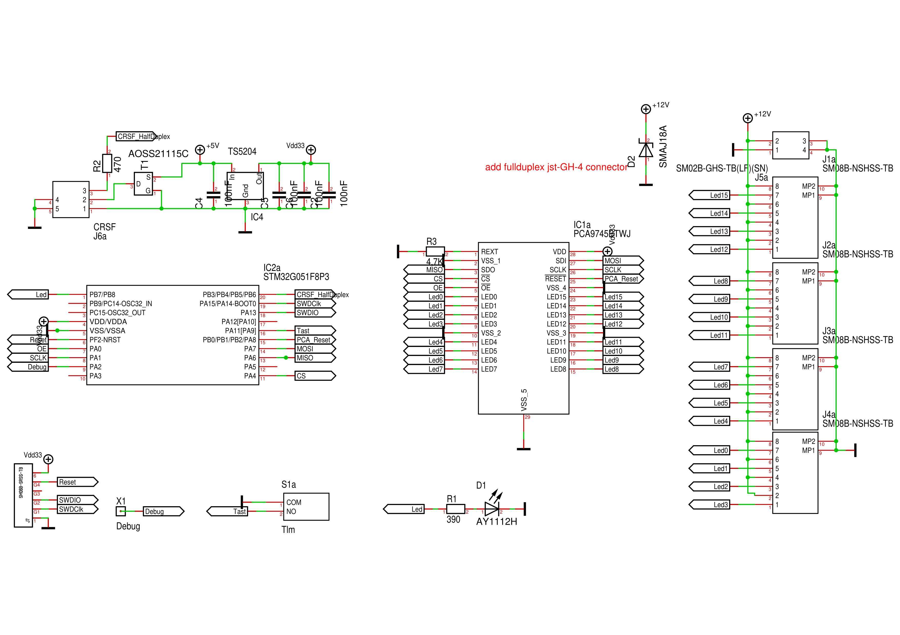

==== PCB

.PCB Top (click to enlarge)
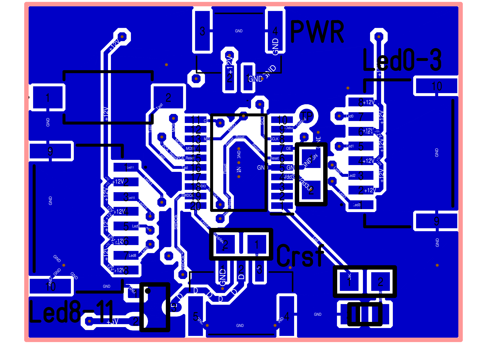

.PCB Bottom (click to enlarge)
image::images/led4x4/RC_Led4x4_32_PCB_U.PNG[width=240, link="images/led4x4/RC_Led4x4_32_PCB_U.PNG"]

==== Firmware

Link to the firmware: https://github.com/wimalopaan/wmucpp/tree/master/boards/rcLed4x4[]

==== Production data

Link to link:images/led4x4/RC_Led4x4_32.T3001[Target 3001 design file].

Link to link:images/led4x4/RC_Led4x4_32.zip[Gerber].

[[crsf-bus]]
=== CRSF-Half-Duplex Bus

Allows to connect up to 4 half-duplex CRSF devices to a full-duplex receiver.

This requires an external means (or arbitration scheme: see <<crsf_hd_scheme>>) to _activate_ the attached half-duplex devices (e.g. a button on the devices), because at most only _one_ device can be active on the bus (s.a. <<crsf-switch>>). 

[[crsf_hd_scheme]]
[TIP]
--
.CRSF Half-Duplex Arbitration Scheme

If all the devices obey a simple arbitration scheme, there could be more than _one active device_ on this half-dupley bus: 

The arbritration scheme works as follows:

* because this is half-duplex, the (immediate) time after receiving a _RC-channels_ packet is free to send packets for the attached devices
* each device _has to_ use a special time slot (depending on his own crsf-address) to place his packet on the bus
* a received _link-stat_ (`0x14`) crsf packet starts the counting of time-slots for sending packets
* the time-slot number for a device is calculated as: (<crsf-address> - 192) * 2
* requirement: the unique adresses of all attached devices are in the range: `0xc0` ... `0xcf` 

The above scheme must hold for all packets to send: especially the `crsf device info` packet after receiving a `crsf ping` or the unconditionally send telemetry packets must be restricted to the devices time slot. 
--

.The schematic  (click to enlarge)
image::images/elrs_msw/RC_CRSF_HalfDuplex_Bus_SCH.PNG[width=240, link="images/elrs_msw/RC_CRSF_HalfDuplex_Bus_SCH.PNG"]

.The PCB  (click to enlarge)
image::images/elrs_msw/RC_CRSF_HalfDuplex_Bus_PCB.PNG[width=240, link="images/elrs_msw/RC_CRSF_HalfDuplex_Bus_PCB.PNG"]

Link to the PCB order (Aisler): https://aisler.net/p/KPBJUCXN[PCB Order]

Link to link:images/elrs_msw/RC_CRSF_HalfDuplex_Bus.T3001[Target 3001 design file].

Link to link:images/elrs_msw/RC_CRSF_HalfDuplex_Bus.zip[Gerber design files].

===== Demo (Video)

Prototyp: https://www.youtube.com/watch?v=PeuxACw40io[Video]

[[rc720e]]
=== Double Schottel-Control (aka Cruise-Controller)

This module was originally designed to control two _Schottel_ drives (for information about those drives
see https://de.wikipedia.org/wiki/Schottel-Ruderpropeller[real world Schottel drive]).

._Schottel_ drive for ship models (Fa. Bauer, see https://www.bauer-modelle.com/Schiffsantriebe-Spezial-und-Wellenantriebe/Schottel-Z-Antriebe[Schottel/Z-Drive])
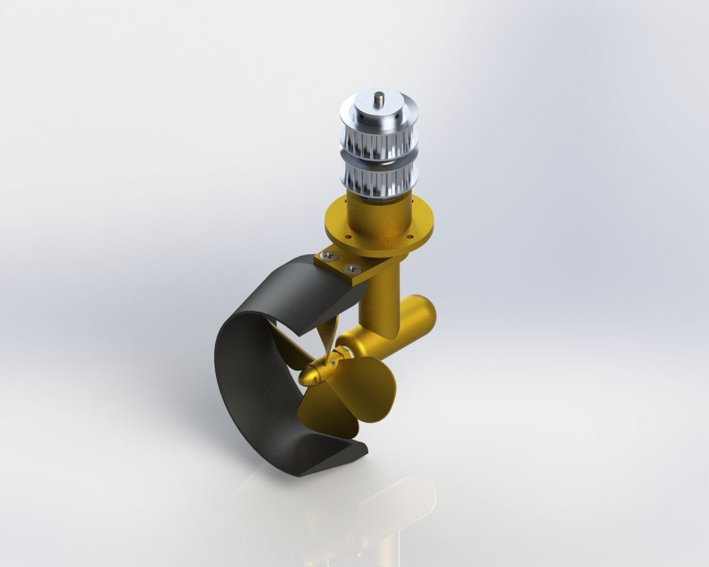

This module evolved over time and now it can be used as a general _cruise-controller_: this
suggested that it acts like a flight-controller in drones, helicopters or airplanes. Albeit this is true
to some extent, its purpose is somewhat different. So, don't expect to see features like autonomos 
navigation through way points.

The cruise controller more aims at being a protocol-concentrator and information-hub. It combines sensor fusion features 
and protocol-transformation.

Features:

* Servos
** PWM-Servos with analog Feedback (e.g. Feetech FB360M)
** PWM-Servos with PWM-Feedback (e.g. Parallax)
** serial Servos (e.g. WaveShare ST3020)

* ESCs
** PWM-ESCs
** `Sbus`,`Sbus2`, `IBus` Escs
** _special_ : KISS(ESCape32), V/ESC
** Telemetry as half-duplex (special, SBUS2) or separate: S.Port, IBus

* BEC joining 
** up to three BEC sources
** if two ESCs are connected with BEC (battery elimination circuit), both BECs are joined (_no disconnect_ of one of the BECs neccessary).

* CRSF
** CRSF input
** CRSF routing to one/two CRSF ports

* Bluetooh
** simple bluetooth module (like HC-05) can be connected to AUX port
** maybe used to control model features without an active radio
** maybe useful to present function/ship models at fairs
** use https://roboremo.app[RoboRemo] to build simple UI.

* GPS, compass, inertial sensor
** Compass / Magnetometer via I2C (QMC5883L)
** Accelerometer via I2C (MPU6050)

* Sbus-Out
** channels 1-16
** Channels 17-32 (needs special mixer script: https://github.com/wimalopaan/LUA?tab=readme-ov-file#mixer-script-crsfch-lua[crsfch.lua])

* SumDV3 Output
** 16/32 channels and 64 binary switches
** ideal to use in combination with e.g. the USM-RC-3 (Fa. Beier: https://www.beier-electronic.de/modellbau/produkte/usm-rc-3/usm-rc-3.php[] )

* SBus / S.Port Input / Telemetry
** 16 channels input
** S.Port telemetry (ESC values, Servo values)
** S.Port telemetry for Schottel visualization
** S.Port (write command) for multiswitch function (e.g. output via SumDV3 to USM-RC-3)

* IBus / SBus / SumDV3 Input
** input for steering and power
** configuration via ELRS
** PC-Link via ELRSBuddy: https://fourflies.mooo.com/elrsbuddy[] and https://github.com/Fourflies/elrsbuddy[]

* CPPM/N, CPPM/P, PWM-Overlay
** input for steering and power

* MultiSwitch
** multi-switch capable as <<elrs_msw>>
** output of analog time-multiplex switch signal (like old Graupner 2-16K NAUTIC-Expert Schaltbaustein)

===== Demo (Video)

https://www.youtube.com/watch?v=Hkk3GpHR4N8[Video1]

https://www.youtube.com/watch?v=VOI6-u9Bq1s[Video2]

https://www.youtube.com/watch?v=yr4b6svxh-k[Video3]

==== Schematics

.The schematic  V2 (click to enlarge)
image::images/rc720e32/RC_720_32_E_02_SCH.PNG[width=240, link="images/rc720e32/RC_720_32_E_02_SCH.PNG"]

Link to link:images/rc720e32/RC_720_32_E_02.T3001[Target 3001 design file].

Link to link:images/rc720e32/RC_720_32_E_02.zip[Gerber design files].

Link to https://aisler.net/p/GBXFAZAU[Aisler RC720E32 V2].

==== PCB

.The PCB top V2  (click to enlarge)
image::images/rc720e32/RC_720_32_E_02_PCB_oben.PNG[width=240, link="images/rc720e32/RC_720_32_E_02_PCB_oben.PNG"]

.The PCB bottom V2 (click to enlarge)
image::images/rc720e32/RC_720_32_E_02_PCB_unten.PNG[width=240, link="images/rc720e32/RC_720_32_E_02_PCB_unten.PNG"]

==== Firmware

Link to https://github.com/wimalopaan/wmucpp/tree/master/boards/rc720E32[source code] (unfortunately you have to clone to whole repository).

If you have trouble building the firmware from the source, e.g. you don't use a _Linux_ system or do not have all the 
tools installed, please follow this tutorial to build all with _gitpod_ <<gitpod_wm>>. 

==== Widget

LUA https://github.com/wimalopaan/LUA?tab=readme-ov-file#widget-for-rc720e32-schottel-controller[Widget] for `EdgeTx`.

[[crsf-switch]]
=== CRSF-Switch

Allows to connect up to seven half-duplex CRSF devices to a full-duplex receiver.

In contrast to <<crsf-bus>> this `CRSF-Switch` allows _all_ attached devices to be active at the same time (no external activation required).
To be fully usefull, it requires to use ExpressLRS Version 4.x.x or Version 3.x.x with the <<elrs-route>> extension.

The CRSF-switch acts in some respects like a LAN router/switch inkl. NAT: the attached devices not not to have different _crsf-addresses_, because the CRSF-switch
translates the addresses of the attached devices to a (predefined) set of addresses. So, the receiver _sees_ a point-2-point connection with a single device 
with multiple addresses or (similar) a device with its own address (the CRSF-switch address), that routes messages to other devices with different addresses.

Broadcast messages or messages without address information like non-extended messages are forwarded to / from all devices. Be this means, RC-channel data gets to all
connected devices as well as telemetry data.

The switch _learns_ the addresses of the attached devices by sending CRSF-Ping messages to all connected devices on startup. It decides if it is neccessary to translate the
address of each attached device. 

[INFO]
--
The PCB of the CRSF-Switch has been updated: now it can connect upto 4 full-duplex ans up to 2 half-duplex devices.

The project is shared on OSHWLAB: https://oshwlab.com/wilhelm.wm.meier/crsfcswitch01[]
--

[[elrs-relay]]
=== ELRS relay configuration

An ELRS TX module starts sending ovr the air if if gets valid CRSF `RC_CHANNEL` packets (with appropriate frequency). So, it might be
tempting to connect a receivers tx line (that outputs the CRSF `RC_CHANNEL` packets) to a tx-module. This works because the tx module detects the 
polarity of the signal (a handset outputs this data inverted, a receiver outputs the data normal) and baudrate.

The drawback of this simple configuration is, that there is no telemetry to the tx-module. So, if you have the chain of 

`handset` --> `tx-module1` --> `rx1` --> `tx-module2` --> `rx2` --> `devices` 

the telemetry data is clearly not transported by the relay comprising the `rx1` and `tx-module2`.

One can try to solve this problem and connect the rx-line of `rx1` to the `tx-module2` and the tx-line of `rx1` via a 4,7K resistor also to the
half-duplex input of the `tx-module2`. 
While this is electrically correct, this has a logical problem, because the CRSF addresses in this chain are no longer unique: there are to devices with
a receiver-address (`rx1` and `rx2`) and two devices with transmitter-addresses (`tx-module1` and `tx-module2`). 

To solve this problem, the relay ( `rx1` and `tx-module2`) needs some logic to rewrite these addreses: a µC in between the two can rewrite the addresses of 
`tx-module2` and `rx2` to use otherwise unused addresses. 

The rcDesk32 can do this rewriting.

[[elrs_ma]]
=== ELRS-MultiAdapter-EA

The `ELRS-MultiAdapter-EA` converts CRSF-serial input into 

* 4 Servo-PWM outputs for arbitrary channels (out of the 16 CRSF channels) or for 4 individual out-of-band channels (4 additional 8-bit channels), or 
* acts like a <<elrs_msw>> but with 4 push-pull outputs up to 1A@18V (max.) (occupies 1 switch-module address in this mode), or
* produces up to 4 PWM outputs for analog switch modules (like Graupner 4159) each occupying one of the 256 addresses, or
* produces 4 motor PWM signals (duty 0 ... 100%) (unidirectionl) up to 1A@18V (max.) for 4 individual out-of-band channels (4 additional 8-bit channels) or 4 normal channels (1 ... 16), or
* produces 2 motor PWM signals (duty 0 ... 100%) (bidirectionl) up to 1A@18V (max.) for 2 individual out-of-band channels (4 additional 8-bit channels) or 2 normal channels (1 ... 16), or

[[CC]]
=== The `CruiseController` 

The `CC` (CruiseController) is like a _Flight-Controller_ but mainly for ship/boat-models.

It consists of 

* ELRS receiver
* Bluetooth module
* Servo-PWM-outputs
* SBus(2)/IBus/SumdV3 output
* SBus(2)/S.Port/IBus/Hott telemetry
* 4 direct switching lines (up to 1A@16V) (shared with servo pwm outputs)
* additional serial connections (e.g. GPS)
* V/ESC support
* 16-channel switching mezzanine board
* 16-channel LED mezzanine board

The cruise-controller and the dual Schottel controller project now have merged.
Please see <<rc720e>> for more information.

[[hwext]]
=== Hardware-Extension-Protocol

The _hardware-extension-protocol_ is a simple serial protocol to send the state of external switches and potentiometers to the handset. The `RadioMaster TX16S` handset has two 
serial interfaces one can use to extend the handset, e.g. to provide more switches or potentiometers (s.a. <<hwlua>>).

The protocol is designed as a multi-master / slave protocol, which gives the chance to have more than one external controller that sends data to the handset (s.a. <<extswitch>> and <<rcdesk>>).

In the case of the `RadioMaster TX16S`, which has _two_ serial interfaces, the other serial interface remains free to used for other purposes, e.g. 
to connect a `SBUS`-receiver realizing a trainer connection or connecting other gear (s.a. <<rcdesk>>).

==== Physical layer

* Baudrate: 115200 Baud
* 8 Bits
* no parity
* 1 Stop bit
* half-duplex

==== Application Layer

An external switch controller (_master_) sends packages to the handset. It is possible to connect more than one external switch controller to the
same half-duplex serial-line (the `rx` line of the handset). This requires unique IDs of the switch controllers (s.a. <<hwext_timing>>)

===== Packet Format

Format: `[0xaa]` `<cntrl-nr>` `<type>` `<payload-length>` `<payload>` `<check-sum>`

* `<cntrl-nr>`: the controller-number (source) (one instance of the LUA-scripts acts upon one specific controller-number (must be a unique number on the bus)
* `<type>`: type of message
** `0x00`: binary switches in payload (each byte encodes 8 switches)
** `0x01`: 8-bit-values in the payload (each byte encodes an distinct value)
** `0x02`: 16-bit-values in the payload (every two bytes encodes an distinct value), LSB-first
** `0x03`: 64 binary switches (8 bytes) | 16 values (2 bytes each, 32 bytes total) (40 bytes payload total)
* `<length>`: number of bytes of the `<payload>`
* `<payload>`: bytes encoding switches or values
* `<check-sum>`: arithmetic sum of `<payload>` byte, only one byte, may overflow

[[hwext_timing]]
===== Multi-Master Timing

The master with the _controller-number_ `0` sends a package every 100ms (maybe down to 20ms) unconditionally. The user has to ensure, that excactly _one_ controller
with number `0` exists on the serial bus.

If there are other masters on the bus with _controller-number_ greater `0` (e.g. `N`), they listen on the bus and wait for a message to see with _controller-number_ `(N-1)`.
If this master receives such a message, it waits 2 byte-times after the last byte of the just received message and then switches to send-mode and sends its own messages.

The user has to ensure, that the inter-message gaps are long enough so that all masters can send their messages. All controllers must have numbers in ascending order 
without gaps starting with `0`.

[[hwlua]]
=== LUA-script for the Hardware-Extension-Protocol

==== New version of the LUA-script for the Hardware-Extension-Protocol

To use the new (`lvgl`) version you also have to use thsi PR https://github.com/EdgeTX/edgetx/pull/5885[].
Please also see <<edgetx_custom>> how to build and install it.

The new version can be found here: https://github.com/wimalopaan/LUA[]

==== Old version

There are several ways to read the information send via the <<hwext>> and some of the serial interfaces of a handset. The two most obvious are:

* modify the `EdgeTx`-firmware to read the data via theserial interface, parse the <<hwext>> and modify the state of switches and inputs, or
* use a `LUA`-script to read the data

To modify the `EdgeTx`-firmware would be the most powerful, because the external hardware read via the <<hwext>> could _act_ like the internal control elements like sticks and switches. 
But, this would be a huge modification of `edgeTx` for only a small number of users I think. So, there will be little chance to get these modifications _offcially_ approved and get them into
the main version of the source code of `EdgeTx`.

To use a LUA-script isn't intrusive in any way, one can use the standard LUA-API of `EdgeTx` (some useful functions for this I got into `EdgeTx` soem time ago). 
Clearly, this approach has limitations: you can't introduce _new_ inputs or _new_ switches.

But

* the `LUA`-script can set/reset some of the 64 _logical-switches_ as a reaction to flipping of an external switch, and
* it can set set one of the 16 _shared-memory_ variables, which then can be used inside a _mixer-script_ to produce an output-channel value.

Sure, there is a limitation of 64 logical-switches and 16 shared-memory variables: but I think there is a good chance to increase these limits a least on the 
color-LCD radios with a substantial amount of RAM.

The code of the widget can be found here: https://github.com/wimalopaan/LUA[]

[[hwluaimg1]]
.Two widgets installed (click to enlarge)  
image::images/hwext/hwextlua1.png[width=240, link="images/hwext/hwextlua1.png"]

[[hwluaimg2]]
.The information screnn of the widget (click to enlarge)  
image::images/hwext/hwextlua2.png[width=240, link="images/hwext/hwextlua2.png"]

https://www.youtube.com/watch?v=oPbaWQnMffA[Video]

[[extswitch]]
=== The TX16s internal switch controller

This is a simple AVR `attiny1614` that reads the stick switches of my TX16s and uses the <<hwext>> to send the data to the handset. The <<hwlua>> decodes the stick-switches into _logical-switches_ in 
`EdgeTx`. This controller has the _controller-number_ `0`, so one can connect more controllers using the <<hwext>> connected to the _same_ serial interface of the TX16s.

[[hwattiny1]]
.Attiny1614 as external switch controller (click to enlarge)  
image::images/hwext/hw1.jpg[width=240, link="images/hwext/hw1.jpg"]

[[hwattiny2]]
.Attiny1614 as external switch controller (click to enlarge)  
image::images/hwext/hw2.jpg[width=240, link="images/hwext/hw2.jpg"]

[[hwattiny3]]
.Attiny1614 as external switch controller (click to enlarge)  
image::images/hwext/hw3.jpg[width=240, link="images/hwext/hw3.jpg"]

[[hwattiny4]]
.Attiny1614 as external switch controller (click to enlarge)  
image::images/hwext/hw4.jpg[width=240, link="images/hwext/hw4.jpg"]

==== Code

Link to the code repo: https://github.com/wimalopaan/wmucpp/tree/master/boards/rcswitch[]

(unfortunately you have to clone to whole repo to include all neccessary files. Maybe this will change in the future)

==== Stick-End Switches

The following stick end switches are used for my RadioMaster TX16s: https://rctechnik.de/products/stick-switch-Radiomaster[stick end switches]

[[rcdesk]]
=== The RC-desk (for RadioMaster TX16S, FrSky X12S / X9E)

This project is a hardware extension for all radios with an exposed serial interface (s.a. <<hwext>>).

It controls and sends the following data to the radio:

* two 4D-Sticks (each has 3 pots and one momentary button): 6 analogs, 2 buttons
* upto 64 buttons / switches (via I2C)
* 2 space-mouse
* 2 incremental with button each
* connection to upto two serials to the radio (e.g. AUX1 / 2 of the RadioMaster TX16S)
* bluetooth (virtual controls on smart phone)
* SBus/IBus/SumDV3 input
* ELRS receiver (configuarion and / or slave radio)
* two LEDs

.The RC-desk32 PCB
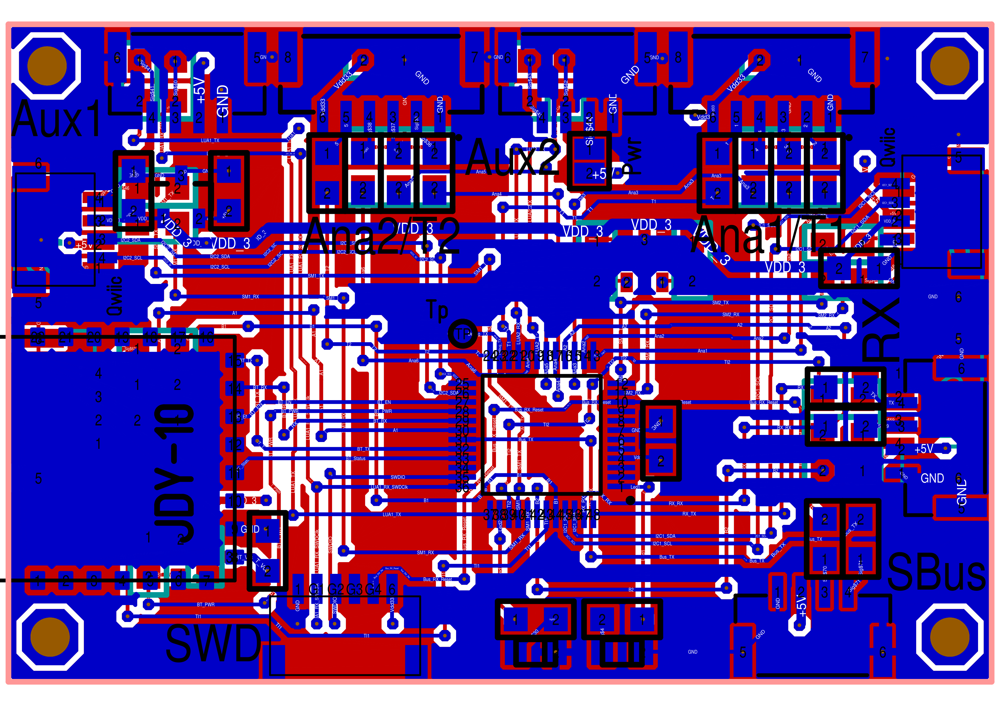

.The RC-desk32 Schematic
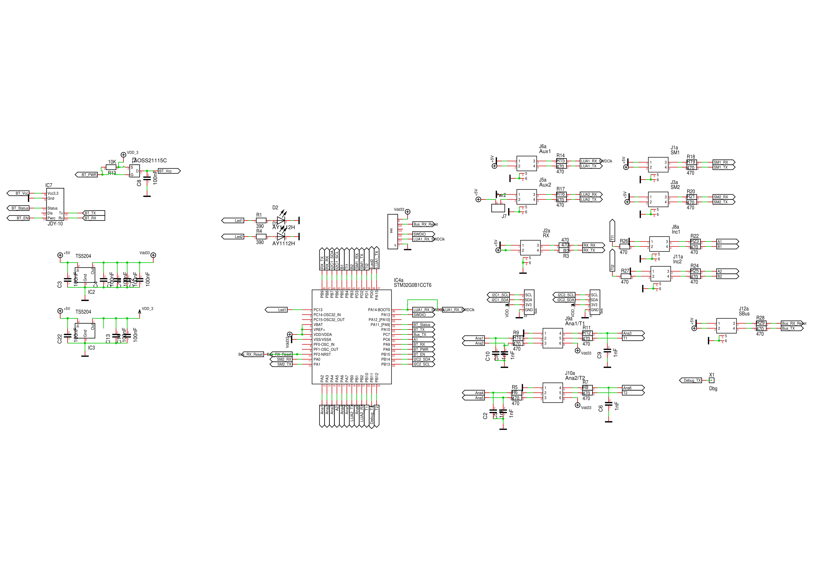

If you use _Target 3001_ as your EDA: link:desk/RC_Desk32_01.T3001[Target 3001 design file].

Link to the code repo: https://github.com/wimalopaan/wmucpp/tree/master/boards/rcDesk32[]

=== A new kind of stick: haptic-control

.The stick model (click to view in full-scale)
image:stickng/stick1.png[width=240, ="stickng/stick1.png"]

tbd

=== Simple RC main power latched switch

In the old days there was this simple project: https://github.com/wimalopaan/Electronics/blob/main/Old.adoc#diy-rc-hauptschalter[main switch]. 
Please follow the preceeding link to get the documentation (unfortunately only in german, don't have the time to translated all documents). 

If you want to build this board, the link:rc/boards/onoff_simple.T3001[Target3001] design file may be of interest.

[[oix6]]
== Openix6

=== Firmware

The https://github.com/OpenI6X/opentx[OpenI6X] project provides OpenTx for
small radios of the type _FlySky_ *FS-i6x*. 

=== Compiling

The following setup configures the firmware to include the following notable options:

[horizontal]
CRSF_FULLDUPLEX:: enables full-duplex communication with an ELRS module
CRSF_EXTENDED_TYPES:: enables decoding `float` and `string` CRSF types
EXTPWR_INVERT:: invert the level of the external power pin to use a p-channel Mosfet
TRANSLATIONS:: select german translation
PCBI6X_ELRS:: enable the internal ELRS _script_

[source]
--
cmake -DCROSSFIRE=YES -DCRSF_FULLDUPLEX=YES -DCRSF_EXTENDED_TYPES=YES -DUSB_MSD=OFF -DEXTPWR_INVERT=YES -DSBUS_TRAINER=OFF -DUSB_SERIAL=OFF -DCMAKE_BUILD_TYPE=Release -DSPLASH=OFF  -DTIMERS=1 -DHELI=OFF -DTRANSLATIONS=DE -DPCB=I6X -DLUA_COMPILER=NO -DLUA=NO -DGVARS=YES  -DMULTIMODULE=OFF -DOVERRIDE_CHANNEL_FUNCTION=OFF -DPCBI6X_ELRS=YES -DPCBI6X_HELLO=YES ..
--

If you like to use `gitpod.io` to compile the firmware (s.a. <<edgetx_custom>> and <<gitpod_wm>>) 
use the following URI in your browser (prepend the URL https://github.com/wimalopaan/opentx[] with `https://gitpod.io/#`) 
https://gitpod.io/#https://github.com/wimalopaan/opentx[].

After a few minutes you see a `vscode` like UI with a terminal in the lower third of the workspace.
Copy the above `cmake` line to the terminal and hit `enter`.

Then type in the command: `make firmware`

After finishing you can download the file `firmware.bin` and do the normal flashing to your radio.

=== Flashing

German https://www.youtube.com/watch?v=tvDtpW6TglE&t[how-to] 

List of _devices_:

----
$ dfu-util  -l 
dfu-util 0.11

Copyright 2005-2009 Weston Schmidt, Harald Welte and OpenMoko Inc.
Copyright 2010-2021 Tormod Volden and Stefan Schmidt
This program is Free Software and has ABSOLUTELY NO WARRANTY
Please report bugs to http://sourceforge.net/p/dfu-util/tickets/

Found DFU: [0483:df11] ver=2200, devnum=10, cfg=1, intf=0, path="1-2", alt=1, name="@Option Bytes  /0x1FFFF800/01*016 e", serial="FFFFFFFEFFFF"
Found DFU: [0483:df11] ver=2200, devnum=10, cfg=1, intf=0, path="1-2", alt=0, name="@Internal Flash  /0x08000000/064*0002Kg", serial="FFFFFFFEFFFF"
----

Flashing:
----
dfu-util -s 0x08000000 -a 0 -D firmware.bin
----

== OpenTx / EdgeTx weekly

_OpenTx weekly_ is a https://www.youtube.com/channel/UCedl1hS-dfWh-V4WBz_jGog[YouTube]-channel mostly 
for EdgeTx and OpenTx stuff but also for my above electronic projects. Unfortunately the spoken language is german :-( 

On https://schiffsmodell.blogspot.com/p/grundlagen-zu-opentx.html[Holger Meyer] you may find an up-to-date table of contents.

[[gear]]
== Actual gear

In the following chapters you will see my actual gear and the modifications.

=== RadioMaster

==== MT12

internal ExpressLRS

EdgeTx

==== TX16S

EdgeTx

hall-sticks

internal 4-in-1

Extensions:

* 2x incremental encoder
** withc µC attiny412
** on top of the handset
** wired in poti-mode to Ext1/Ext2
* stick switches
** encoded by a µC (Attiny1614) inside the handset into FrSky-D telemetry via AUX1
* SWD-connector
** magnetic connector on the bottom of the handset

.TX16S incremental encoder (click to enlarge)
image::images/tx16s_inc.jpg[width=240, ="images/tx16s_inc.jpg"]

.TX16S SWD magnetic adapter (click to enlarge)
image::images/tx16s_swd.jpg[width=240, ="images/tx16s_swd.jpg"]

.TX16S desk with space mouse (click to enlarge)
image::images/tx16s_desk1.jpg[width=240, link="images/tx16s_desk1.jpg"]

.TX16S desk with space mouse (click to enlarge)
image::images/tx16s_desk2.jpg[width=240, link="images/tx16s_desk2.jpg"]

.TX16S stick switches: the attiny1614 inside the radio (click to enlarge)
image::images/tx16s_switch1.jpg[width=240, link="images/tx16s_switch1.jpg"]

.TX16S stick switches (click to enlarge)
image::images/tx16s_switch2.jpg[width=240, link="images/tx16s_switch2.jpg"]

==== Desk for the TX16s

=== FlySky

==== FS-i6X

https://github.com/OpenI6X/opentx[OpenI6X]

Modifications:

* External ELRS (rx-as-tx EP2) inside the handset (<<elrx_i6x>>)
* SWD-connector 
** magnetic connector on the bottom of the handset
* Make all switches `SA`, `SB`, `SC` and `SD` 3-position 

.Closeup of the magnetic SWD connector (click to enlarge)
image::images/i6x_mag.jpg[width=240, link="images/i6x_mag.jpg"]

=== Jumper

==== T12

EdgeTx

External ELRS (JR-module bay): <<elrs_jr>> 

=== FrSky

==== X9e

EdgeTx

External ELRS (JR-module bay)(inside the housing): <<elrs_jr>> 

Modifications:

* AUX1 (P12)
** magnetic connector at the bottom of the handset 

.Closeup of the magnetic serial connector (click to enlarge)
image::images/x9e_mag.jpg[width=240, link="images/x9e_mag.jpg"]

==== X12S

EdgeTx

Modifications:

* touch-screen: <<x12s_touch>>
* internal ELRS: <<elrs_x12s>>
* LiIon accu
* AUX1
** magnetic connector at the bottom of the handset

.Closeup of the magnetic serial connector (click to enlarge)
image::images/x12s_mag.jpg[width=240, link="images/x12s_mag.jpg"]

.Serial connection to the desk electronik (click to enlarge)
image::images/x12s_desk.jpg[width=240, link="images/x12s_desk.jpg"]

.LiIon-accu (click to enlarge)
image::images/x12s_liion.jpg[width=240, link="images/x12s_liion.jpg"]

=== Graupner/SJ

==== MC-16

[[vintage]]
== Vintage RC

=== Graupner / Grundig / JR 

[[gr_txs]]
==== Transmitter

.MiniProp4 transmitter
image::images/retro/miniprop1.jpg[width=480]

.MiniProp4 receiver
image::images/retro/miniprop2.jpg[width=480]

.Varioprop Expert Modulsystem FM 6014
image::images/retro/Graupner6014.jpg[width=480]

.Varioprop Graupner Grundig 12S
image::images/retro/Varioprop12S.jpg[width=480]

.Varioprop Graupner Grundig T14 Expert Modulsystem
image::images/retro/Varioprop14_Expert.jpg[width=480]

.Varioprop Graupner Grundig 14S 27MHz
image::images/retro/Varioprop14S_schwarz27.jpg[width=480]

[[varioprop_black]]
.Varioprop Graupner Grundig 8S 40MHz
image::images/retro/Varioprop8S_schwarz.jpg[width=480]

[[varioprop_yellow]]
.Varioprop Graupner Grundig 8S 27MHz
image::images/retro/Varioprop8S.jpg[width=480]

[[varioprop_red]]
.Varioprop Graupner Grundig C8 27MHz
image::images/retro/VariopropC8.jpg[width=480]

==== Receiver

.Varioprop miniSuperhet FM 40S
image::images/retro/RX01.jpg[width=480]

.Varioprop miniSuperhet 27MHz
image::images/retro/RX02.jpg[width=480]

.Varioprop miniSuperhet FM 35S
image::images/retro/RX03.jpg[width=480]

==== Other

.Varioprop Fahrtregler
image::images/retro/ESC_Varioprop.jpg[width=480]

=== Robbe / Futaba

[[rb_txs]]
==== Transmitter

.Robbe Promars
image::images/retro/promars.jpg[width=480]

.Robbe digital4
image::images/retro/RobbeDigital4.jpg[width=480]

[[robbe_f14]]
.Robbe Futaba F-14 Navy 40MHz
image::images/retro/FutabaF14.jpg[width=480]

==== Receiver

==== Other

=== Other

==== Transmitter

==== Receiver

==== Other

.Model Craft Speed Controller
image::images/retro/ESC_Modellcraft.jpg[width=480]

.hitec Speed Controller
image::images/retro/ESC_hitec.jpg[width=480]

== Licence

Please see link:LICENSE[Lizenz], as far as not other licences apply (e.g. in the source code).

== Kontakt

mailto:wilhelm.wm.meier@googlemail.com[email]
