= RC Electronics
Wilhelm Meier <wilhelm.wm.meier@googlemail.com>
:toc:
:toclevels: 4
:numbered:
:toc-placement!:
:tip-caption: :bulb:
:note-caption: :information_source:
:important-caption: :heavy_exclamation_mark:
:caution-caption: :fire:
:warning-caption: :warning:

:ddir: https://wimalopaan.github.io/Electronics
:rcb: {ddir}/rc/boards

[NOTE]
--
This page and the accompanying repositories are mostly for my rc (radio controlled models) electronics including EdgeTx/OpenTx addons, LUA-scripting, videos, and more.
--

toc::[]

== Foreword

[NOTE]
.To the german readers
--
Die alte Seite ist noch (und bleibt auch) als <<Old.adoc#, Old.adoc>> verfügbar.
--

[[elrs]]
== ExpressLRS

=== ExpressLRS for short range radio control

https://www.expresslrs.org[ExpressLRS] (ELRS) is a long range link for radio controlled models / machinery of all kind.
Obviously it has some advantages over some other commercial rc-links like AFHDS2A, Hott or ACCST, ...

ExpressLRS is:

[[elrs_feat]]
.Main features of ExpressLRS
* open-source (software and hardware)
* low-latency / high packet-rate
* using open (well-documented) CRSF protocol (https://github.com/crsf-wg/crsf[working group])
* extremely long range

Together with https://edgetx.org[EdgeTx] (Open-Source radio transmitter operating system) one has a extremely powerful system 
at hand to control and monitor all kind of models or machinery from remote. And the whole system (but the handset) now is open-source: 
there are no limits in extending the system.

But ELRS is not limited to its long-range capability, that makes it useful for all kind of flying machinery (planes, helicopters, drones, ...).
ELRS is as well suited for short-range radio control of boats, cars, crawlers, stationary-models (e.g. cranes, ...).

The most appealing features of ELRS with respect to short-range radio-control of models are:

[[elrs_func]]
.Features for functional models
* extensibility due the flexibility of the CRSF protocol, mainly on the model side (after the receiver)
* low-latency / high packet-rate for new kinds of features (e.g. haptic-control)

In the following sections are proposals for some extensions to the CRSF protocol. These extensions are already in use with my <<CC>> and some 
multi-switch-modules or lighting-modules

[[crsf_sw]]
=== Proposal for CRSF protocol extensions

Following is a proposal for an extension to the the `CRSF` protocol. This can be used with every handset, transmitter-module and receiver 
due to the extensability of the protocol. 

Refer to https://github.com/crsf-wg/crsf/wiki[crsf].

This is used by a <<elrs-widget, EdgetTx-Widget>> (encoder) alongside with the <<CC>> (decoder).

.CRSF-protocol extension
[TIP]
--
For all commands new _realms_  are defined:

* `0xa0`: `CruiseController`
* `0xa1`: addressable Module
--

==== Binary data (e.g. switch states: on/off)

Total of 64 switches.

* Paket type: `CRSF_FRAMETYPE_COMMAND`, `0x32`
* Command realm: `CruiseController`, `0xa0`, (user defined realm)
* Command: `0x01`
* Data: 64 bits as 8 x 8 bytes (64 binary switches)

Overall packet: `[0xc8]` `[len]` `[0x32]` `[` `[dst]` `[src]` `[0xa0]` `[0x01]` `<byte0>` ... `[byte7]` `]` `[crc8]`

==== N-ary data (e.g. 2/4/8-bits)

===== 2 bits

Total of 64 switches.

* Paket type: `CRSF_FRAMETYPE_COMMAND`, `0x32`
* Command realm: `CruiseController`, `0xa0`, (user defined realm)
* Command: `0x02` (2 bit per channel) 
* Data: 128 bits as 16 x 8 bytes (64 quaternary switches)

Overall packet: `[0xc8]` `[len]` `[0x32]` `[` `[dst]` `[src]` `[0xa0]` `[0x02]` `<byte0>` ... `[byte15]` `]` `[crc8]`

===== 4 bits

Total of 64 switches.

The total number of bytes is transferred in chunks:

* Paket type: `CRSF_FRAMETYPE_COMMAND`, `0x32`
* Command realm: `CruiseController`, `0xa0`, (user defined realm)
* Command: `0x03` (4 bit per channel) 
* Number of chunk: `0x00`: (channels 0 - 31), `0x01`: (channels 32 - 63) 
* Data: 128 bits as 16 x 8 bytes (32 16-ary switches)

Overall packet: `[0xc8]` `[len]` `[0x32]` `[` `[dst]` `[src]` `[0xa0]` `[0x03]` `<chunk nr>` `<byte0>` ... `[byte31]` `]` `[crc8]`

===== 8 bits

Total of 64 channels switches.

The total number of bytes is transferred in chunks:

* Paket type: `CRSF_FRAMETYPE_COMMAND`, `0x32`
* Command realm: `CruiseController`, `0xa0`, (user defined realm)
* Command: `0x04` (8 bit per channel) 
* Number of chunk: `0x00`: (channels 0 - 15), `0x01`: (channels 16 - 31), `0x02`: (channels 32 - 47), `0x03`: (channels 48 - 63)  
* Data: 128 bits as 16 x 8 bytes (16 8-bit-channels)

Overall packet: `[0xc8]` `[len]` `[0x32]` `[` `[dst]` `[src]` `[0xa0]` `[0x04]` `<chunk nr>` `<byte0>` ... `[byte31]` `]` `[crc8]`

[[prop32]]
==== Proportional data (e.g. additional channels: >8bit)

tbd

[[crsf-sw]]
==== Module Commands (e.g. switch states: on/off)

* Paket type: `CRSF_FRAMETYPE_COMMAND`, `0x32`
* Command realm: `Module`, `0xa1`, (user defined realm)
* Command: `0x01` (Set)
* Address: `0x00` ... `0xff`
* Data: variable length, 1 up to 8 bytes 

Overall packet: `[0xc8]` `[len]` `[0x32]` `[` `[dst]` `[src]` `[0xa1]` `[0x01]` `<address>` `<byte0>` ... `[byte7]` `]` `[crc8]`

[[elrs-widget]]
=== EdgetTx-Widget for switches

==== Horus

tbd

==== Taranis

tbd

=== ExpressLRS: modules and receivers

With ELRS modules like <<hm_es24tx>> (approx. 100mW RF power)  and ultra-small receivers like <<hm_ep1ep2>> or <<rm_er6>>
you get an enormous range of n-times 10km. This is good for drone-pilots but is of no use for crawler or model-boat / ship control.

[[hm_es24tx]]
.Happymodel ES24TX transmitter module
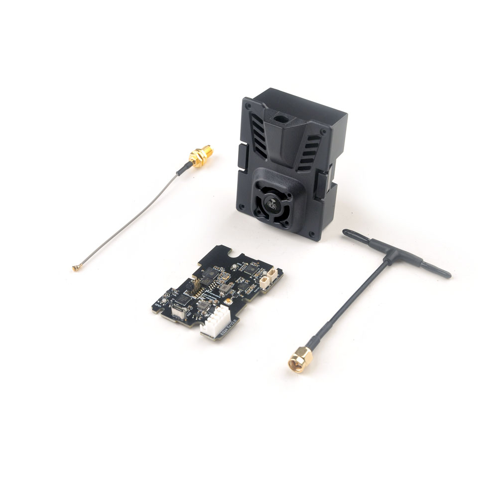

[[hm_ep1ep2]]
.Happymodel EP1 and EP2 receiver with CRSF/SBUS output
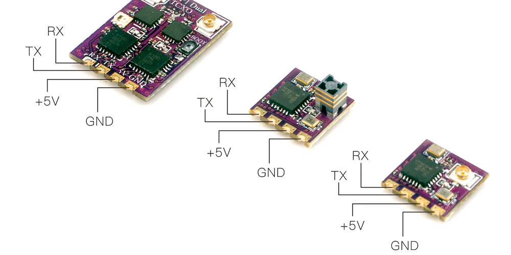

[[rm_er6]]
.RadioMaster ER6 receiver with dedicated PWM outputs
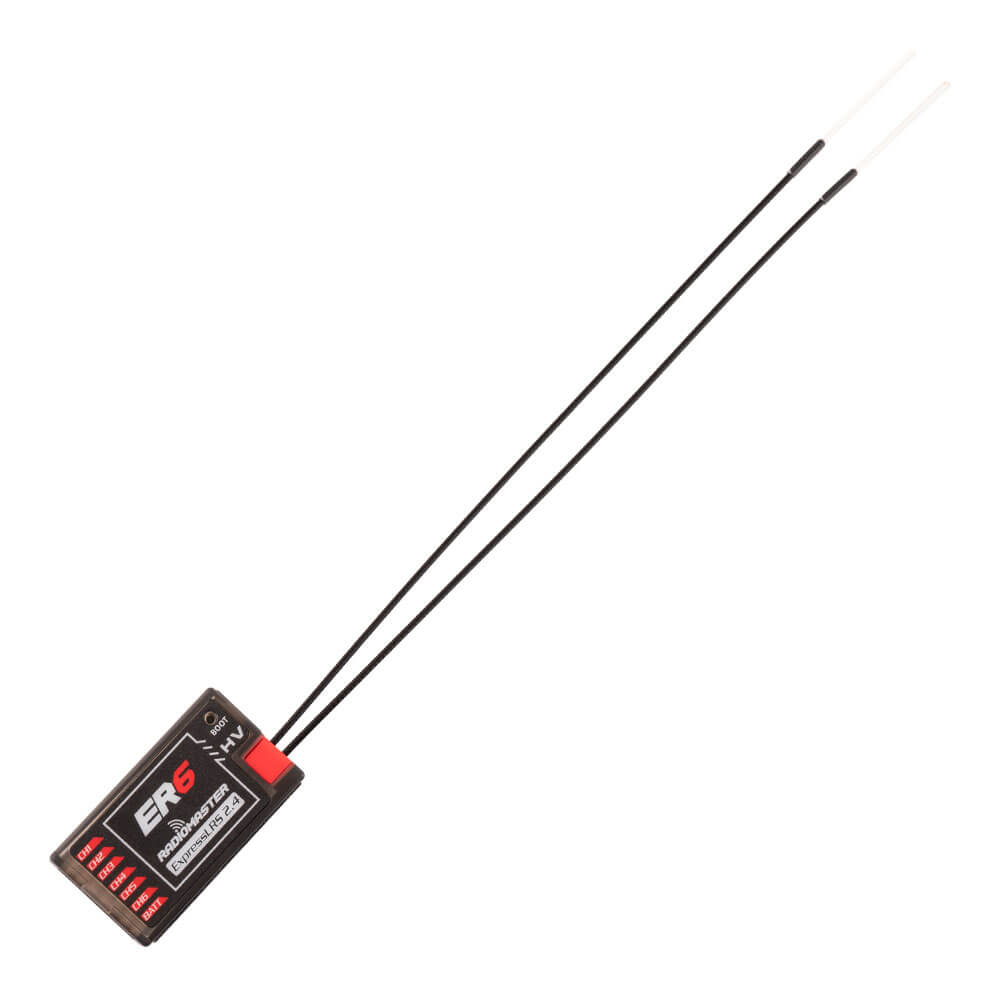

The <<elrs_func>> can also be achieved using an ELRS-receiver as a transmitter-module. This is a big advantage because it make it possible 
to equip many handsets with an internal elrs-capability, e.g. the _FrSky X12S_, _X9E_ or _Jumper T12_ or the _FlySky FS-I6X_. 
See <<elrs_jr>> and <<elrs_x12s>> and <<elrs_i6x>> for details.

=== Multiple ELRS-receivers bound to one ELRS-module

Using the same pass-phrase it is possible to bin more than one receiver to a tx-module. If all receivers were sending telemetry data to the tx-module, 
there will be interference in the rf domain, and, if by pure accident the rf data comes through undistorted, the tx module would receive ambigous data. 
ELRS is not capable of handling multiple telemetry streams in one passphrase realm.

Therefore, one has to disable sending telemetry on all but one receiver. This can be done via the web interface of the receiver(s). In this scenario, one 
may have multiple receivers - maybe in different models -, but only one is allowed to send telemetry, while all others must not send telemetry data. 
Sometimes this may be acceptable, but more often this is not acceptable: if the recivers belong to different models, not all batteries, etc. can be 
monitored. This may lead to severe damage to the batteries.

Since version `3.4` of ELRS it incorporates a feature called _TeamRace_ (see the receivers menu in the `elrsV3.lua` menu).
In _TeamRace_ each receiver has a unique ID-number calles `position`. One can select an _active_ receiver via a designated rc channel 
(one of the 16 rc channels). The active receiver outputs servo data and sends back telemetry, an inactive receiver does not send telemetry and goes 
into failsafe for the channel data. For more info see: https://github.com/ExpressLRS/ExpressLRS/pull/2176[TeamRace].

_TeamRace_ allows to switch the receiver / model very quick by e.g. the six-position-switch on a TX16S or X12S.

Going into failsafe for the inactive receivers will not be desired in most above mentioned use cases: it would be way better, if the inactive receiver
simply stops sending telemetry but still outputs the channel data.

This was implemented in this pull-request: https://github.com/ExpressLRS/ExpressLRS/pull/2685[Multi model telemetry].
Unfortunately this pull-request waas not accepted by the ELRS team. Therefore you have to select this pull-request manually in the 
`expresslrs-configurator`.

=== 32-channels for ELRS

ELRS transfers 16 RC-channels from the handset to the receiver. In EdgeTx one can select the first of the 16 consecutive channels 
to be transferred.

EdgeTx manages 32 RC-channels, so it would be of interest to tranfer the remaining 16 channels also.

On the handset a LUA-script (widget) collects the channels 17-32 and encodes them as a custom CRSF package (<<prop32>>).
The ELRS-receiver outputs this custom packages on his serial interface (select: CRSF-protokoll). 
Clearly, a special CRSF-decoder is needed: it has to decode the normal RC channel packages and the custom-packages. 

The <<CC>> uses two `SBus`-interface, one for channel 1-16, and one for the channels 17-32.

=== ELRS modifications and pull-requests

[[elrs-route]]
==== Allow other than `0xc8` as extended addresses 

The stock ELRS only routes `0xc8` (Flight-Controller) as extended address from and to the handset. This is kind of wrong based on the 
protocol definition of CRSF. 
https://github.com/wimalopaan/ExpressLRS/tree/3.x.x-wmaddress[This] or 
https://github.com/ExpressLRS/ExpressLRS/pull/2975[this]
allows to use the complete range of `0xc0` to `0xcf` to be routed.

==== ELRS4 new arming method for version 3

ELRS version 4 introduces a new arming method: now you can use a switch-based arming instead of a channel-based arming. 

Before the release of ELRS V4 and with ELRS V3 you can use this new arming method with https://github.com/wimalopaan/ExpressLRS/tree/3.x.x-arm4[this] 
based on the version 3 maintenance branch.

== Projects

The following chapters describe some of my active projects. The majority of my former projects (see <<Old.adoc#, Old>> (in german)) are
in a frozen state now. This is due to the fact that I completely shifted the µCs from the AVR-family (DA, DB, tiny1/2) to the more powerful 
STM32-family, mainly the STM32G4xx. These have enough computing resources for the <<sdr>> project, which would have been impossible sticking to 
the AVRs. 

Well, there is one exception: the <<corona>>.

[[corona]]
=== Corona RP8D1 replacement firmware

The `Corona RP8D1` receiver come into several flavors, for the 35MHz band, the 40MHz and the 72MHz band (afaik). 
The reason for giving a substantial amount of time to develop a new firmware for this receiver is the fact that I am
_hoarding_ vintage electronic RC stuff. Unfortunately some of this gear wasn't working anymore. In the process of 
reworking these things I needed a good receiver and I decided to get a scan-receiver without external crystals. But it turns out
that the mostly helpful signal filtering of the `Corona` receiver makes the situation worse if one tries to use these multi-channels
extensions in the transmitters. These encoders produce a time-multiplex over one RC channel, and the correspondant decoder
isn't capable decoding the time multiplex if the receiver modifies / filters the impulse durations. So, the project started ;-) 

There is an extra repositoty https://github.com/wimalopaan/CoronaRP8D1[] for this project.

[[varioprop]]
=== Renewed mainboard for some (old) 27/35/40MHz RC transmitters

As you can see in <<gr_txs>> or <<rb_txs>> I own some old, vintage RC transmitters. As of this writing some of them are more than 40 years old.
The majority of them does kind of work, but due to aging of the components the do not meet the RC criteria of the RF regulations in the EU.

But there are also some other shortcomings with these old transmitters:

* to change the rf channel one has to change the quarz in the transmitter.
** quarzes are very expensive nowadays
** if not using receivers with quarzes, scan-receivers are ubiquous (see also <<corona>>) and they don't need a quarz
* With the exception of the Robbe/Futaba F-14 most of them are not capable of having switches together with a switching encoder
* They don't have features like mixers, trainer ...

All this lead to the idea to design a new mainboard not only for the Robbe/Futaba F14, but also for the yellow, red and black Graupner/Grundig
Varioprop series of transmitters. 

The first attempt was to make a new mainboard for the yellow Varioprop S8. This mainboard uses a small µC `atmega324pb` to sample the potentiometers 
of the handset and produce a `ppm`-signal, which was fed into a FrSky DHT 2.4GHz module. This worked quite well but felt a bit like abusing the
old yellow Varioprop, which is very cool stuff nowadays (in germany). Actually the attempt is undocumented.

The next attempt was to design a kind of relais-station to transform the 2.4-GHz FrSky ACCST into FM-FSK-40MHz. I thought this to be a cool idea
because this relais-station could (in theory) used by more than one pilot / captain. The main reason was to re-use a modern 
transmitter with all its features like mixers and other cool stuff for the 40MHz band. But then came Corona (the disease, not <<corona>>) ... 

I learned a lot about rf electronics in the sub-GHZ range and this was great fun, so I decided to design something that would combine 
all the features I played with in the previous versions.

This lead to the actual design ...

==== The new mainboard

The mainboard comes as pcb that coul be easily adapted to the three form factors for the

* Robbe/Futaba F-14 (see <<robbe_f14>>)
* yellow Graupner/Grundig Varioprop 8S (see <<varioprop_yellow>>)
* red/black Graupner/Grundig Varioprop (see <<varioprop_red>> and <<varioprop_black>>)

The mainboard 

* handles up to 8 analog inputs (usually the potentiometers of the handset)
* has a 100mW rf module (27/35/40 MHz)
* uses the analog gauge as an accu monitor
* has a beeper
* has a I2C-connector to use with up to two switches-boads with 8 3pos-switches each
* has a bluetooth (BLE) module
* has an ELRS module (to be used as receiver or transmitter)
* can switch channels via BLE or ELRS
* has a free uart for further extensions

===== Previous versions of the new mainboard

There have been some iterations for the design of the new mainboard though. In the following you see
the last iteration: this one really works, but has some design flaws that I'm actually in process of fixing ;-) 

.The new mainboard populated, but with many design problems (click to enlarge)
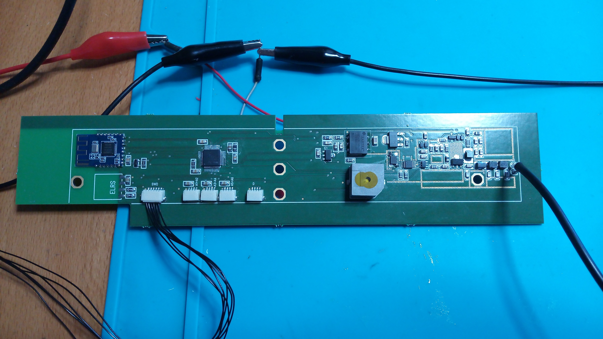

.The new mainboard inside an old VarioProp case (click to enlarge)
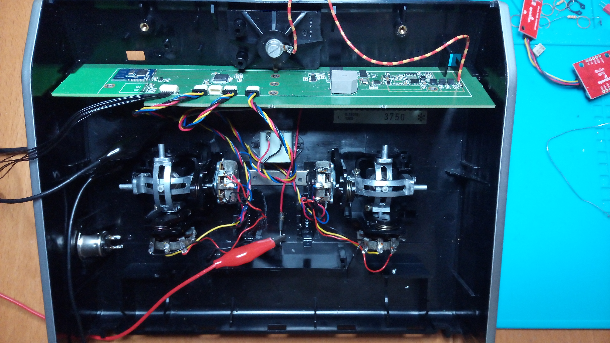

In <<VarNG02>> you see the schematic. Aside from some minor flaws there is one major issue with this board: the generation 
of the frequency-shift-signal! As you see in the schematic the `Si5361` genarates two rectangular signals, one with the `space`
frequency _f0_ on `CLK0` and one with the `mark` frequency _f1_ on `CLK1`. Thereafter a `74LVC1G157` is used to switch between
these two frequencies with the `cppm` signal. 

Although this appears to work there are very serious problems! (Do not use this part of the schematic in your projects.)

A little bit of theory: the switching between these two signals can be seen as a convolution of each signal 
(each itself a _si()_ signal in the frequency domain) with another according _si()_ signal (the cppm rectagular signal in the time domain) 
and then added together. This produces two main problems:

* The switching in the time-domain witch a rectangular signal or convolution in the frequency domain of two _si()_ function results in a very broad spectrum (see <<hardsw>>).

* Additionally the switching is not synchronized with the base signal, so there are additional short-term pulses and therefore broad fequency components.

It turns out that this renders the rf part unusable, because several conventional receivers were not able to decode the signal if the signal strength goes down. 
And clearly this was not acceptable.

[[VarNG02]]
.Schematic of Version 2 (click to enlarge)  
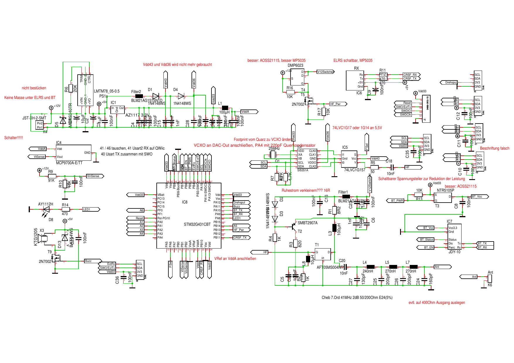

Well, although I was aware of this problem from the beginning I didn't think that the negative impact was as this huge!

I looked around and I found some `27MHz` VCXO (voltage controlled crystal oszillator) with an appropriate pulling range up to 100ppm. This looks quite reasonable: the µC could generate the cppm signal 
with some exponential (gaussian) roll-on / roll-off via its DAC. The VCXO clock signal is the used as the input for the SI5351. And the SI5351 simply generates the desired output
frequency from the modulated clock signal. I made several test with different roll-on / roll-off curves and found that an exponential gives the best results with respect 
to the smallest frequency sprectrum of the resulting rf signal. Very good (see <<gausssw>>).

The roll-on / roll-off via DAC of the µC (STM32G431) is easily realized via timer-triggered DMA to the DAC for each pulse-edge of the cppm signal.

All modifications are now in <<VarNG03>>.

[[VarNG03]]
.Schematic of Version 3 (click to enlarge)  
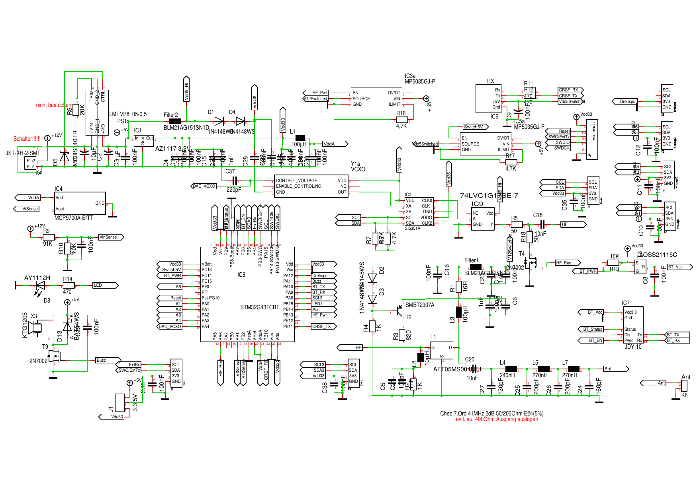

[[VarNG03pcbtop]]
.PCB top (click to enlarge)  
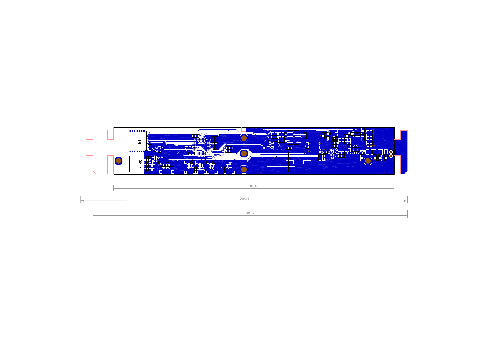

[[VarNG03pcbbot]]
.PCB bottom (click to enlarge)  
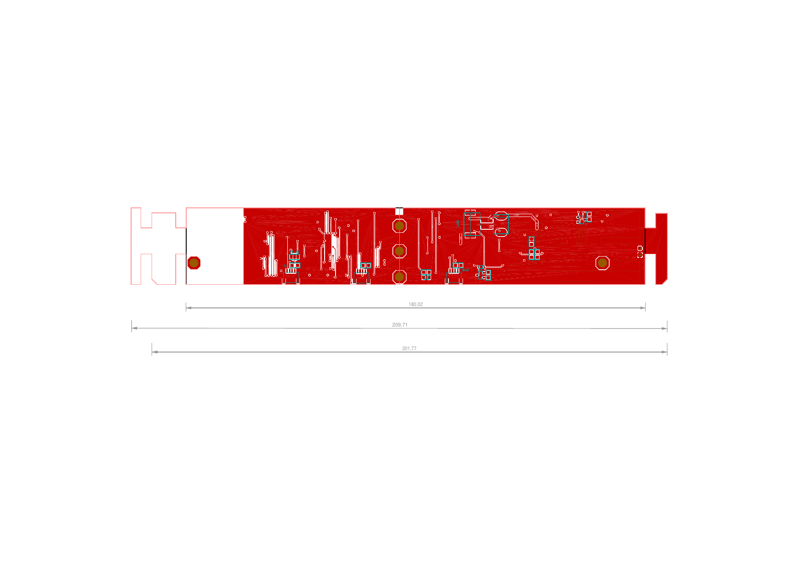

As said above the main reason for this version was the problematic rf signal generation part, but there are other modifications:

* new rf signal generation part to produce way better spectral results
* additional I2C interface (in total now two interfaces)
* on/off switching of the ELRS
* circuit to reduce rf power
* simplified power switching for submodules

This version is actually under test.

[[hardsw]]
.Spectrum when hard-switching the frequencies (click to enlarge)  
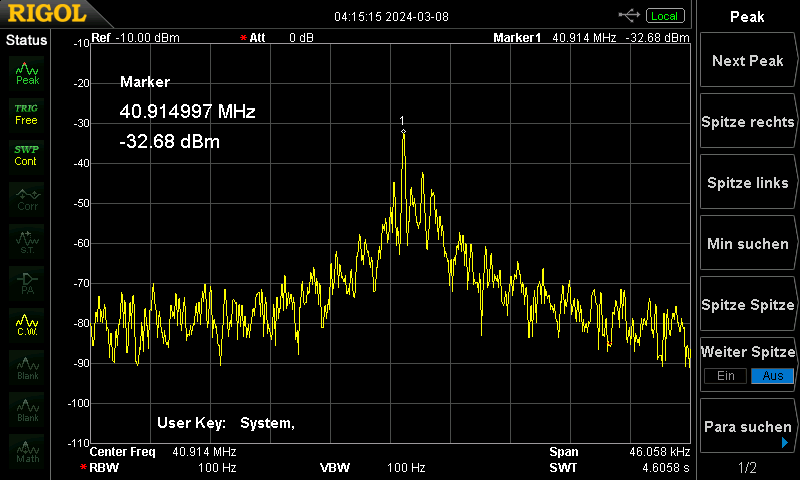

[[gausssw]]
.Spectrum when using gaussian roll-on  / roll-off (click to enlarge)  
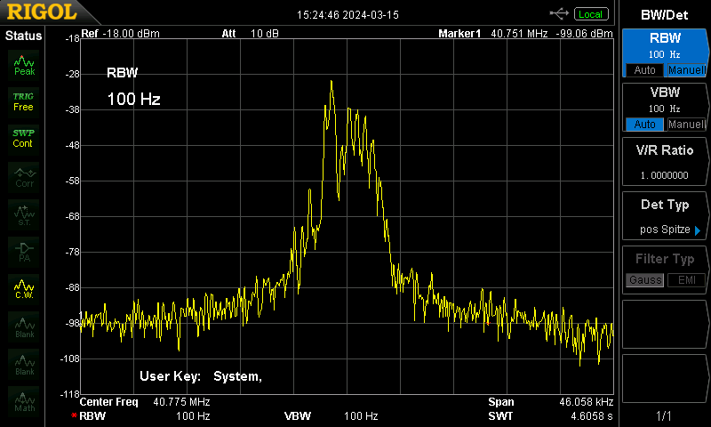

[[f14spec]]
.Spectrum Futaba F14 (click to enlarge)  
image::variopropng/F14spec.png[width=240, link="variopropng/F14spec.png"]

[[grspec]]
.Spectrum Graupner 40MHz JR module (click to enlarge)  
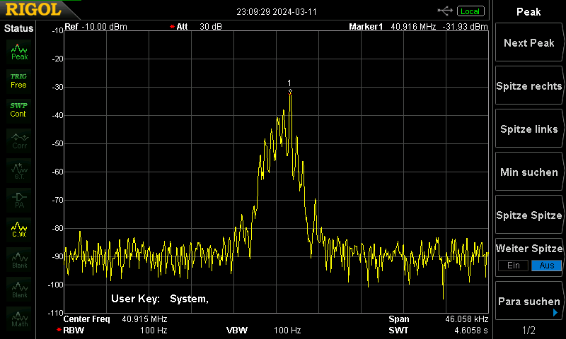

==== The new switches-board

The switches board is very simple: it is connected via `I2C` to the main board. And it can be cascaded.

.Schematic (click to enlarge)
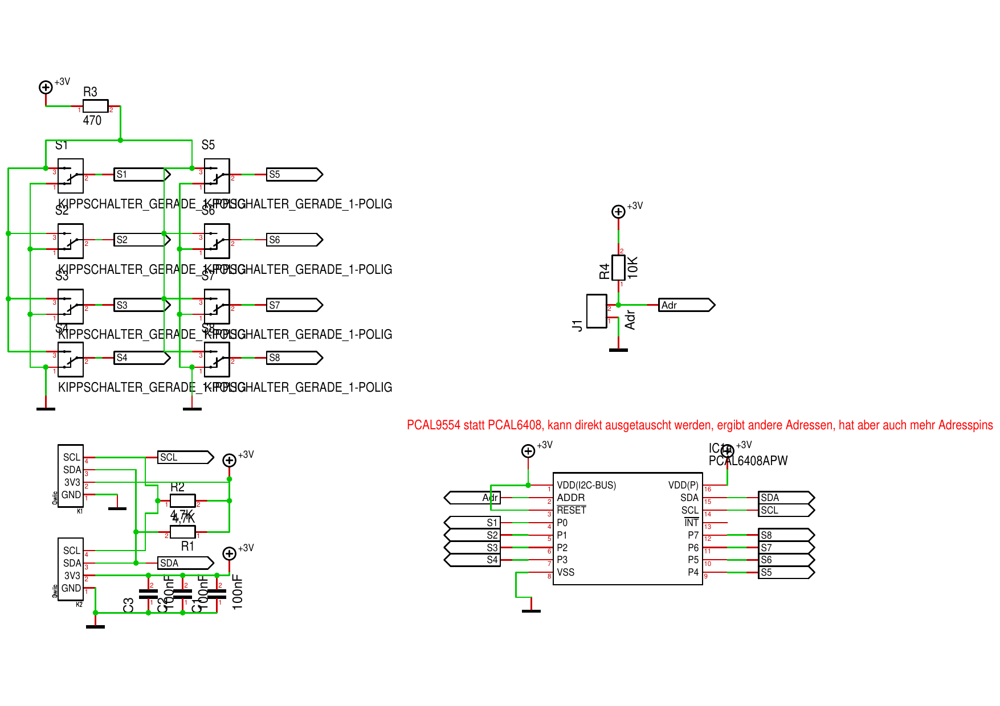

.PCB (click to enlarge)
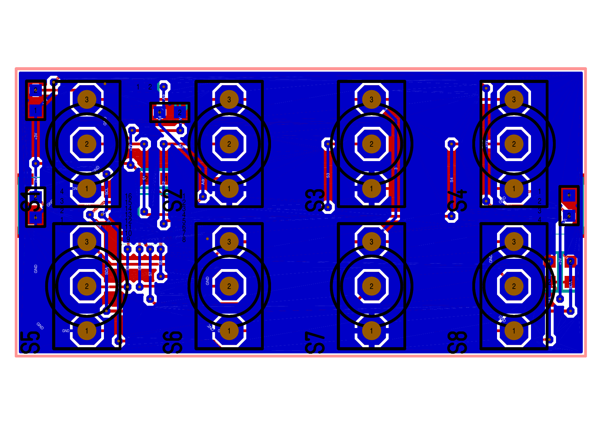

.Two switches boards connected to the new mainboard (click to enlarge)
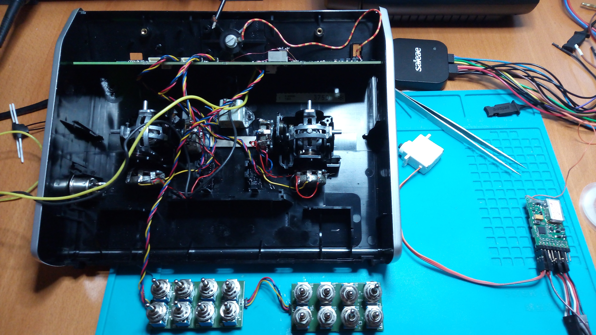

==== Remote control the remote control via BlueTooth

.RoboRemo App Interface (click to enlarge)
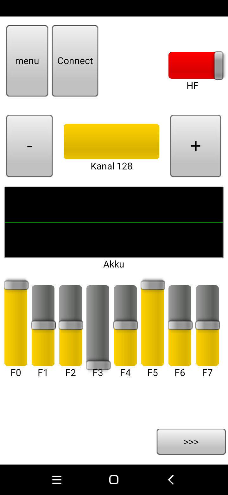

.RoboRemo App Interface conncting to the new mainboard via BLE (click to enlarge)
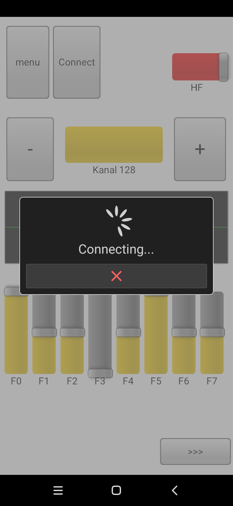

==== Inside the housing

tbd

[[sdr]]
=== SDR RC receiver for 27/35/40MHz

My most ambitious project. The origin is also in <<corona>>. The goal is to design a SDR as a I/Q-mixer (tayloe-mixer) with zero-IF and a STM32G431 doing all
the DSP stuff.

Actually, this works for ppm/pcm-modulation in the near field of the transmitter. 

Remaining problems are sensitivity and AGC.

There is no documentation yet.

[[x12s_touch]]
=== Touch-Screen for the FrSky X12S

In my opinion the `FrSky X12S` is a very well designed and high-quality RC transmitter. Together with https://edgetx.org[EdgeTx] this is unbeatable.
The only drawback is, that it has no touch-screen. I managed to modify https://edgetx.org[EdgeTx] and the hardware to get the same touch-LCD as with the 
RadioMaster TX16S working inside the X12s.

The software modifications are in mainline https://edgetx.org[EdgeTx] (no need to patch or modify) and the hardware modification is described in an extra 
document: {ddir}/rc/touch.html[X12S touch]

Video: https://www.youtube.com/watch?v=BhzwIHQNJnw[Demo]

=== Modification of an old Graupner / JR 40MHz transmitter RF modul for use in e.g. a Radiomaster TX16s / FrSky X12S/X9e or similar

Modern handsets with a JR-like module bay provide a `cppm`-signal and battery-voltage on the pins of the connector. 
Therefore it must be possible to use an old vintage _Graupner JR 40MHz_ quarz transmitter module together with an old 40MHz quarz receiver.

The good news are: yes, it is possible. *But* ...

[CAUTION]
--
It is tempting to place an old 40MHz JR module into the module bay of a modern handset. 

Please: *don't do this!!!*

You can damage your handset!
--

.Some old vintage 40MHz transmitter modules
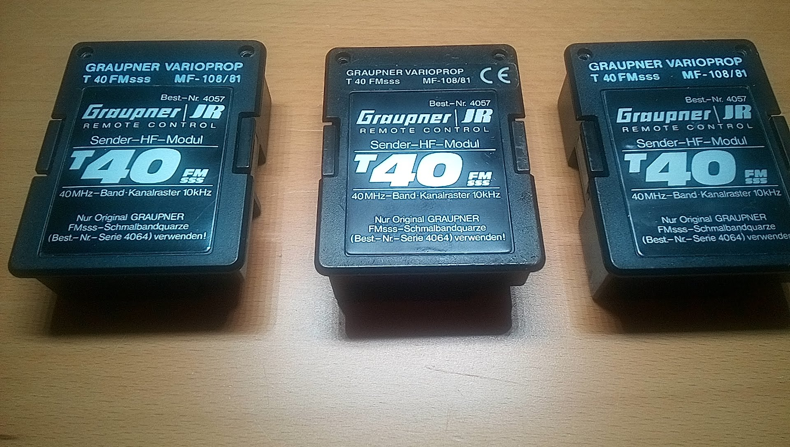

.After the modification
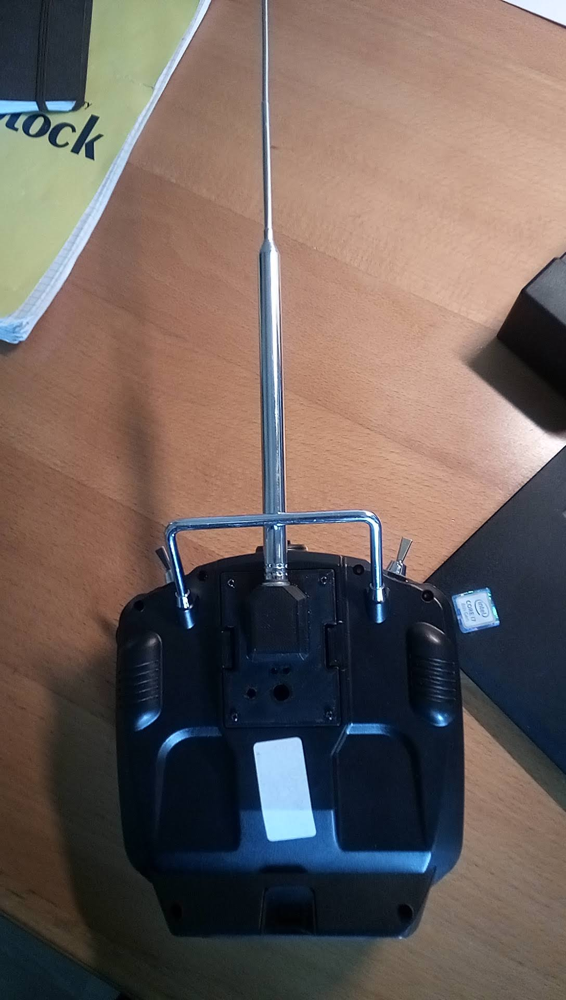

For the full story, please follow this link:rc/jr40mhz.html[Howto (german)]

=== Brushed DC-motor controller with sensorless measurement of rotational speed

Features:

* SBus(2)/IBus/SumDV3 serial input
* SBus2/S.Port/IBus/Hott telemetry
* PPM-Input
* serial terminal configuration interface
* telemetry
** supply voltage
** motor current
** motor temperature (sensor needed)
** motor rotational speed (*no* sensor)

==== Rotational speed measurement

A bit of theory ...

tbd

==== Version 1: max. 8A / 36V

The smaller one of the two versions comes as one _pcb_.

[[bdc_S_sch]]
===== Schematic and PCB

.Schematic (Version 1) (click to enlarge)
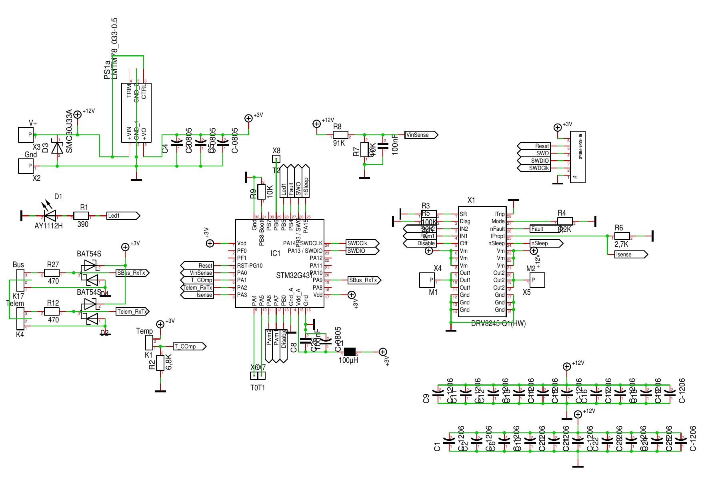

.PCB (Version 1) (click to enlarge)
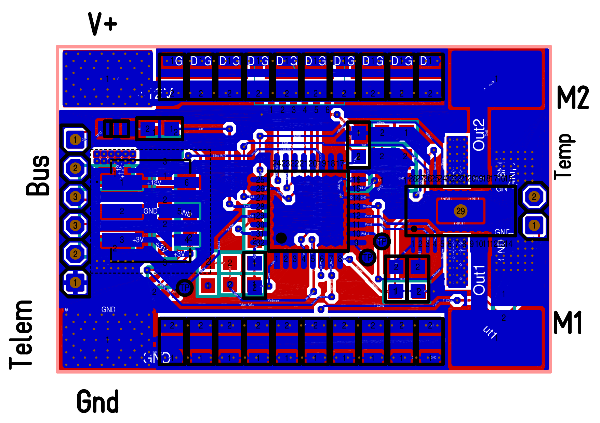

If you use _Target 3001_ as your EDA: link:bdc/BDC_ESC_G431_02.T3001[Target 3001 design file].

===== Images

.BDC (Version 1) (click to enlarge)
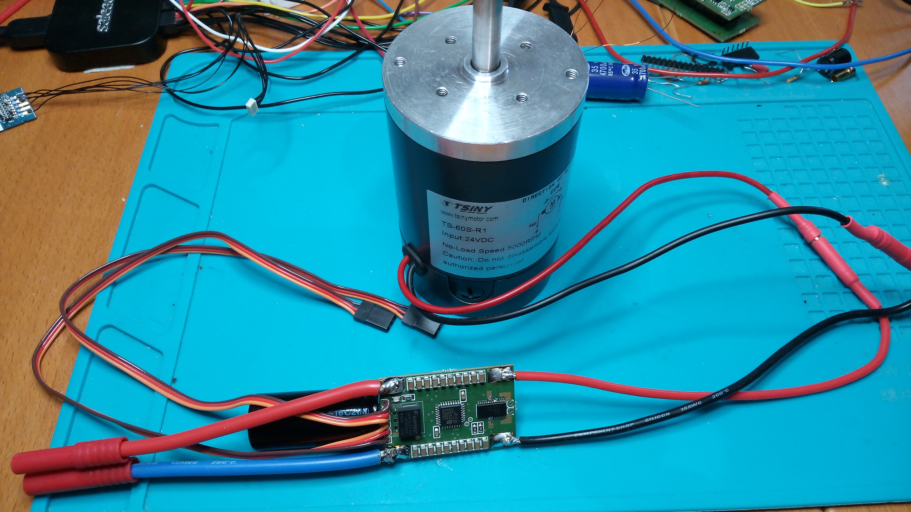

.BDC (Version 1) (click to enlarge)
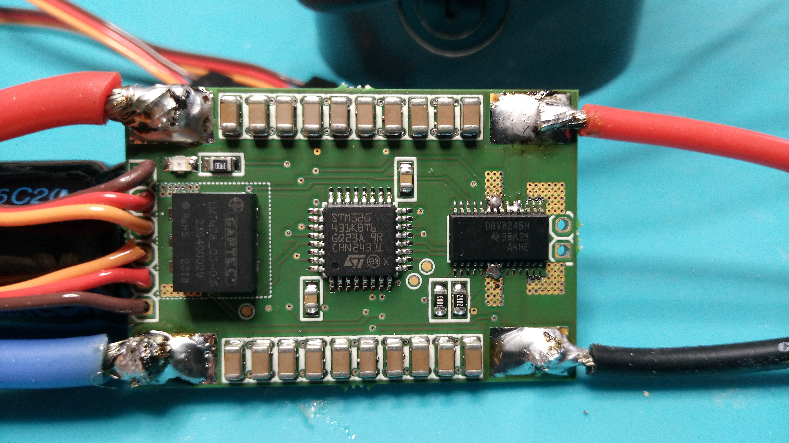

.BDC (Version 1) (click to enlarge)
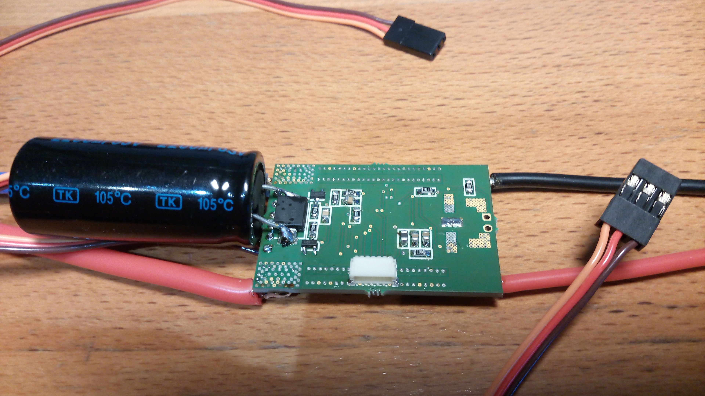

.BDC (Version 1) (click to enlarge)
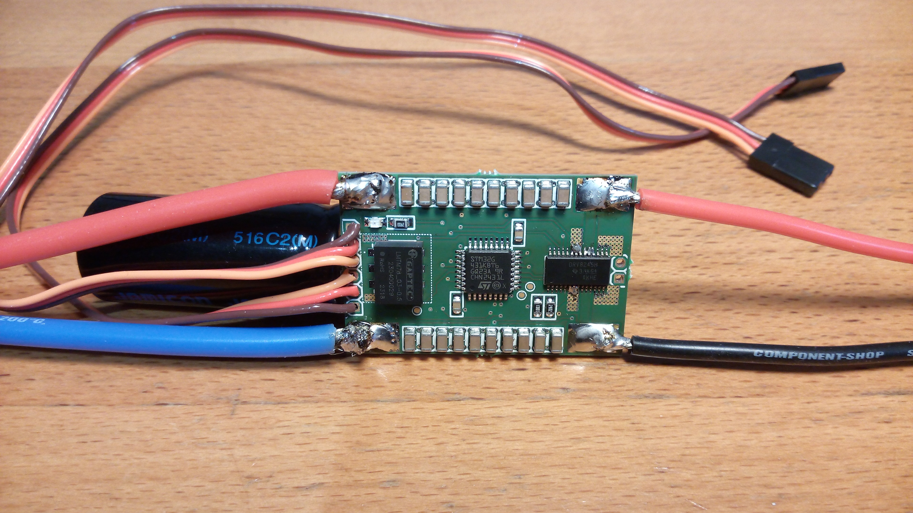

==== Version 2: max. 50A / 36V

The bigger one of the two versions consists of two pcbs, one pcb for the µC module and one pcb for the power module.
Both are connected via two pin-header or the can be soldered directly back-to-back with one layer of capton-tape in between.

===== µC module

.Schematic µC module (Version 1) (click to enlarge)
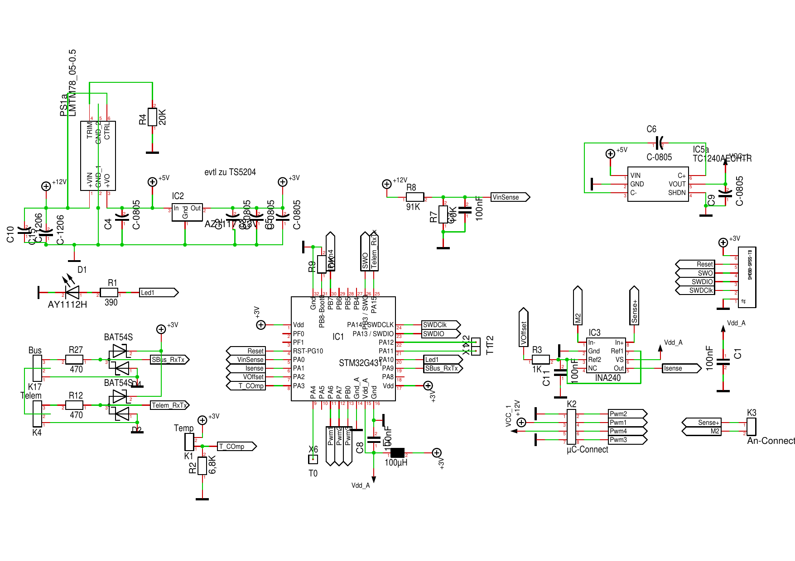

.PCB µC module (Version 1) (click to enlarge)
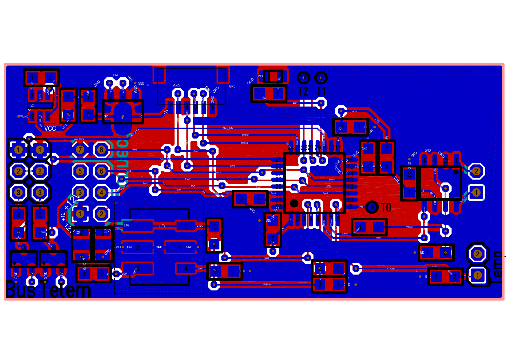

If you use _Target 3001_ as your EDA: link:bdc/BDC_ESC_mC_Module_01_PCB.T3001[Target 3001 design file].

===== Power module

.Schematic power module (Version 1) (click to enlarge)
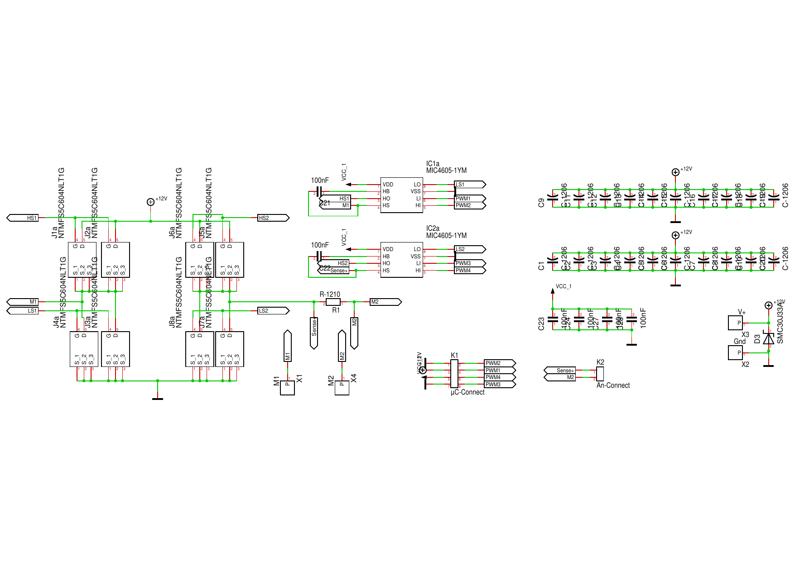

.PCB power module (Version 1) (click to enlarge)
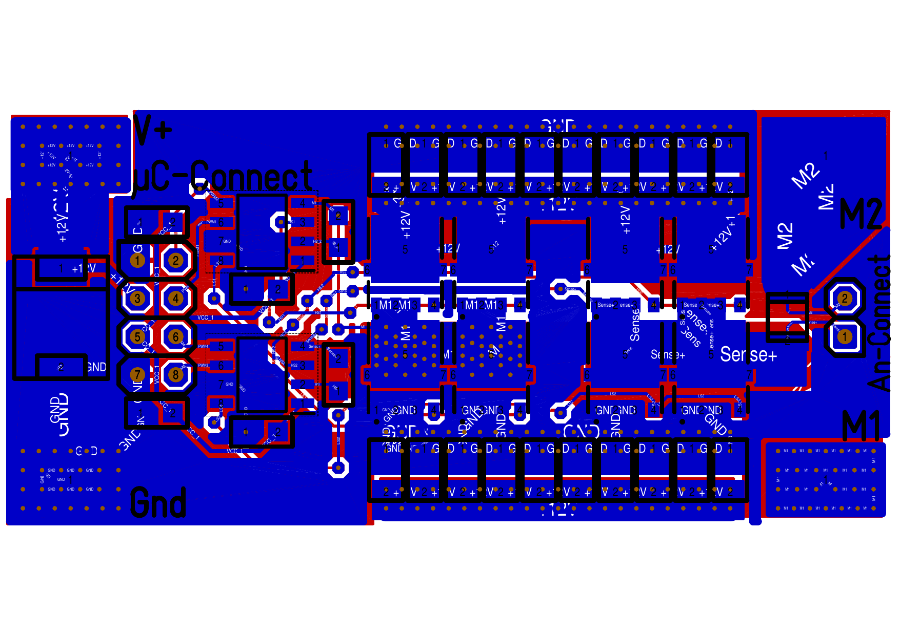

If you use _Target 3001_ as your EDA: link:bdc/BDC_ESC_PWR_Module_01_PCB.T3001[Target 3001 design file].

===== Images

.BDC (Version 2) (click to enlarge)
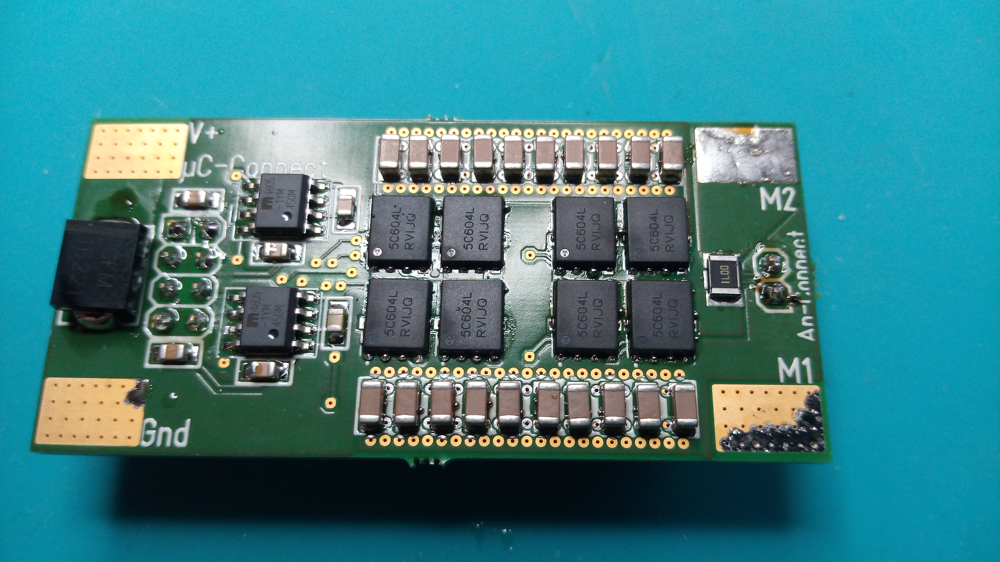

.BDC (Version 2) (click to enlarge)
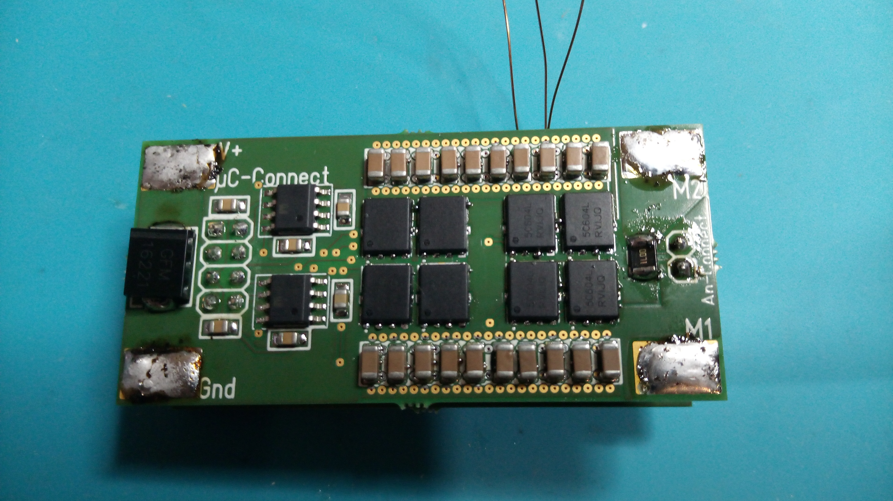

.BDC (Version 2) (click to enlarge)
image::bdc/bdc_L_3.jpg[width=240, link="bdc/bdc_L_3.jpg"]

.BDC (Version 2) (click to enlarge)
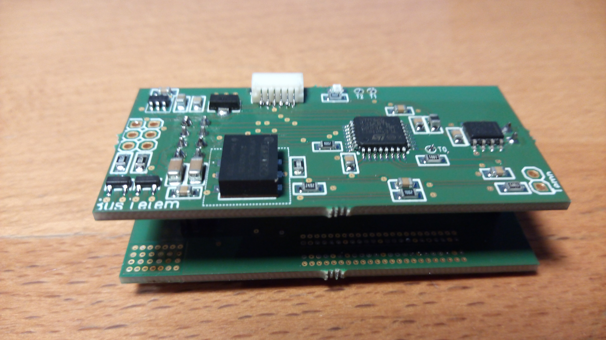

[[escape32]]
=== ESCape32: firmware for a familiy of small/medium BLDC motor controller (brushless ESC)

`ESCape32` is a firmware for a family of brushless motor controller sharing a common design (originated in the _BLHeli_-project). 
One of the most outstanding feature of `ESCape32` is the possibility to use serial input (SBus(2), CRSF, ...) and telemetry. A markable 
feature ist the `Sbus2` protocoll, than combines control and telemetry data via one half-duplex line.

https://github.com/wimalopaan/ESCape32[ESCape32]

.ESCape32
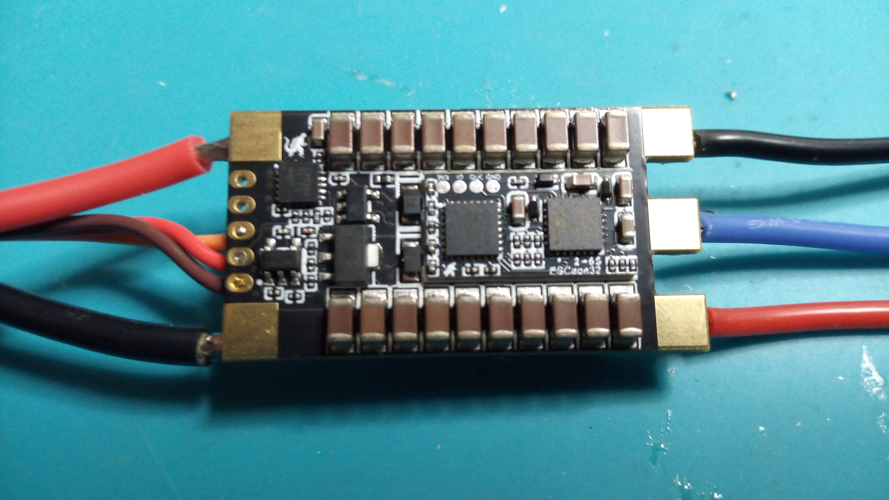

[[vesc]]
=== V/ESC: the ultimate firmware for medium/big BLDC motor controller (brushless ESC) 

Clearly, _V/ESC_ is the king. The firmware provides sensorless FOC, that gives us full torque from *zero* RPM and silent motor 
operation. This comes together with an incredible configuration software.

Unfortunately the `V/ESC` project has only an analog PPM input, but no SBUS/IBUS/SumDv3 serial input. 

This modification introduces a serial, half-duplex connection using the V/ESC serial commands for the FlipSky hardware:

Half-Duplex Modification https://github.com/wimalopaan/bldc/tree/master[VESC]

[[elrs_jr]]
=== JR-module-bay adapter for ELRS receiver as transmitter

==== Using ELRS receivers as transmitter-modules

Since the differences between ELRS receivers and transmitters (well: both are transceivers and the differences are mostly in transmit-power) are
marginal, one can use every ELRS receiver as a transmitter. Of course, you have to flash a different firmware to it.
See <<elrs_esp8285>> and <<elrs_esp32>> for the correct setting in `expresslrs-configurator`.

[CAUTION]
--
Don't expect the range to be more than 1km. Please test before going to the field (or lake or sea)!
--

==== ESP8285-based receivers

The small receivers based upon the `ESP8285` are very well suited to either placed inside the handset or to the used 
mounted inside a typical _JR-bay module_.

But they have two (not so major) drawbacks: 

* they allow only _univerted_, _full-duplex_ serial communication
* they need regulated 5V as power source

If you want to use this kind of receiver as an _external module_ it is neccessary to

* uninvert and split the _inverted_, _half-duplex_ serial signal out of the _S.Port_ connector in the module bay
* produce a regulated 5V out of the unregulated battery voltage out ouf the module bay connector.

A special case is the _FlySky-I6X_ handset: here you get an uninverted, half-duplex serial, that can simply be converted 
to the full-duplex of the ESP8285-based rx-as-tx.

* on OpenI6X uninverted mode ist compile-time option

[[elrs_esp8285]]
.ELRS firmware selection for ESP8285 based receivers
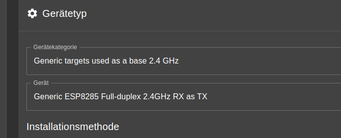

==== ESP32-based receivers

Instead of the small / simple ESP8285-based receivers you can also use the (slightly larger) ESP32-based receiver (e.g. BetaFPV SuperD). 
Fortunately the are capable of inverting the serial polarity ond also to use half-suplex on one (tx) pin. Therefore, they can directly 
connected to the _S.Port_ connector-pin.

Pleas be aware, that you now have to use a special firmware (`gemini`), see <<elrs_esp32>>.

In the hardware-config (wifi) you can now:

* disable gemini mode
* use inverted serial on one (tx) pin 

For more detals see this https://github.com/ExpressLRS/ExpressLRS/pull/1914[PR].

[[elrs_esp32]]
.ELRS firmware selection for ESP32 based receivers
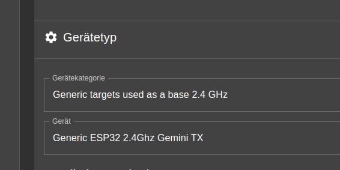

==== JR-Module-bay adapter

The communication between the handset and the tranceiver-module inside the JR-module bay takes place over 
`CRSF` / half-duplex serial protocol. The main difficulty here is that for historic reasons the polarity of the 
physical layer is inverted, so the idle level is low (0V) instead of high (3.3V) as normal. The `ESP8285` based boards
aren't capable of processing inverted serial signals. 

The next culprit is that there is no 5V regulated voltage on the pins of the module bay, but the ELRS receiver boad needs
5V regulated voltage.

Due to this fact it would be most convenient to have a adapter, that

* produces the regulated 5V out of the main battery voltage of the handset,
* uninvertes the inverted serial data, and
* splits the half-duplex connection into a seperated full-duplex one.

If you are interested in the pinout of the module bay, see: https://www.expresslrs.org/quick-start/transmitters/tx-prep[pinout]

[[jr_elrs_sch]]
.The schematic (click to view in full-scale)
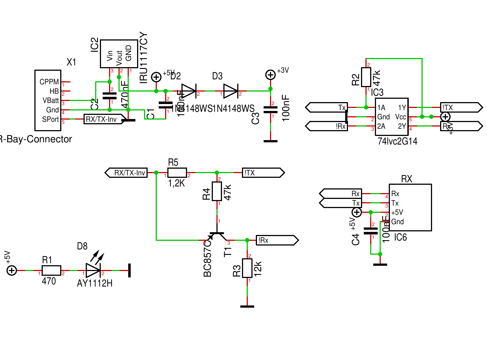

[[jr_elrs_pcb]]
.The PCB (click to view in full-scale)
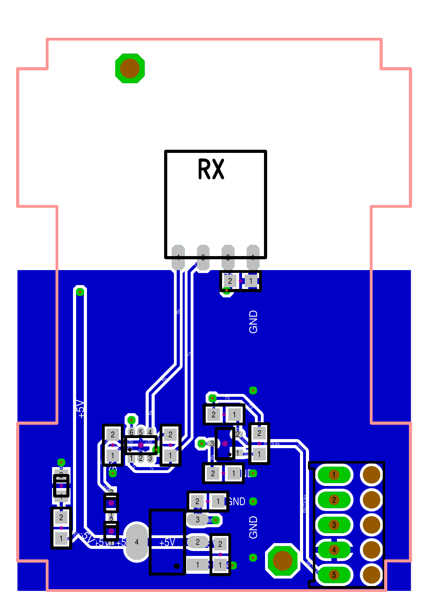

[[jr_elrs_target]]
If you use _Target 3001_ as your EDA: link:elrs/jr/JR-ELRS.T3001[Target 3001 design file].

In <<jr_elrs_la>> you see a logic-analyser trace of the `rx` and `tx` serial signal as they appear
at the ELRS-receiver. So, they are in normal polarity. 
Please not, the the sent bytes at the `tx` do not appear at the `rx`-pin: no local echo. This is 
suppressed by the circuit.

[[jr_elrs_la]]
.Signals from the ELRS receiver (click to view in full-scale)
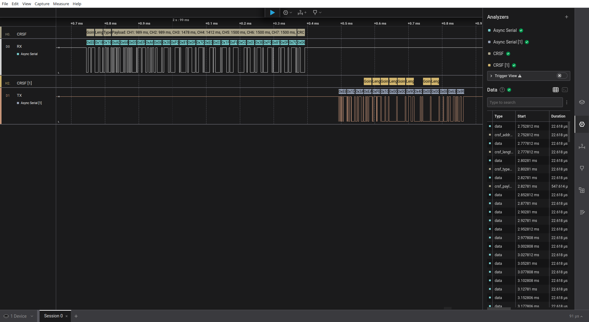

==== Assembling

The assembling is straight forward, all components are placed on one side. Please refer to the <<jr_elrs_target>>.

.The unpopulated pcb and the empty box (click to enlarge)
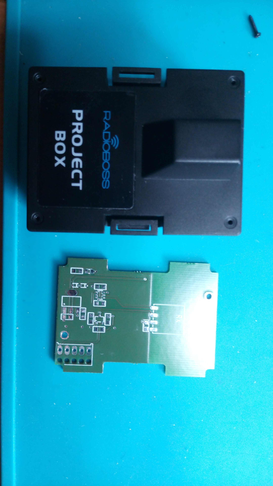

.The unpopulated pcb, the empty box, the 5-pin connector and a Happymodel EP2 receiver (click to enlarge)
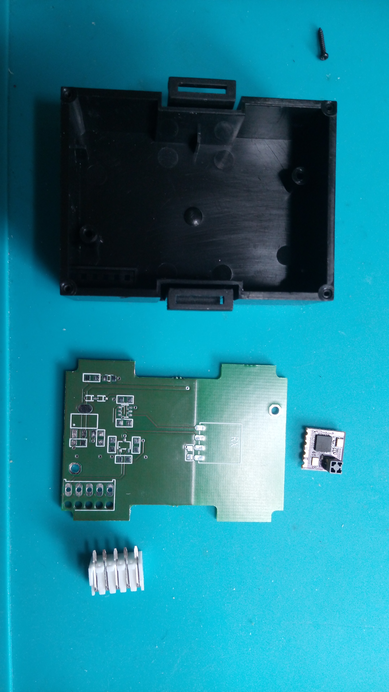

.All parts assembled (click to enlarge)
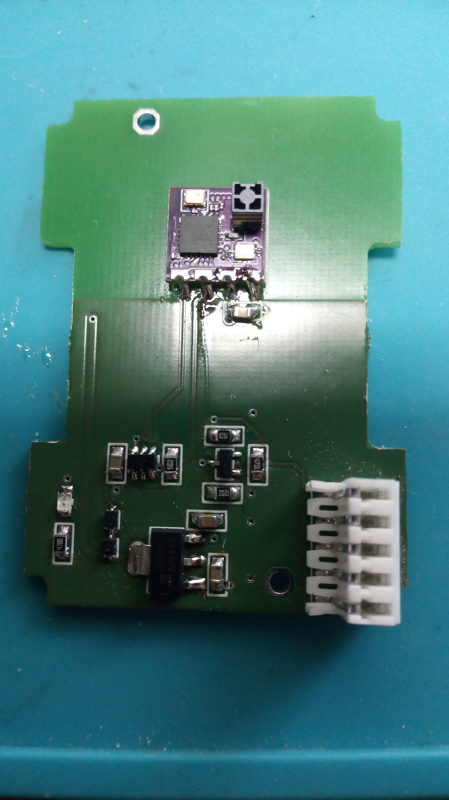

.Assembled pcb inside the JR box (click to enlarge)
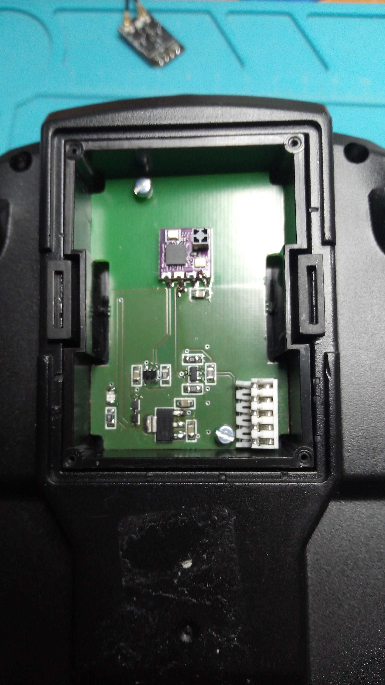

==== Usages

===== Jumper T12

.JR box snapped into the module bay of a Jumper T12 (click to enlarge)
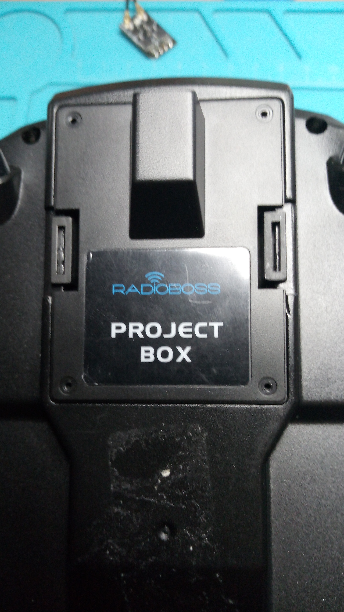

===== FrSky X9e

Unfortunately, one cannot easily replace the internal XJT-module of a _FrSky X9E_. 

.JR box inside a FrSky X9e (click to enlarge)
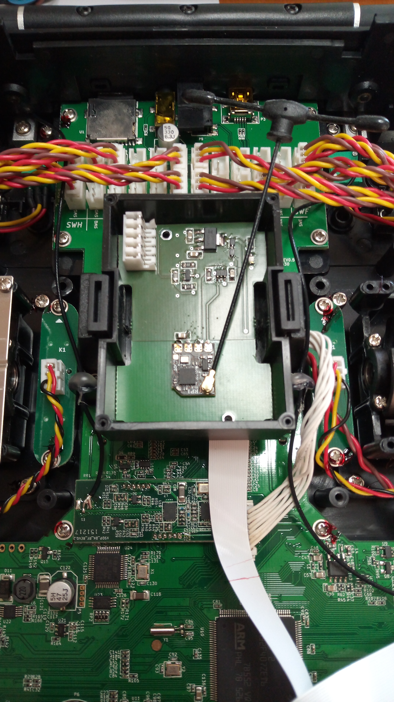

It would be possible to use the antenne of the internal XJT oder the Bluetooth module as well as an antenna for the ELRS.

.JR box inside a FrSky X9e (click to enlarge)
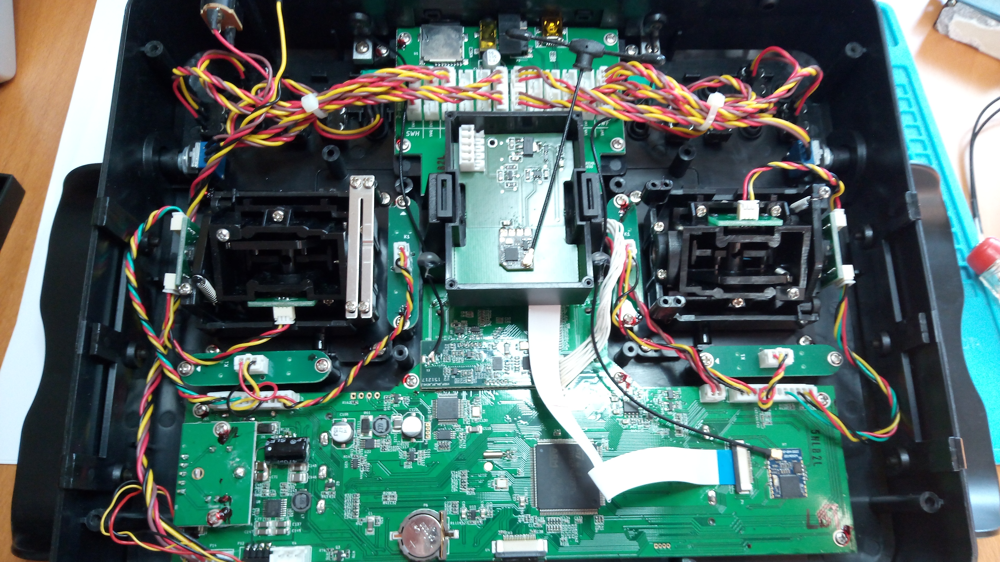

.ELRSV3.lua on FrSky X9E(click to enlarge)
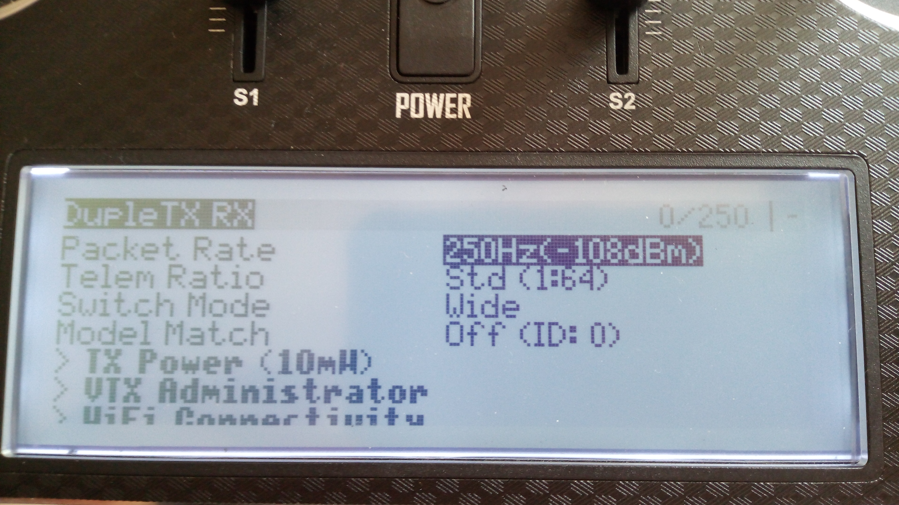

[[elrs_x12s]]
=== Adapter for ELRS receiver as internal XJT/ISRM module for FrSky X12S

If you don't want to use an external ELRS transceiver module e.g. for the JR-bay of your handset, then you may choose to replace the 
internal XJT / ISRM module of the X12S with an ELRS module. 

As mentioned in <<elrs_jr>> it is possible to use (most) ELRS receivers as trasmitters (well: transceiver). The advantage of this approach
is that the ELRS is so tiny, that you can mount it onto the X12S internal daughter boad. Maybe you can also use the antennas of the X12S if
the ELRS is also working at 2.4 GHz. The disadvantage is clearly, that the range is somewhat limited: don't expect it to be more than 1km and 
please make range tests before going to the field or lake.

You can hand-wire all the stuff but much more convenient is a small adapter board as is <<x12s_elrs_sch>> and <<x12s_elrs_pcb>>.

[[x12s_elrs_target]]
If you use _Target 3001_ as your EDA: link:elrs/x12s/X12S_ELRS_Adapter.T3001[Target 3001 design file].

.The Adapter mounted onto the X12S daughter board (click to view in full-scale)
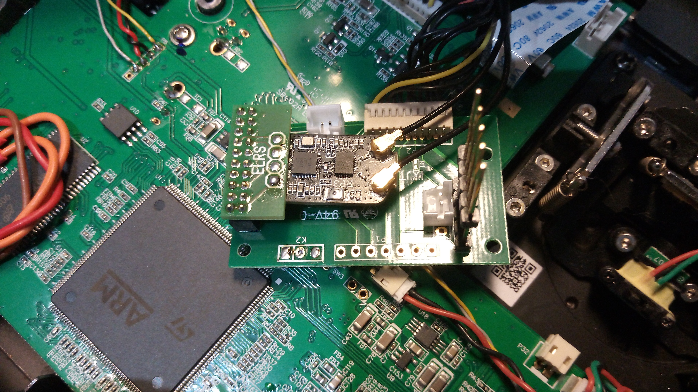

.Soldering the ELRS RX-as-TX to the adapter (click to view in full-scale)
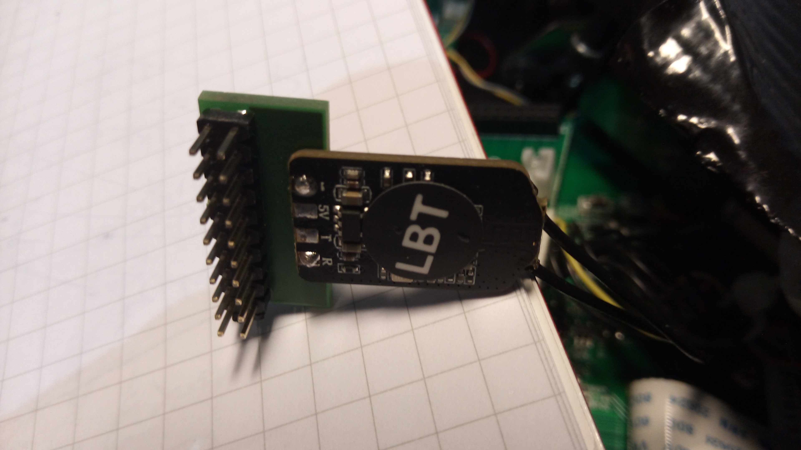

.Using the antennas (click to view in full-scale)
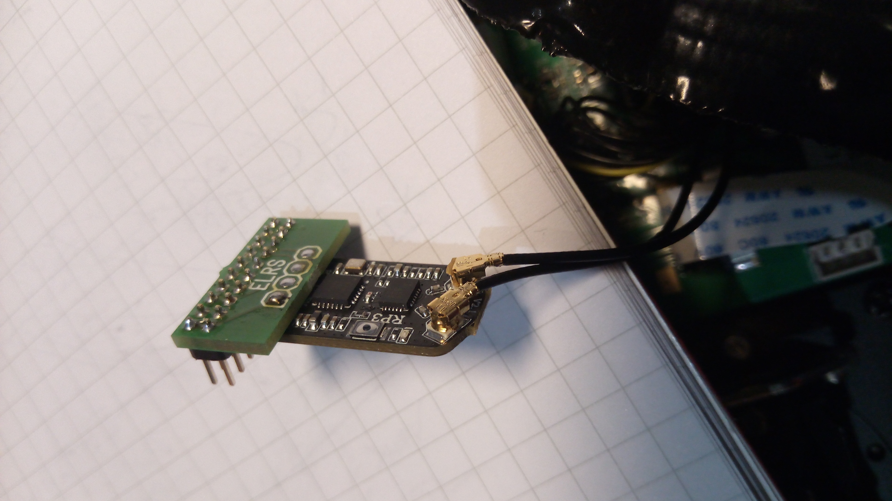

[[x12s_elrs_sch]]
.The schematic (click to view in full-scale)
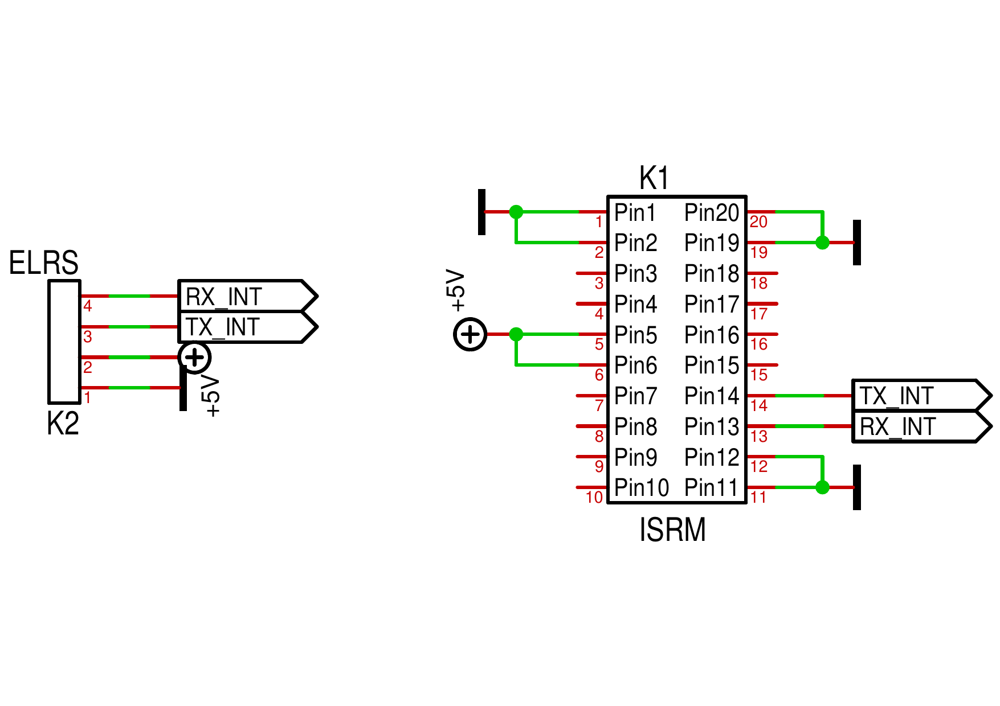

[[x12s_elrs_pcb]]
.The PCB (click to view in full-scale)


[[elrx_i6x]]
=== ELRS for the FlySky-I6X

==== Since Version `1.13`

Because of problems with the half-duplex solution and `CRSF_UNINVERTED`, this option was removed and the option `CRSF_FULLDUPLEX`
was introduced. As the name states, with this option it is possible to use a full-duplex, uninverted (normal) serial connection to the RX-as-TX.

All you have to do is to locate the `TX2` and the `PA15` pad on the mainboard of the `I6X`, refer to https://github.com/OpenI6X/opentx/wiki/Modifications#all-optional-hardware-connections[I6X elrs]
Connect the `rx`-pin of the RX-as-TX with the `TX2` pad on the board and the `tx`-pin of the RX-as-TX with the `PA15` pad on the board.
Then compile the firmware with the following options:

.cmake for uninverted full-duplex `crsf` on the `TX2` and `PA15` pad of the I6X mainbard.
[source]
--
$ cmake -DCRSF_FULLDUPLEX=YES -DEXTPWR_INVERT=YES -DUSB_SERIAL=OFF -DCMAKE_BUILD_TYPE=Release -DSPLASH=OFF  -DTIMERS=1 -DHELI=OFF -DTRANSLATIONS=DE -DPCB=I6X 
-DLUA_COMPILER=NO -DLUA=NO -DGVARS=YES  -DMULTIMODULE=OFF -DOVERRIDE_CHANNEL_FUNCTION=OFF -DPCBI6X_ELRS=YES -DPCBI6X_HELLO=YES ..
--

The option `EXTPWR_INVERT` inverts the logic on the `PC13` pad, that is used as a power-on signal to an external module. Normally the is _logic-high_ 
to signal power-on. If you want to used a simple P-channel MosFet at power-switch for the RX-as-TX, this mus be logic-low as power-on 
to the gate of the P-Channel MosFet. Be sure to use a MosFet with a low (<=2V) `Ugs` gate-source-threshold voltage 
(I use the https://www.digikey.de/de/products/detail/microchip-technology/LP0701N3-G/4902364?s=N4IgjCBcpgTAnBaIDGUBmBDANgZwKYA0IA9lANogAsYAzAOwAMVIAusQA4AuUIAylwBOASwB2AcxABfKcVgUQ2DoyYRWUoA[LP0701N3] in
a TO-92 package)

==== Before Version `1.13`

(be aware, that for some reason with this modification one get 5-8% packet loss on the connection handset <-> rx-as-tx)

All you need is to identify the `TX2` pad on the mainboard of the `I6X`, 
refer to https://github.com/OpenI6X/opentx/wiki/Modifications#all-optional-hardware-connections[I6X elrs]. This is used as the `S.Port` 
signal, which would be inverted. But fortunately there is a compile-time option to the firmare (`CRSF_UNINVERTED`) that can be set.
So the `cmake` line should be read as follows:

.cmake for uninverted `crsf` on the `tx2` pin of the I6X mainbard.
[source]
--
$ cmake -DCRSF_UNINVERTED=YES -DUSB_SERIAL=OFF -DCMAKE_BUILD_TYPE=Release -DSPLASH=OFF  -DTIMERS=1 -DHELI=OFF -DTRANSLATIONS=DE -DPCB=I6X 
-DLUA_COMPILER=NO -DLUA=NO -DGVARS=YES  -DMULTIMODULE=OFF -DOVERRIDE_CHANNEL_FUNCTION=OFF -DPCBI6X_ELRS=YES -DPCBI6X_HELLO=YES ..
--

The next dificulty is to get the regulated `5V` for the rx-as-tx. You can install a _LDO_ but it turns out to be sufficient to power the 
rx-as-tx with the internal `3.3V` of the https://github.com/OpenI6X/opentx/wiki/Modifications#all-optional-hardware-connections[mainboard].

If you want to power-off the external module, you can use `PC13` of the µC to control a power-switch for the module. If you are stouthearted desolder the
volatge-regulator from the ELRS-receiver (tx-module) and try to solder a p-Channel mosfet with _source_ and _drain_ on the same foorprint. Then use _PC13_ 
to drive the gate (by an additional n-Channel (to invert the polarity)) or use the `-DEXTPWR_INVERT=YES` compile-time switch.

==== Images, wiring and schematic

tbd

[[elrs_msw]]
=== ELRS-MultiSwitch

==== In the old days

I have been working for a long time on generalized _MultiSwitch_-Modules (s.a. https://github.com/wimalopaan/Electronics/blob/main/Old.adoc#msd[MultiSwitch-D] ).
For those not knowing what a _MultiSwitch_ is lets first explain some things (for the german reader, 
the follwing maybe sufficient: https://www.beier-electronic.de/modellbau/produkte/nms-16/nms-16.php[Beier])

In ancient times handset / transmitters were only capable of transmitting proportional _channel values_ like rudder or speed. These value got encoded as `PPM`-signals. There was no possibility to 
transport _binary_ information, e.g. like the state of a 2-position switch on the handset. Some clever people therefore invented the so called multi-switch-encoder / decoder. The encoder was placed 
inside the handset and encoded the state of a set of switches (typically 8) as distinct pulse-length on one of the _proportional_-channels of the transmitter. Since only _one_ channel should be use for 
this purpose, the switch-states have to be encoded as a time-multiplex, making it neccessary to introduce a 9th (and maybe 10th) impulse as synchronizing event.

This situation has not really changed with the advent of modern, digital 2,4GHz rc-links: these are typically designed to transport 16 (or 24 or 32) 10/11/12-bit integers as _proportional_ values. 
There is not *direct* way to transport arbitrary binary (state of switches) information (exception: Hott/SJ together with SUMDV3 can transport 64 binary state values). 

My above mentioned old MultiSwitch modules somewhat got around this limitation with the obvious technique: use the 10/11/12-bit integers to transport the binary data. But if you want to do this 
you have recognize that there is some _scaling_ on the way from the handset to the transmitter-module and inside the receiver. This renders this approach ... well ... say uncomfortable (but working). 
Other limitations are e.g. that the communacation uni-directional (exception as said above: Hott).

But the really serious limitation was, that all these rc-links (Hott, ACCST, AFHDS2A, ...) where _closed-source_ stuff!

But eventually then I dicovered `ExpressLRS`. And this was a game changer.

==== New ELRS version

With ELRS and clearly EdgeTx we have two open-source projects, that work perfectly together and give us a _complete_ rc solution. No need for closed-source components anymore. 
And as an additional important fact, the communication protocoll between the handset and the ELRS transmitter-module and betwenn the ELRS-receiver and some other device (e.g. flight-controller) 
is `CRSF`, which is well documented and nowadays the evolution is kind-of governed: https://github.com/crsf-wg/crsf[CRSF-WG].

===== Overview

The first MutliSwitch-ELRS module is the MultiSwitch-E8: this module is capable of switching 8 loads (dc-motors, LEDs, sound, ...) steady on/off, intervall on/off (blinking) 
or pwm on/off (the on-state is pwm-modulated). It is possible to have up to 256 such MultiSwitch-E8 connected to _one_ ELRS-receiver. 

To make use of the functions of the MultiSwitch-E8, a special `MultiSwitch`-Widget is needed on the radio. This widget has the _module address_ (0 ... 255) as an option. Each widget instance
can control one of the 256 MultiSwitch-E8 modules in the model. All functions can be reached via the touch-screen. If appropriate some of the functions can also be controlled via the 
physical switches on the radio.

The configuration of each of all the MultiSwitch-E8 modules is done via the standard `elrsv3.lua` script. The modules are listed under `Other devices` in the menu of that `elrsv3.lua` script.

Different to the old versions using other rc-links (AFHDS2A, ACCST, ...) this new concept does not need one the the 16 proportional channels: it is completely 
independent!

.The `MultiSwitch` widget


.The `MultiSwitch` widget (fullscreen)


===== Puzzeling parts

The hardware components:

* Radio running `EdgeTx`
* ELRS-Transmitter module
* ELRS-Receiver (PWM or serial-only)
* up to 256 MultiSwitch-ELRS modules (see below)
* CRSF-half-duplex bus (not strictly needed) (see below)

The software components:

* `elrsv3.lua` script on the radio (if you are already using ELRS, you know it for sure)
* `MultiSwitch` widget script (see below

Additional:

If you want to use multiple `MultiSwitch-E` with the _telemetry-menu_ permanently on (without pressing the button), there are some prerequisites:

* use the <<elrs-route>> version for ELRS
* make sure, each `MultiSwitch-E` uses a different CRSF-Bus address (from `0xc0` up to `0xcf`)
* make sure, each `MultiSwitch-E` uses a different _ping-answer-slot_ (which is ensured, if you use the defaults in the config menu)

Auto-Configuration:

If you want to use the _Auto-Configuration_ of the `MultiSwitch-E` be sure to use https://github.com/EdgeTX/edgetx/pull/5773[this] PR for EgdeTx.
This is optional if you only use _one_ MultiSwitch-Widget at a time. But if you plan to use more thant one MultiSwitch-Widget in one model configuration
then you'll need this. Otherwise the _auto-configuration_ may not work.

===== Design

Although it would be possible to control the MultiSwitch-E8 via the standard `elrsv3.lua` script, this approch would be very inconvenient. So, I wrote a special 
widget to control the MultiSwitch modules. Each MultiSwitch module has its own _address_ (0 ... 255), so the widget must _know_ the appropriate address. There is a widget 
option where you can set the address of the correponding module.

For each address you can also set a descriptive _name_ of the module unique for each model on the radio, as well as the names of the _function_ to switch on or off and 
which physical switches should be used (if any). This is done via a model-specific configuration file on the sd-card of the radio.

The CRSF protocol is extensible, and this fact is used to propose an extension to control such modules: <<crsf-sw>>.

===== MultiSwitch-E8

.The schematic (click to enlarge)


.The PCB  (click to enlarge)


Link to the PCB order (Aisler): https://aisler.net/p/GCSJNSFV[PCB order]

Link to link:images/elrs_msw/RCMultiSwitchSmall10.T3001[Target 3001 design file].

Link to link:images/elrs_msw/RCMultiSwitchSmall10.zip[Gerber].

Link to https://github.com/wimalopaan/wmucpp/tree/master/boards/rcmultiswitchG030[source code] (unfortunately you have to clone to whole repository)

Instructions to compile to firmware:

[source,console]
----
$ cd <repo-root>/boards/rcmultiswitchG030
$ make all
----

===== Housing

here you can find the files to print a nice housing for the PCS: https://github.com/firlefantz/Elrs-Multiswitch-guide[Housing and additional information].

===== MultiSwitch Widget

The code of the widget can be found here: https://github.com/wimalopaan/LUA[]

.The `MultiSwitch` widget

.The `MultiSwitch` widget (fullscreen)

Normally the widget uses a _config-file_ (name of the file: `<name_of_model>.lua`) to determine the type of buttons, the text of the buttons, which logical switch to use, ...
This work well, but if you switch the handet, the new handset must ahve the same model name set up and also you must copy (and keep equal) the config file. This might be tedious.
This overcomde this limitation, the `MultiSwitch-E` module itself can contain the configuration and the widget can request that configuration.

To use this, enable the `AutoConf` option of the widget.

[[crsf-bus]]
=== CRSF-Half-Duplex Bus

Allows to connect up to 4 half-duplex CRSF devices to a full-duplex receiver.

Attention: this requires an external means to _activate_ the attached half-duplex devices (e.g. a button on the devices), because at most only _one_ device can be active on the bus (s.a. <<crsf-switch>>). 

.The schematic  (click to enlarge)


.The PCB  (click to enlarge)


Link to the PCB order (Aisler): https://aisler.net/p/KPBJUCXN[PCB Order]

Link to link:images/elrs_msw/RC_CRSF_HalfDuplex_Bus.T3001[Target 3001 design file].

===== Demo (Video)

Prototyp: https://www.youtube.com/watch?v=PeuxACw40io[Video]

[[rc720e]]
=== Double Schottel-Control

This module controls two Schottel dives.

Features:

* Servos
** PWM-Servos with analog Feedback (e.g. Feetech FB360M)
** PWM-Servos with PWM-Feedback (e.g. Parallax)
** serial Servos (e.g. WaveShare ST3020)

* ESCs
** PWM-ESCs
** `Sbus`,`Sbus2`, `IBus` Escs
** _special_ : KISS(ESCape32), V/ESC
** Telemetry as half-duplex (special, SBUS2) or separate: S.Port, IBus

* BEC joining 
** up to three BEC sources

* CRSF
** CRSF input
** CRSF routing to one/two CRSF ports

* GPS + inertial sensor
** (planned)

* Sbus-Out
** channels 1-16
** Channels 17-32 (needs special mixer script: https://github.com/wimalopaan/LUA?tab=readme-ov-file#mixer-script-crsfch-lua[crsfch.lua])

* IBus / SBus / SumDV3 Input
** input for steering and power
** configuration via ELRS
** PC-Link via ELRSBuddy: https://fourflies.mooo.com/elrsbuddy[] and https://github.com/Fourflies/elrsbuddy[]

* CPPM/N, CPPM/P, PWM-Overlay
** input for steering and power

* MultiSwitch
** multi-switch capable as <<elrs_msw>>
** output of analog time-multiplex switch signal (like old Graupner 2-16K NAUTIC-Expert Schaltbaustein)

===== Demo (Video)

https://www.youtube.com/watch?v=Hkk3GpHR4N8[Video1]

https://www.youtube.com/watch?v=VOI6-u9Bq1s[Video2]

https://www.youtube.com/watch?v=yr4b6svxh-k[Video3]

==== Schematics

.The schematic  V2 (click to enlarge)


Link to link:images/rc720e32/RC_720_32_E_02.T3001[Target 3001 design file].

Link to https://aisler.net/p/GBXFAZAU[Aisler RC720E32 V2].

==== PCB

.The PCB top V2  (click to enlarge)


.The PCB bottom V2 (click to enlarge)


==== Firmware

Link to https://github.com/wimalopaan/wmucpp/tree/master/boards/rc720E32[source code] (unfortunately you have to clone to whole repository)

==== Widget

LUA https://github.com/wimalopaan/LUA?tab=readme-ov-file#widget-for-rc720e32-schottel-controller[Widget] for `EdgeTx`.

[[crsf-switch]]
=== CRSF-Switch

Allows to connect up to seven half-duplex CRSF devices to a full-duplex receiver.

In contrast to <<crsf-bus>> this `CRSF-Switch` allows _all_ attached devices to be active at the same time (no external activation required).

[[elrs_ma]]
=== ELRS-MultiAdapter-EA

The `ELRS-MultiAdapter-EA` converts CRSF-serial input into 

* 4 Servo-PWM outputs for arbitrary channels (out of the 16 CRSF channels) or for 4 individual out-of-band channels (4 additional 8-bit channels), or 
* acts like a <<elrs_msw>> but with 4 push-pull outputs up to 1A@18V (max.) (occupies 1 switch-module address in this mode), or
* produces up to 4 PWM outputs for analog switch modules (like Graupner 4159) each occupying one of the 256 addresses, or
* produces 4 motor PWM signals (duty 0 ... 100%) (unidirectionl) up to 1A@18V (max.) for 4 individual out-of-band channels (4 additional 8-bit channels) or 4 normal channels (1 ... 16), or
* produces 2 motor PWM signals (duty 0 ... 100%) (bidirectionl) up to 1A@18V (max.) for 2 individual out-of-band channels (4 additional 8-bit channels) or 2 normal channels (1 ... 16), or

[[CC]]
=== The `CruiseController` 

The `CC` (CruiseController) is like a _Flight-Controller_ but mainly for ship/boat-models.

It consists of 

* ELRS receiver
* Bluetooth module
* Servo-PWM-outputs
* SBus(2)/IBus/SumdV3 output
* SBus(2)/S.Port/IBus/Hott telemetry
* 4 direct switching lines (up to 1A@16V) (shared with servo pwm outputs)
* additional serial connections (e.g. GPS)
* V/ESC support
* 16-channel switching mezzanine board
* 16-channel LED mezzanine board

More to come ...

[[hwext]]
=== Hardware-Extension-Protocol

The _hardware-extension-protocol_ is a simple serial protocol to send the state of external switches and potentiometers to the handset. The `RadioMaster TX16S` handset has two 
serial interfaces one can use to extend the handset, e.g. to provide more switches or potentiometers (s.a. <<hwlua>>).

The protocol is designed as a multi-master / slave protocol, which gives the chance to have more than one external controller that sends data to the handset (s.a. <<extswitch>> and <<rcdesk>>).

In the case of the `RadioMaster TX16S`, which has _two_ serial interfaces, the other serial interface remains free to used for other purposes, e.g. 
to connect a `SBUS`-receiver realizing a trainer connection or connecting other gear (s.a. <<rcdesk>>).

==== Physical layer

* Baudrate: 115200 Baud
* 8 Bits
* no parity
* 1 Stop bit
* half-duplex

==== Application Layer

An external switch controller (_master_) sends packages to the handset. It is possible to connect more than one external switch controller to the
same half-duplex serial-line (the `rx` line of the handset). This requires unique IDs of the switch controllers (s.a. <<hwext_timing>>)

===== Packet Format

Format: `[0xaa]` `<cntrl-nr>` `<type>` `<payload-length>` `<payload>` `<check-sum>`

* `<cntrl-nr>`: the controller-number (source) (one instance of the LUA-scripts acts upon one specific controller-number (must be a unique number on the bus)
* `<type>`: type of message
** `0x00`: binary switches in payload (each byte encodes 8 switches)
** `0x01`: 8-bit-values in the payload (each byte encodes an distinct value)
* `<length>`: number of bytes of the `<payload>`
* `<payload>`: bytes encoding switches or values
* `<check-sum>`: arithmetic sum of `<payload>` byte, only one byte, may overflow

[[hwext_timing]]
===== Multi-Master Timing

The master with the _controller-number_ `0` sends a package every 100ms (maybe down to 20ms) unconditionally. The user has to ensure, that excactly _one_ controller
with number `0` exists on the serial bus.

If there are other masters on the bus with _controller-number_ greater `0` (e.g. `N`), they listen on the bus and wait for a message to see with _controller-number_ `(N-1)`.
If this master receives such a message, it waits 2 byte-times after the last byte of the just received message and then switches to send-mode and sends its own messages.

The user has to ensure, that the inter-message gaps are long enough so that all masters can send their messages. All controllers must have numbers in ascending order 
without gaps starting with `0`.

[[hwlua]]
=== LUA-script for the Hardware-Extension-Protocol

There are several ways to read the information send via the <<hwext>> and some of the serial interfaces of a handset. The two most obvious are:

* modify the `EdgeTx`-firmware to read the data via theserial interface, parse the <<hwext>> and modify the state of switches and inputs, or
* use a `LUA`-script to read the data

To modify the `EdgeTx`-firmware would be the most powerful, because the external hardware read via the <<hwext>> could _act_ like the internal control elements like sticks and switches. 
But, this would be a huge modification of `edgeTx` for only a small number of users I think. So, there will be little chance to get these modifications _offcially_ approved and get them into
the main version of the source code of `EdgeTx`.

To use a LUA-script isn't intrusive in any way, one can use the standard LUA-API of `EdgeTx` (some useful functions for this I got into `EdgeTx` soem time ago). 
Clearly, this approach has limitations: you can't introduce _new_ inputs or _new_ switches.

But

* the `LUA`-script can set/reset some of the 64 _logical-switches_ as a reaction to flipping of an external switch, and
* it can set set one of the 16 _shared-memory_ variables, which then can be used inside a _mixer-script_ to produce an output-channel value.

Sure, there is a limitation of 64 logical-switches and 16 shared-memory variables: but I think there is a good chance to increase these limits a least on the 
color-LCD radios with a substantial amount of RAM.

The code of the widget can be found here: https://github.com/wimalopaan/LUA[]

[[hwluaimg1]]
.Two widgets installed (click to enlarge)  


[[hwluaimg2]]
.The information screnn of the widget (click to enlarge)  
image::images/hwext/hwextlua2.png[width=240, link="images/hwext/hwextlua2.png"]

https://www.youtube.com/watch?v=oPbaWQnMffA[Video]

[[extswitch]]
=== The TX16s internal switch controller

This is a simple AVR `attiny1614` that reads the stick switches of my TX16s and uses the <<hwext>> to send the data to the handset. The <<hwlua>> decodes the stick-switches into _logical-switches_ in 
`EdgeTx`. This controller has the _controller-number_ `0`, so one can connect more controllers using the <<hwext>> connected to the _same_ serial interface of the TX16s.

[[hwattiny1]]
.Attiny1614 as external switch controller (click to enlarge)  
image::images/hwext/hw1.jpg[width=240, link="images/hwext/hw1.jpg"]

[[hwattiny2]]
.Attiny1614 as external switch controller (click to enlarge)  


[[hwattiny3]]
.Attiny1614 as external switch controller (click to enlarge)  


[[hwattiny4]]
.Attiny1614 as external switch controller (click to enlarge)  


==== Code

Link to the code repo: https://github.com/wimalopaan/wmucpp/tree/master/boards/rcswitch[]

(unfortunately you have to clone to whole repo to include all neccessary files. Maybe this will change in the future)

[[rcdesk]]
=== The RC-desk (for RadioMaster TX16S, FrSky X12S / X9E)

SpaceMouse

tbd

=== A new kind of stick: haptic-control

.The stick model (click to view in full-scale)


tbd

=== Simple RC main power latched switch

In the old days there was this simple project: https://github.com/wimalopaan/Electronics/blob/main/Old.adoc#diy-rc-hauptschalter[main switch]. 
Please follow the preceeding link to get the documentation (unfortunately only in german, don't have the time to translated all documents). 

If you want to build this board, the link:rc/boards/onoff_simple.T3001[Target3001] design file may be of interest.

[[oix6]]
== Openix6

=== Firmware

The https://github.com/OpenI6X/opentx[OpenI6X] project provides OpenTx for
small radios of the type _FlySky_ *FS-i6x*. 

=== Compiling

If you want to use the modification where all switches are 3-position switches,
use the https://github.com/OpenI6X/opentx/pull/403[PR403] of the project 
and set the compile-time option `ALL3POS`:

[source]
--
$ cmake -DALL3POS=YES -DUSB_SERIAL=OFF -DCMAKE_BUILD_TYPE=Release -DSPLASH=OFF  -DTIMERS=1 -DHELI=OFF -DTRANSLATIONS=DE -DPCB=I6X 
-DLUA_COMPILER=NO -DLUA=NO -DGVARS=YES  -DMULTIMODULE=OFF -DOVERRIDE_CHANNEL_FUNCTION=OFF -DPCBI6X_ELRS=YES -DPCBI6X_HELLO=YES ..
--

=== Flashing

German https://www.youtube.com/watch?v=tvDtpW6TglE&t[how-to] 

List of _devices_:

----
$ dfu-util  -l 
dfu-util 0.11

Copyright 2005-2009 Weston Schmidt, Harald Welte and OpenMoko Inc.
Copyright 2010-2021 Tormod Volden and Stefan Schmidt
This program is Free Software and has ABSOLUTELY NO WARRANTY
Please report bugs to http://sourceforge.net/p/dfu-util/tickets/

Found DFU: [0483:df11] ver=2200, devnum=10, cfg=1, intf=0, path="1-2", alt=1, name="@Option Bytes  /0x1FFFF800/01*016 e", serial="FFFFFFFEFFFF"
Found DFU: [0483:df11] ver=2200, devnum=10, cfg=1, intf=0, path="1-2", alt=0, name="@Internal Flash  /0x08000000/064*0002Kg", serial="FFFFFFFEFFFF"
----

Flashing:
----
dfu-util -s 0x08000000 -a 0 -D firmware.bin
----

== OpenTx / EdgeTx weekly

_OpenTx weekly_ is a https://www.youtube.com/channel/UCedl1hS-dfWh-V4WBz_jGog[YouTube]-channel mostly 
for EdgeTx and OpenTx stuff but also for my above electronic projects. Unfortunately the spoken language is german :-( 

On https://schiffsmodell.blogspot.com/p/grundlagen-zu-opentx.html[Holger Meyer] you may find an up-to-date table of contents.

[[gear]]
== Actual gear

In the following chapters you will see my actual gear and the modifications.

=== RadioMaster

==== TX16S

EdgeTx

hall-sticks

internal 4-in-1

Extensions:

* 2x incremental encoder
** withc µC attiny412
** on top of the handset
** wired in poti-mode to Ext1/Ext2
* stick switches
** encoded by a µC (Attiny1614) inside the handset into FrSky-D telemetry via AUX1
* SWD-connector
** magnetic connector on the bottom of the handset

.TX16S incremental encoder (click to enlarge)


.TX16S SWD magnetic adapter (click to enlarge)


.TX16S desk with space mouse (click to enlarge)


.TX16S desk with space mouse (click to enlarge)


.TX16S stick switches: the attiny1614 inside the radio (click to enlarge)


.TX16S stick switches (click to enlarge)


==== Desk for the TX16s

=== FlySky

==== FS-i6X

https://github.com/OpenI6X/opentx[OpenI6X]

Modifications:

* External ELRS (rx-as-tx EP2) inside the handset (<<elrx_i6x>>)
* SWD-connector 
** magnetic connector on the bottom of the handset
* Make all switches `SA`, `SB`, `SC` and `SD` 3-position 

.Closeup of the magnetic SWD connector (click to enlarge)


=== Jumper

==== T12

EdgeTx

External ELRS (JR-module bay): <<elrs_jr>> 

=== FrSky

==== X9e

EdgeTx

External ELRS (JR-module bay)(inside the housing): <<elrs_jr>> 

Modifications:

* AUX1 (P12)
** magnetic connector at the bottom of the handset 

.Closeup of the magnetic serial connector (click to enlarge)


==== X12S

EdgeTx

Modifications:

* touch-screen: <<x12s_touch>>
* internal ELRS: <<elrs_x12s>>
* LiIon accu
* AUX1
** magnetic connector at the bottom of the handset

.Closeup of the magnetic serial connector (click to enlarge)


.Serial connection to the desk electronik (click to enlarge)


.LiIon-accu (click to enlarge)


=== Graupner/SJ

==== MC-16

[[vintage]]
== Vintage RC

=== Graupner / Grundig / JR 

[[gr_txs]]
==== Transmitter

.MiniProp4 transmitter


.MiniProp4 receiver


.Varioprop Expert Modulsystem FM 6014


.Varioprop Graupner Grundig 12S
image::images/retro/Varioprop12S.jpg[width=480]

.Varioprop Graupner Grundig T14 Expert Modulsystem
image::images/retro/Varioprop14_Expert.jpg[width=480]

.Varioprop Graupner Grundig 14S 27MHz
image::images/retro/Varioprop14S_schwarz27.jpg[width=480]

[[varioprop_black]]
.Varioprop Graupner Grundig 8S 40MHz
image::images/retro/Varioprop8S_schwarz.jpg[width=480]

[[varioprop_yellow]]
.Varioprop Graupner Grundig 8S 27MHz


[[varioprop_red]]
.Varioprop Graupner Grundig C8 27MHz
image::images/retro/VariopropC8.jpg[width=480]

==== Receiver

.Varioprop miniSuperhet FM 40S


.Varioprop miniSuperhet 27MHz
image::images/retro/RX02.jpg[width=480]

.Varioprop miniSuperhet FM 35S


==== Other

.Varioprop Fahrtregler
image::images/retro/ESC_Varioprop.jpg[width=480]

=== Robbe / Futaba

[[rb_txs]]
==== Transmitter

.Robbe Promars
image::images/retro/promars.jpg[width=480]

.Robbe digital4


[[robbe_f14]]
.Robbe Futaba F-14 Navy 40MHz
image::images/retro/FutabaF14.jpg[width=480]

==== Receiver

==== Other

=== Other

==== Transmitter

==== Receiver

==== Other

.Model Craft Speed Controller
image::images/retro/ESC_Modellcraft.jpg[width=480]

.hitec Speed Controller


== Licence

Please see link:LICENSE[Lizenz], as far as not other licences apply (e.g. in the source code).

== Kontakt

mailto:wilhelm.wm.meier@googlemail.com[email]
