= 5D-Sticks für die FrSky X12S
Wilhelm Meier <wilhelm.wm.meier@googlemail.com>
:revnumber: 1.0
//:revdate: 01.01.1970
//:revremark: undefined
:lang: de
:toc:
:toc-title: Inhalt
:toclevels: 4
:numbered:
:src_numbered:
:icons: font
:icontype: svg
:figure-caption: Abbildung
:description: 5D-Sticks für die FrSky X12S
:title: 5D-Sticks für die FrSky X12S
:sectanchors:
:sectlinks:
:experimental:
:copyright: Wilhelm Meier
:duration: 90
:source-highlighter: pygments
:pygments-css: class
:status:
:menu:
:navigation:
:split:
:goto:
:blank:
:showtitle:
:docinfo1:
:stem:
// for attributes in link:[] macro like link:xxx[window="_blank"]
:linkattrs:

== Einführung

//image::images/x12s.jpg[]

In diesem Dokument wird der Umbau eines _FrSky X12S_ Senders auf zwei der _SFrog 5D Sticks_ beschrieben (s.a. <<quellen>>).

_Jeder_ dieser <<sticks, Sticks>> bietet

* Slider (Poti)
* Miniatur-Kreuzknüppelaggregat (2x Poti)
* Taster im Miniatur-Kreuzknüppelaggregat
* (beleuchteter) Taster an der Vorderseite
* LED (für Taster)

Insgesamt werden bei zwei umgebauten Sticks also 6 zusätzliche, analoge Eingänge, 4 digitale Eingänge sowie 2 LED-Ausgänge benötigt.
Daher können diese Sticks mit allen Gebern nicht direkt an das _Mainboard_ der X12S angeschlossen werden.

Stattdessen wird der Weg gewählt, diese Geber an ein (kleines) zusätzliches µC-Board anzuschließen. Dieses µC-Board produziert daraus ein
seriellen Datenstrom mit dem `SBus` Protokoll. Dieses kann dann an dem Verbinder _P13_ auf dem Mainboard entgegen genommen werden.

In `EdgeTx` wird dies dann als serielles Schülersignal entgegen genommen (s.a. <<edgetx>>):

.FrSky X12S im Originalzustand
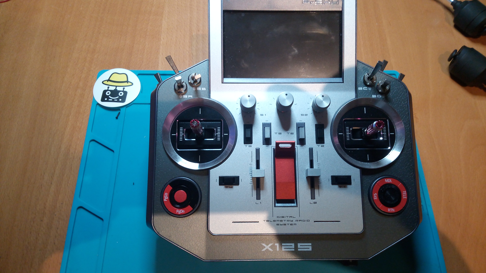

.FrSky X12S im Endzustand
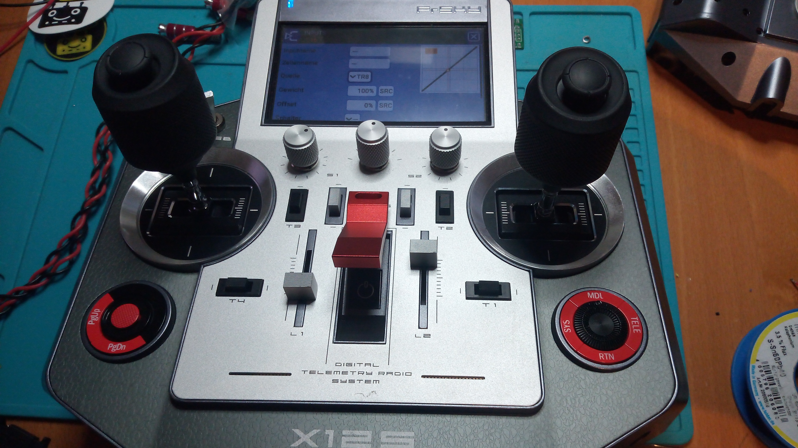

[[sticks]]
.SFrog 5D-Knüppel im Auslieferungszustand
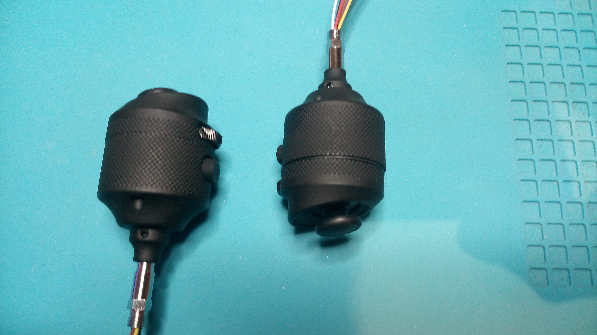

.Mögliche µC-Module für den Umbau: WmG0B1 (links) und WeActG031
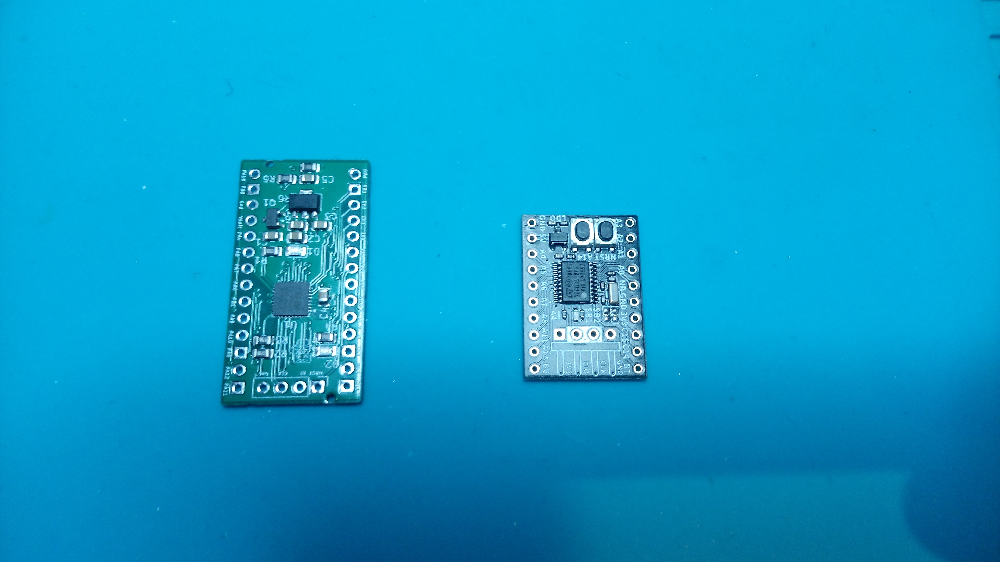

== Montageablauf

Der Ablauf der Montage ist in den folgenden <<pics, Fotos>> gut zu erkennen.

Er besteht im wesentlichen aus den Hauptschritten:

. Demontage der originalen Sticks
. Aufbohren der Aggregatbrücke auf 3,5mm
. (optional) Modifikation der 5D Sticks zur Ansteuerung der LED
. Einbau der 5D Sticks in die Aggregat
. Verkabelung an das µC-Modul
. Fixierung des µC-Moduls im Inneren der X12S
. Flashen des µC-Moduls
. Einstellungen in EdgeTx
. Funktionstest

[[pics]]
=== Montage-Schritte als Fotos

==== Demontage der originalen Knüppel inkl. Bolzen

Zuerst werden die originalen Bolzen mit Knüppeln abgeschraubt.

Achtung: diese sind mit Schraubensicherungslack gesichert. Daher mit einem guten 6mm Gabel-/Ringschlüssel
oder (besser) mit einer 6mm Nuss abschrauben. Ggf. kann die Aggregatbrücke mit einem 8mm sehr flachen Gabelschlüssel
gekontert werden.

.Das Knüppelaggregat mit abgeschraubten, original FrSky Stick
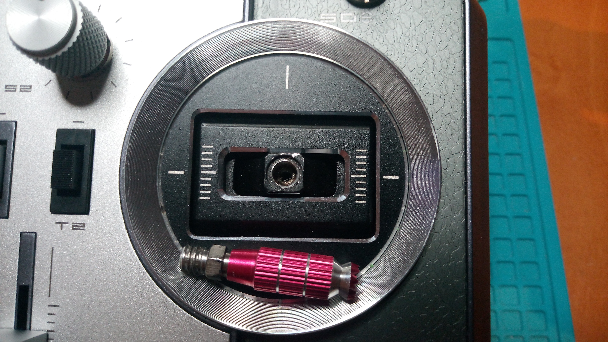

.FrSky X12S Innenansicht auf die Knüppelaggregate (ebenfalls sichtbar: Zusatz für Touch-Screen-Umbau)
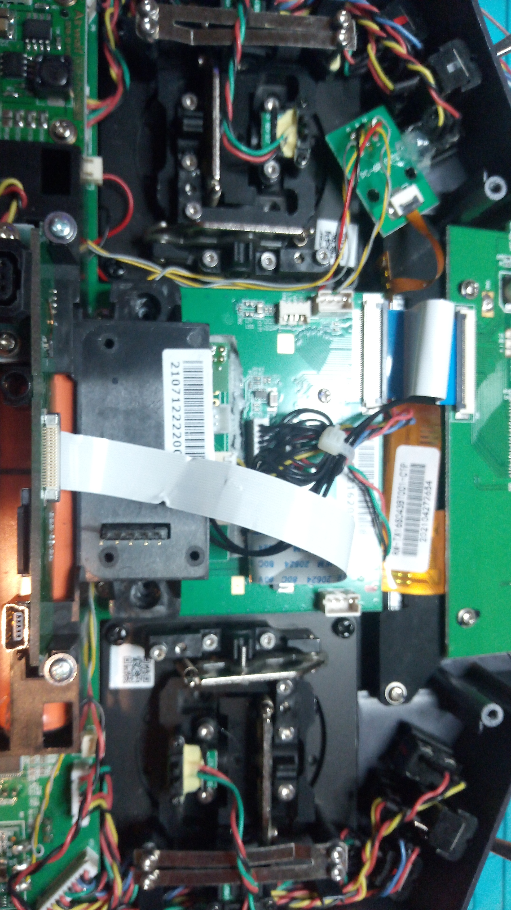

.Nahansicht des Knüppelaggregats mit original vorhandener Bohrung
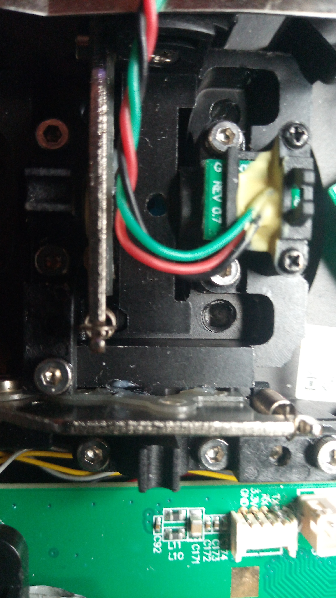

=== Aufbohren der Aggregatbrücke

Damit die Kabel aus dem SFrog 5D Sticks in des Senderinnere geführt werden können, muss die Aggregatbrücke beider
Aggregrate aufgebohrt werden. Eine Aufbohrung auf 3,5mm hat sich als ausreichend und unproblematisch erwiesen.

Vor dem Aufbohren unbedingt den Sprengring aus dem ursprünglichen Montageloch entfernen.

.Sprengring unbedingt nach der Demontage der original Sticks und vor dem Bohren aus dem Schraubloch entfernen
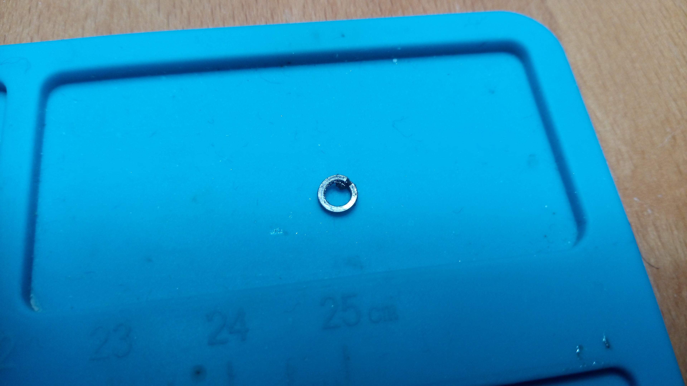

Dieser Durchmesser reicht auch aus, um das zusätzliche Kabel für die LED mit hindurch zu führen.

.Beginn der Aufbohrung des Knüppelaggregats auf 3,5mm
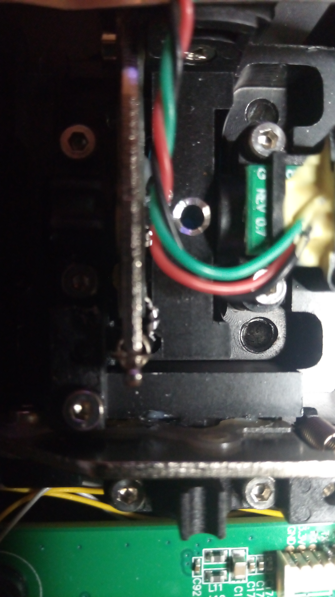

Die Aufbohrung kann von innen, besser von außen erfolgen. Beim Aufbohren von außen können keine
Alu-Spähne in das Innere des Senders gelangen. Trotzdem ist es sinnvoll, die Aggregate
zum Schutz vor Spähnen abzukleben.

.Schutz des Knüppelaggregats durch Abkleben vor Aluminiumspänen beim Aufbohren
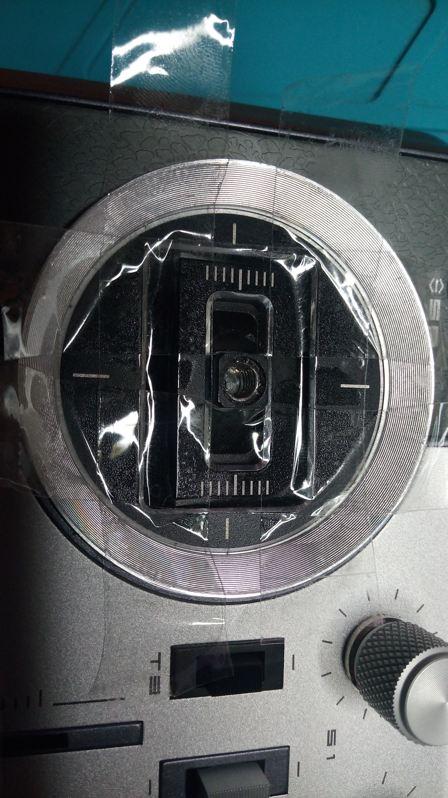

Anschließend kann eine Testmontage erfolgen.

.Montage-Test der SFrog 5D-Sticks
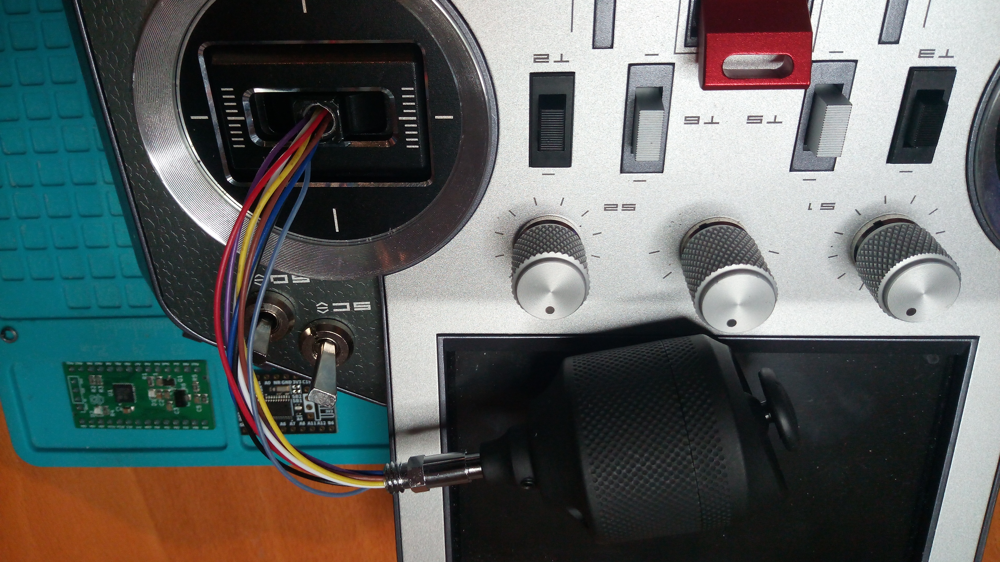

=== Pin-Belegung / Farbzuordnung der SFrog 5D Sticks

Das folgende Foto zeigt die Zuordnung der Kabel zu den einzelnen Elementen des SFrog 5D Sticks:

.Pin-Belegung des SFrog 5D-Sticks
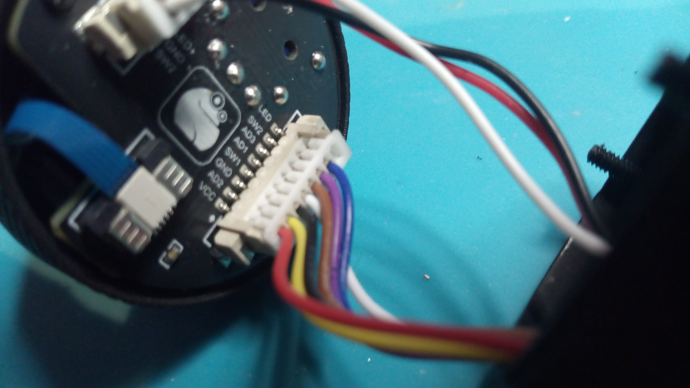

=== (Optionale) Modifikation des SFrog 5D Sticks für eine einzelne Ansteuerung der LEDs im Stick

Im Auslieferungszustand ist im SFrog 5D Knüppel intern die LED an Vcc/3,3V angeschlossen und leuchtet damit dauerhaft.

Möchte man die LED jedoch vom µC-Board aus ansteuern, so ist es dafür notwendig:

* das (rote) Verbindungskabel von der Hauptplatine des Knüppels zum LED-Tochter-Board entfernen (aus den JST-PB Steckschuhen herausziehen)
* in den nun freien Kontakt des 3-poligen JST-PB Konnektors am LED-Tochter-Board ein zusätzliches Kabel mit einem JST-PB Kontakt einführen und einstecken
* das zusätzliche Kabel mit den anderen Kabeln durch den Hohl-Bolzen führen.
* den Bolzen dazu aus dem Stick-Gehäuse herausziehen (Sicherungsschrauben lösen)
* anschließend den Bolzen wieder in den Stick einführen und sichern

.Pin-Belegung des SFrog 5D-Sticks mit Ansicht des Tochter-Board-Verbinders
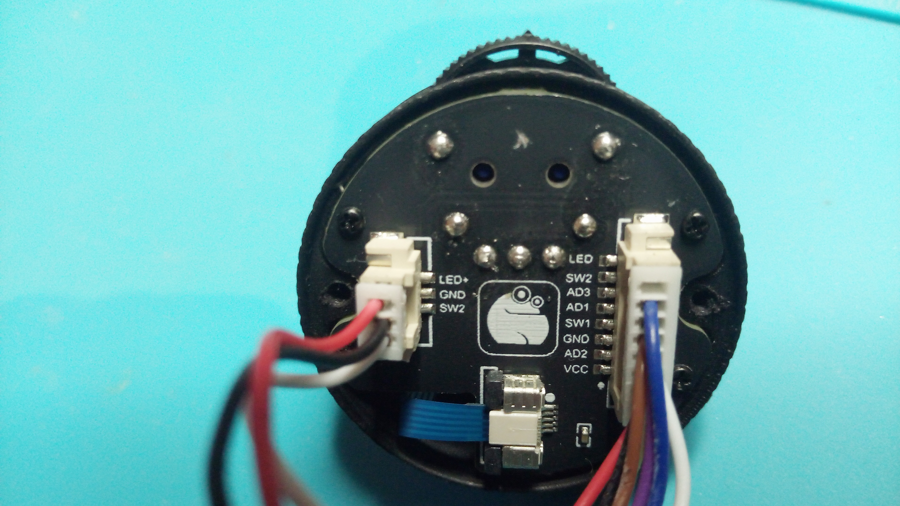

.Pin-Belegung des LED-Boards: man erkennt das zusätzliche blaue, nach außen geführte Kabel für die steuerbare LED
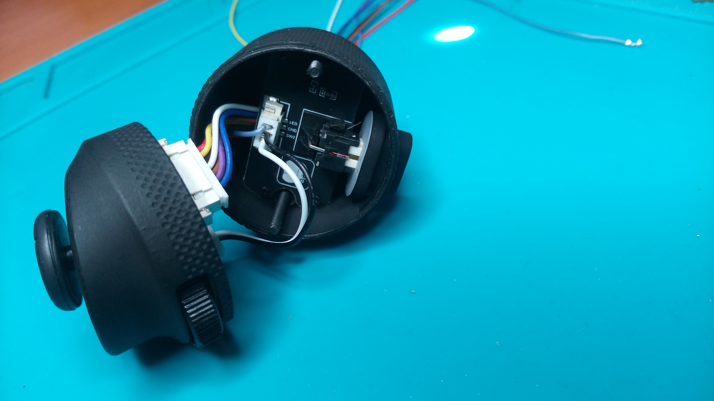

// image::images/sfrog_pinout_3.jpg[]

.Das entfernte rote Kabel aus der Verbindung von Haupt-Platine zum LED Tochter-Board. In den frei werdenden Kontakt des JST-PB Steckers zum LED Tochter-Board kann ein weiteres Kabel JST-PB Kontakt eingeführt werden.
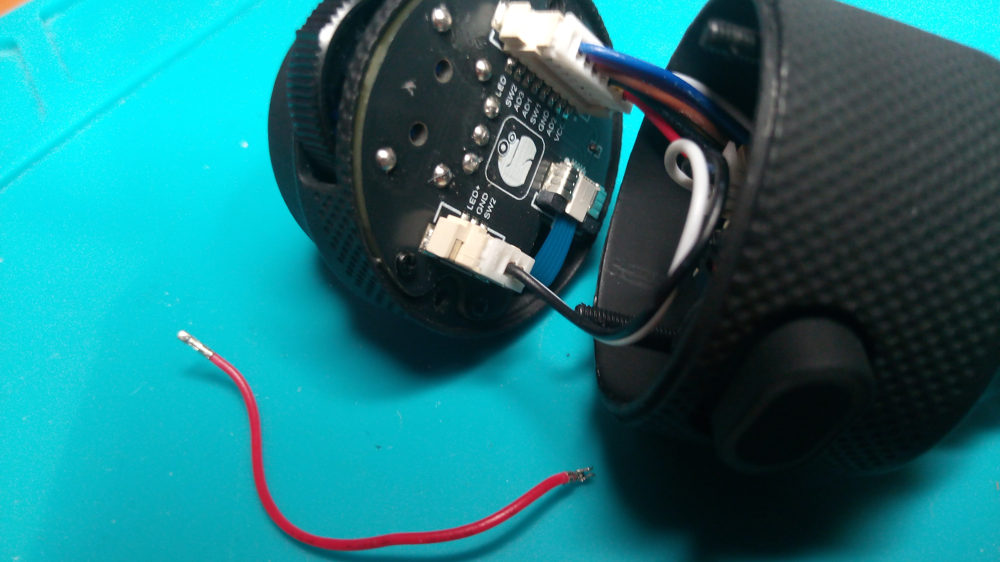

=== Montage der SFrog 5D Sticks

Nun die Kabel der Sticks durch die aufgebohrten Aggregat-Brücken in das Innere des Senders führen.

Anschließen die Knüppelbolzen in die Aggregatbrücke schrauben.

=== Verkabelung an das WeAct STM32 G031

Nun alle Kabel gemäß der <<uc_pinout, Tabelle>> anschließen.

Die Versogung kann am IMU entnommen werden (a.a. <<power>>).

.WeAct STM32G0B1
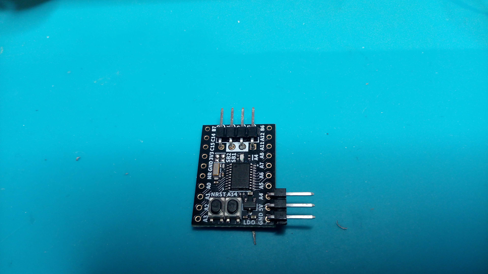

.WeAct STM32G0B1 mit 3-poligem Versorgungsstecker (2-Pole belegt: Gnd, 5V) und 4-poligem SWD-Prorammierstecker
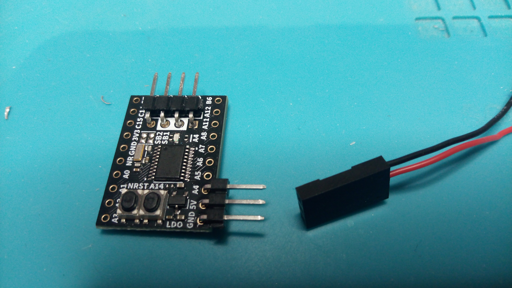

[[uc_pinout]]
.Tabelle zum Anschluss an das µC-Modul
|===
| Bedeutung | Farbe | Anschluss µC-Board

| Stick 1 / ADC1 | baun | A0
| Stick 1 / ADC2 | geld | A1
| Stick 1 / ADC3 | lila | A2
| Stick 1 / SW1 | weiß | C14
| Stick 1 / SW2 | blau | B7
| Stick 1 / Led | tbd | A3
| Stick 1 / Gnd | schwarz | Gnd
| Stick 1 / Vcc | rot | 3,3V

| Stick 2 / ADC1 | braun | A5
| Stick 2 / ADC2 | gelb | A6
| Stick 2 / ADC3 | lila | A7
| Stick 2 / SW1 | weiß | B6
| Stick 2 / SW2 | blau | C15
| Stick 2 / Led | tbd | A8
| Stick 2 / Gnd | schwarz | Gnd
| Stick 2 / Vcc | rot | 3,3V

| SBus | tbd | A11
|===

[[power]]
.Gnd und 5V steht hier am IMU-Modul zur Verfügung
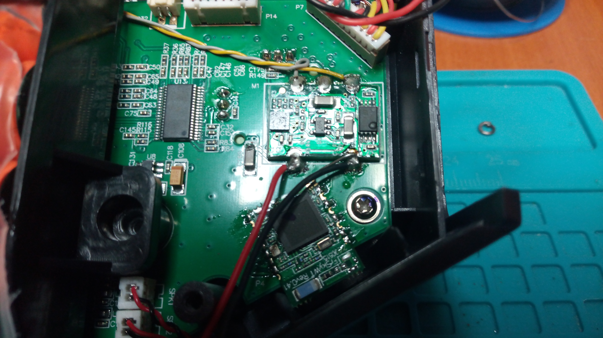

.Anschluss des seriellen tx-Ausgangs des µC-Moduls an den rx-Pin des P13 Verbinders auf dem Main-Board der X12S
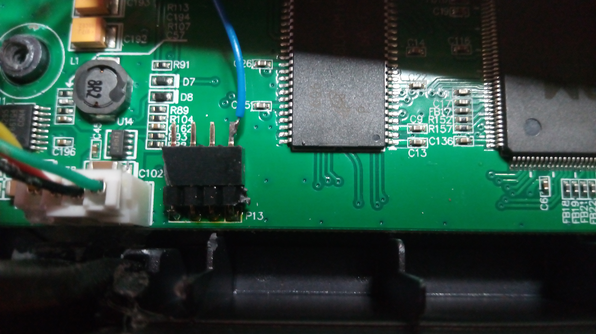

.Testlauf in der Einbauphase

=== Fixierung des µC-Boards im Sender

.Montage des µC-Moduls an der Rückseite des LCD-Displays
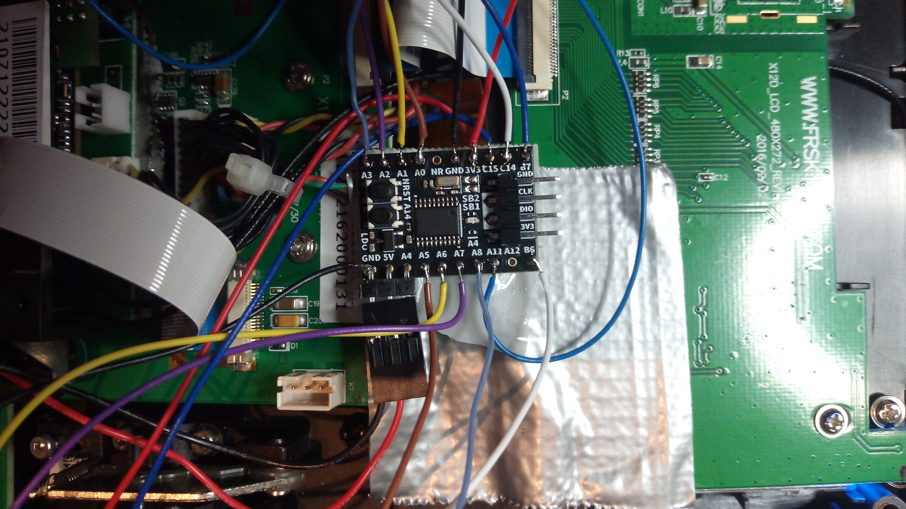

.Gesamtantsicht von Innen
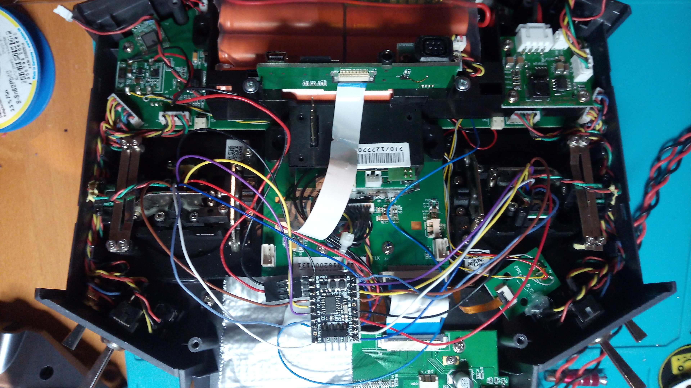

=== Abschluss

.Abschluss der Montage
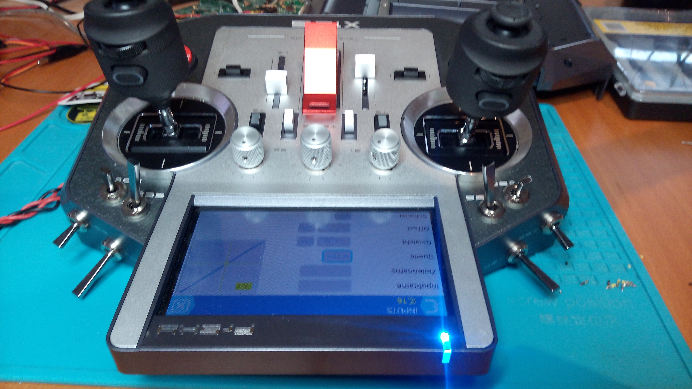

.LEDs in Funktion
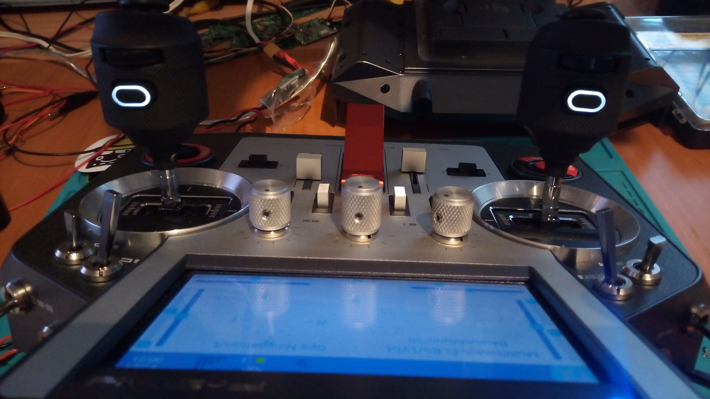

[[edgetx]]
== EdgeTx-Einstellungen

Folgende Einstellungen sind in EdgeTx vorzunehmen:

* unter `Sys -> Hardware` die Schnittstelle 'Aux1` auf `SBus` einstellen
* in den `Modelleinstellungen -> Lehrer/Schüler` auf `Lehrer/Serial` einstellen
* die Trainereingänge wie üblich als Geber in den Inputs oder Mixer, ... verwenden

Die analogen Eingänge erscheinen als `TR1` bis `TR6`.

Die digitalen Eingänge erscheinen ls `TR8` bis `TR11`.

[[firmware]]
== Firmware

Die Firmware für das WeAct G031 µC-Board steht hier zur Verfügung:

https://github.com/wimalopaan/wmucpp/tree/master/boards/rcDesk32mini[]

Bitte die Einstellungen in der Firmware beachten (`mini_01.cc`).

Statt auf dem lokalen Rechner kann die Firmware auch einfach in einem `github` _CodePace_  erfolgen.

Dazu siehe: https://github.com/wimalopaan/Electronics?tab=readme-ov-file#gitpod_wm[]

== Bedienung

Die auf die SFrog Sticks abgestimmte Firmware unterstützt eine Kalibrierung, die jederzeit eingeleitet werden kann.

Dazu folgende Schritte:

* bei ausgeschaltetem Sender an einem Stick beide Taster drücken
* Sender einschalten
* die Taster loslassen
* die LEDs blinken nun doppelt
* kontrollieren, ob die Slider und die Mini-Kreuzknüppel in Mittelstellung sind, bei beiden Sticks
* Taster an einem Stick drücken
* die LEDs blinken nun dreifach
* nun alle Slider und die Mini-Kreuzknüppel in die Extrempositionen bringen
* dies kann auch am Kanalmonitor / EdgeTx beobachtet werden, sofern die Mischer schon konfiguriert wurden.
* Taster an einem Stick drücken
* LEDs blinken nun langsam und die Kalibrierung ist nun abgeschlossen.

[[quellen]]
== Verweise

https://wuehlbox.com/de/fernsteuerung/1269-646-sfrog-5d-knuppel.html#/307-ausfuhrung-a_only_sticks[]

https://glku.com/sfrog-rc-model/2808-2117-sfrog-upgrade-frsky-tandem-xe-and-frsky-x12s-remote-control-5d-joystick-kit-assembly.html[]

